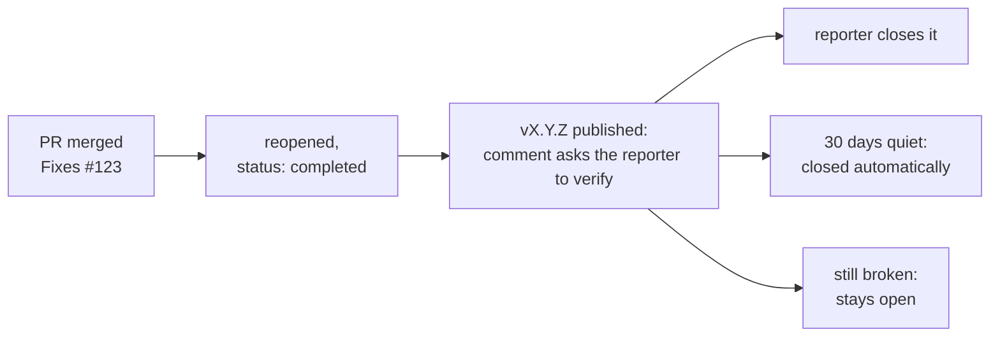

# Contributing

Read [docs/architecture.md](docs/architecture.md) first. PrintGuard runs in two modes, local
in the browser and hub on a server, and the engine is shared code running on CPython and
Pyodide. All mode differences live behind the `Platform` contract.

- [Development setup](#development-setup)
- [Documentation is part of the change](#documentation-is-part-of-the-change)
- [Regenerating the docs screenshots](#regenerating-the-docs-screenshots)
- [Adding a printer integration](#adding-a-printer-integration)
- [Adding a notification provider](#adding-a-notification-provider)
- [Ground rules](#ground-rules)
- [Release cycle](#release-cycle)
- [What a merge does to the issues it fixes](#what-a-merge-does-to-the-issues-it-fixes)

## Development setup

```bash
uv sync                              # Python engine + hub server
uv run printguard                    # hub on :8000 (MediaMTX is bundled into the image; for video in dev, brew install mediamtx and set MEDIAMTX_BINARY=$(which mediamtx))
cd web && npm install && npm run dev # UI with hot reload on :5173, proxied to :8000
```

To work on the desktop app, run the tray build in dev or produce a local installer:

```bash
uv run --extra desktop printguard-desktop   # tray app: the hub in the background
bash packaging/build.sh                      # build a .dmg (macOS) / .zip (Windows) into dist/
```

Run the tests before and after your change:

```bash
uv run pytest                        # engine simulation, adapter contracts, plugin sandbox
cd web && npm run typecheck          # strict TypeScript over the UI
cd web && npm run test:sandbox       # the browser plugin sandbox, in chromium and webkit
```

`tests/test_engine.py` simulates cameras and printers against a fake platform, covering
fairness, gating, the watchdog, alerts and the protocol. `tests/test_adapters.py` pins the
exact request shapes of every integration and notifier. `tests/test_plugin_runtime.py` runs
real JavaScript in the shipped QuickJS build to hold the hub sandbox to what it promises. If
you touch the scheduler, monitor or printer state handling, extend the first; a new adapter
gets its payloads tested in the second.

The browser half of the plugin sandbox is only meaningful in a real engine, so
`web/tests/sandbox.spec.ts` drives it through Playwright in both chromium and webkit. Run it
if you touch anything under `web/public/plugin-sandbox.html`, `web/src/plugins.ts` or the
node renderer.

## Documentation is part of the change

A change is not finished while a doc still describes the old behaviour. Treat the docs like
the tests: if your change touches something a page below covers, update that page in the
same pull request, and delete anything the change makes wrong or redundant.

| If you change | Update |
|---|---|
| Install steps, ports, image tags, headline features | [README.md](README.md) |
| The engine protocol, an event, the platform contract, the scheduler, logging, repo layout | [docs/architecture.md](docs/architecture.md) |
| A printer integration, camera source, notifier, or their setup steps | [docs/printers.md](docs/printers.md) |
| Model runtimes, execution providers, image variants, GPU setup | [docs/hardware.md](docs/hardware.md) |
| Exposure, proxies, origin checks, ports, hardening | [docs/deployment.md](docs/deployment.md) |
| A REST endpoint, MCP tool, scope, or a response shape | [docs/api.md](docs/api.md) |
| The plugin API, a permission, the sandbox, or the catalogue | [docs/plugins.md](docs/plugins.md) |
| A failure mode users will hit, or its fix | [docs/troubleshooting.md](docs/troubleshooting.md) |
| Anything user-visible | [CHANGELOG.md](CHANGELOG.md), see [Release cycle](#release-cycle) |
| The UI's appearance | The screenshots, see below |

Writing style for docs and release notes:

- British English. Concise and factual: no filler, no salesmanship, no emoji in prose.
- **No em dashes.** Use a comma, a colon, brackets, or a spaced hyphen.
- Prefer a table or a diagram over a long paragraph. Mermaid renders on GitHub, so use it
  for flows, sequences and state.
- Link to the page that explains a thing rather than restating it. Duplicated docs rot.

## Regenerating the docs screenshots

The images in `docs/assets/` are rendered from fake data, with no backend, broker or video
feed, by a Playwright script. Regenerate them whenever the UI changes:

```bash
cd web
npx playwright install chromium      # one-time: fetch the browser binary
npm run screenshots                  # renders docs/assets/*.png from web/screenshots/
```

Each image is one entry in `SCENES` in `web/screenshots/capture.spec.ts`; add a scene there
to capture a new screen.

## Adding a printer integration

Integrations talk to print servers, such as OctoPrint or Moonraker, to read state and pause
or cancel jobs. One adapter runs in both modes because it only speaks through the platform's
HTTP function.

1. Create `printguard/engine/integrations/<service>.py` subclassing
   [`IntegrationAdapter`](printguard/engine/integrations/base.py):
   - implement `fetch_state()`, normalising to the canonical `DeviceStatus` values.
     `offline` must mean "unreachable", not "idle", because it keeps inference watching;
   - implement `send()` for pause, resume and cancel, raising `RuntimeError` on rejection;
   - describe the config form as a JSON Schema, where `secret: true` masks fields and
     `placeholder` hints at the expected value;
   - set `docs_url` to the official API reference. It is required for review.
2. Register an instance in
   [`integrations/__init__.py`](printguard/engine/integrations/__init__.py).
3. Add the service to the table in [docs/printers.md](docs/printers.md), with a `<details>`
   block if it needs setup steps of its own.

The configuration form, connection test, device polling, inference gating and defect actions
all follow from the adapter. No other change is needed in either mode.

## Adding a notification provider

Notifiers deliver defect snapshots and watchdog warnings.

1. Create `printguard/engine/notifiers/<service>.py` subclassing
   [`NotifierAdapter`](printguard/engine/notifiers/base.py):
   - implement `send(http, config, title, body, image)`. Attach the JPEG `image` when the
     service supports uploads, where `multipart_form()` in the same module builds the body,
     and raise `RuntimeError` with the service's error detail on rejection;
   - set `browser_ok = False` if the service sends no CORS headers, which offers it in hub
     mode only. Check from a browser console before assuming;
   - JSON-schema config and `docs_url`, exactly as for integrations.
2. Register an instance in
   [`notifiers/__init__.py`](printguard/engine/notifiers/__init__.py).
3. Add the channel to the table in [docs/printers.md](docs/printers.md#notifications).

The settings form, test button, and delivery of alerts and warnings all follow from the
adapter.

## Adding a plugin to the catalogue

Plugins live outside the release cycle: anyone can publish one to a GitHub repository and
anyone can install it. The catalogue is the list I have read, and being on it is what makes
a plugin show as **verified**.

1. Write it as [docs/plugins.md](docs/plugins.md#writing-a-plugin) describes. Plain
   JavaScript, no build step, no minifying: it has to be readable to be reviewed.
2. Open a pull request adding the folder under `plugins/`.
3. Run `uv run python plugins/pin.py` and commit the catalogue it rewrites. It pins the
   commit the plugin last changed in and the hash of every file, so it has to run *after*
   the plugin is committed, and again after every change to it.

What I look for: it asks for no permission it does not use, it does nothing surprising with
the ones it does, and its network hosts are declared and expected.

## Ground rules

- **No mode forks.** If shared code needs something runtime-specific, extend the `Platform`
  protocol on both sides with identical signatures. Never branch on mode.
- **Fail loudly.** Anything on the alert path that can fail must emit an `error` or `warning`
  event. No bare `except: pass` where a user would want to know.
- **Minimal code.** Prefer consolidating existing code over adding parallel variants. No
  speculative abstractions or defensive defaults.
- **No comments in the UI.** The TypeScript and React code carries none: names document
  intent. Python modules, classes and public methods get docstrings, but inline comments only
  where the *why* is genuinely non-obvious.
- **Docs travel with the code.** See [above](#documentation-is-part-of-the-change).

## Release cycle

Merging to `main` starts the release process, so every pull request carries its own release
metadata: a version bump and a changelog entry.

```bash
uv version --bump patch   # or minor / major (also updates uv.lock)
```

Then add a matching section at the top of [CHANGELOG.md](CHANGELOG.md) in
[Keep a Changelog](https://keepachangelog.com/en/1.1.0/) form:

```markdown
## [X.Y.Z] - YYYY-MM-DD

### Added | Changed | Fixed | Removed

- What changed, written for someone deciding whether to pull the new image.
```

The section is published verbatim as the GitHub release notes, so describe the user-visible
effect, not the implementation.

A pull request can only merge once three required checks pass:

| Check | Enforces |
|---|---|
| **tests** | The engine simulation suite |
| **image** | Every production image variant builds, so a change that breaks an image can never reach `main` |
| **version** | The version is bumped past the last release and has a matching `CHANGELOG.md` section, so every merge ships as a unique, documented, immutable version. Re-publishing an existing tag is refused |

On merge, the [release workflow](.github/workflows/release.yml):

1. builds and pushes the images to `ghcr.io/oliverbravery/printguard`, tagged `X.Y.Z`, `X.Y`
   and `latest`, plus the `-intel` and `-nvidia` variants;
2. only once the images are published, tags the merge commit `vX.Y.Z` and creates the GitHub
   release with the changelog section as its notes, so a failed build never becomes a
   release;
3. deploys the in-browser demo to GitHub Pages;
4. builds the macOS and Windows desktop apps and attaches them to the release.

Docker, for servers and NAS boxes, and the desktop app, for personal computers, are the
supported distributions.

## What a merge does to the issues it fixes

Link the issues a pull request resolves with a closing keyword, `Fixes #123`, or through the
**Development** sidebar. Everything below follows from that link, so a pull request that only
mentions an issue in prose gets none of it.

A fix is not resolved until the reporter says it is, so
[the issues workflow](.github/workflows/issues.yml) reopens what the merge closed and swaps
the issue's `status:` label for `status: completed`. Once the release is actually published,
the release workflow comments on each one naming the version and asking the reporter to close
it if it worked, or to say what is still wrong. Thirty days without a reply closes it, and
anyone can reopen it later.


