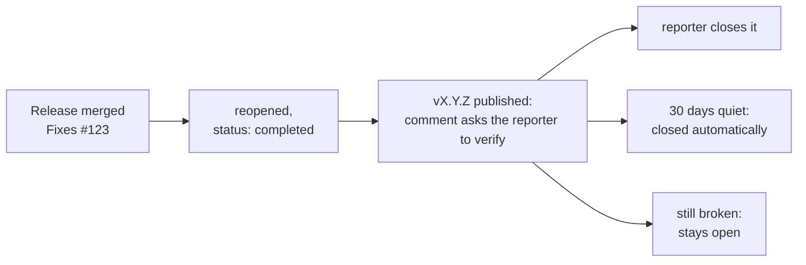

# Contributing

Read [docs/architecture.md](docs/architecture.md) first. One engine owns every decision, the
hub server runs it, and everything the engine's own logic needs from hardware, the network or disk comes through the
`Platform` contract.

- [Development setup](#development-setup)
- [Documentation is part of the change](#documentation-is-part-of-the-change)
- [Regenerating the docs screenshots](#regenerating-the-docs-screenshots)
- [Adding a printer integration](#adding-a-printer-integration)
- [Adding a notification provider](#adding-a-notification-provider)
- [Adding a plugin to the catalogue](#adding-a-plugin-to-the-catalogue)
- [Ground rules](#ground-rules)
- [Release cycle](#release-cycle)
- [What a merge does to the issues it fixes](#what-a-merge-does-to-the-issues-it-fixes)

## Development setup

```bash
uv sync                              # Python engine + hub server
uv run printguard                    # hub on :8000 (MediaMTX is bundled into the image; for video in dev, brew install mediamtx and set MEDIAMTX_BINARY=$(which mediamtx))
cd web && npm install && npm run dev # UI with hot reload on :5173, proxied to :8000
cd web && npm run site               # the GitHub Pages landing page in web/site, with hot reload
```

To work on the desktop app, run the tray build in dev or produce a local installer:

```bash
uv run --extra desktop printguard-desktop   # tray app: the hub in the background
bash packaging/build.sh                      # build a .dmg (macOS) / .zip (Windows) into dist/
```

Run the tests before and after your change:

```bash
uv run pytest                        # engine simulation, adapter contracts, plugin sandbox and lint
cd web && npm run typecheck          # strict TypeScript over the UI
cd web && npm run test:sandbox       # the browser plugin sandbox, in chromium and webkit
cd feedback-worker && npm ci && npm run typecheck && npm test   # the training inbox Worker, in the Workers runtime
```

The **tests** check in CI runs all four. `typecheck` covers the Playwright suites as well as the
UI, and `test:sandbox` needs `npx playwright install chromium webkit` once.

`tests/test_engine.py` simulates cameras and printers against a fake platform, covering
fairness, gating, the watchdog, alerts and the protocol. `tests/test_adapters.py` pins the
exact request shapes of every integration and notifier. `tests/test_plugin_runtime.py` runs
real JavaScript in the shipped QuickJS build to hold the hub sandbox to what it promises.
`tests/test_plugin_lint.py` reads every shipped plugin against its own manifest, the same check
`pin.py` refuses to list a plugin without, and it needs `npm install` in `web/` since the
checker runs on node. If you touch the scheduler, monitor or printer state handling, extend the
first. A new adapter gets its payloads tested in the second. The REST API, MCP server, MQTT
bridge, tokens, gcode reader and MediaMTX client each have a `tests/test_<name>.py` of their
own.

[`feedback-worker/`](feedback-worker) is the Cloudflare Worker that takes
[training frames](docs/feedback.md). Its limits are in `src/limits.ts` and every one has a test.
Install with `npm ci`, since npm 10 fails to resolve Vitest's peers from scratch.

Only I deploy it. The bucket needs a lifecycle rule matching `EXPIRY_DAYS`, since the Worker only
counts what is about to expire and the rule is what deletes it:

```bash
cd feedback-worker
npx wrangler r2 bucket create printguard-feedback --jurisdiction eu
npx wrangler r2 bucket lifecycle add printguard-feedback expire-uncollected --expire-days 30 --jurisdiction eu
npx wrangler r2 bucket lifecycle list printguard-feedback --jurisdiction eu
npx wrangler deploy --secrets-file <file>   # TOKEN_SECRET, REMINDER_TO and REMINDER_FROM, on the first deploy
```

Replacing `TOKEN_SECRET` gives every hub a new ID, which orphans the frames sent under the old
ones from any [deletion request](docs/feedback.md#having-your-frames-deleted).

The browser half of the plugin sandbox is only meaningful in a real engine, so
`web/tests/sandbox.spec.ts` drives it through Playwright in both chromium and webkit. Run it
if you touch anything under `web/public/plugin-sandbox.html`, `web/public/plugin-panel.html` or
`web/src/plugins.ts`. `web/tests/dashboard.spec.ts` runs alongside it and holds the dashboard's
own behaviour, such as reconnecting to the hub, against a faked engine.

`web/launch/launch.spec.ts` checks a build the way a user meets it. It registers two cameras
fed by a fake MJPEG server, one showing a healthy print and one a failing print, binds a
monitor to each and expects only the failing one to raise an alert. The **launch** check runs
it on pull requests into `main` in parallel for the container, the macOS app and the Windows
app. It drives the Windows app inside its own window, which `PRINTGUARD_DEBUG_PORT` opens to
the DevTools protocol, and reaches the macOS app's hub from Playwright's WebKit. To run it
against a fresh hub, with Chrome installed:

```bash
cd web && PRINTGUARD_URL=http://localhost:8000 npx playwright test --project=launch
```

## Documentation is part of the change

A change is not finished while a doc still describes the old behaviour. Treat the docs like
the tests. If your change touches something a page below covers, update that page in the same
pull request, and delete anything the change makes wrong or redundant.

| If you change | Update |
|---|---|
| Install steps, ports, image tags, headline features | [README.md](README.md), and the landing page in `web/site/Home.tsx` |
| A supported printer service, camera source or alert channel | The lists in [README.md](README.md), `web/site/Home.tsx` and `web/src/guide.tsx` |
| The engine protocol, an event, the platform contract, the scheduler, logging, repo layout | [docs/architecture.md](docs/architecture.md) |
| A printer integration or its setup steps, the print library, temperatures | [docs/printers.md](docs/printers.md) |
| A camera source | [docs/cameras.md](docs/cameras.md) |
| A monitor or camera setting, risk history | [docs/monitoring.md](docs/monitoring.md) |
| The frames kept from a print, what's sent for training, the Worker's limits | [docs/feedback.md](docs/feedback.md) |
| A notifier, or when a notice is sent | [docs/notifications.md](docs/notifications.md) |
| Model runtimes, execution providers, image variants, GPU setup | [docs/hardware.md](docs/hardware.md) |
| Exposure, proxies, origin checks, ports, hardening, an environment variable, the data directory | [docs/deployment.md](docs/deployment.md) |
| A REST endpoint, MCP tool, scope, response shape or Home Assistant entity | [docs/api.md](docs/api.md) |
| Installing plugins, a permission, what a plugin can reach | [docs/plugins.md](docs/plugins.md) |
| The plugin API, a manifest field, a limit, either sandbox, the catalogue | [docs/plugin-development.md](docs/plugin-development.md) |
| A failure mode users will hit, or its fix | [docs/troubleshooting.md](docs/troubleshooting.md) |
| Anything user-visible | [CHANGELOG.md](CHANGELOG.md), see [Release cycle](#release-cycle) |
| The UI's appearance | The screenshots, see below |
| Dev setup, tests, the adapter guides, the release process | This file |

A new page goes in the table in [docs/README.md](docs/README.md), the README's Documentation
table and the nav line at the top of every page.

Writing style for docs and release notes:

- British English, concise and factual, with no filler, no salesmanship and no emoji in prose.
- Only punctuation you would type. No em dashes and no arrows, so write "the Plugins tab in
  Settings" rather than drawing a path with symbols.
- Start a new sentence instead of hanging a list or an explanation off a colon.
- Prefer a table or a diagram over a long paragraph. Mermaid renders on GitHub, so use it for
  flows, sequences and state.
- Link to the page that explains a thing rather than restating it. Duplicated docs rot.
- Cut the trailing clause. "Reach the addresses it lists" beats "Reach the addresses it lists,
  and nowhere else". Where half a sentence is there to reassure, delete that half.
- A changelog entry is one line, written for someone deciding whether to pull the image.

## Regenerating the docs screenshots

The images in `docs/assets/` are rendered from fake data, with no backend, broker or video
feed, by a Playwright script. Regenerate them whenever the UI changes:

```bash
cd web
npx playwright install chromium      # one-time: fetch the browser binary
npm run screenshots                  # renders docs/assets/*.png, web/public/guide/*.jpg and plugins/*/shots
```

Each image is one entry in `SCENES` in `web/screenshots/capture.spec.ts`; add a scene there
to capture a new screen. A scene naming `plugins` runs those plugins from `plugins/` in the real
sandbox, so a screenshot shows what the code actually draws.

The same run renders the crops the in-app guide shows, from `CROPS` in that file. A crop names
the element to frame and is captured in both themes, since the guide picks the one matching the
theme the reader is on. Point a guide entry at one with `shot: "<id>"` in `web/src/guide.tsx`.

It also renders each shipped plugin's own screenshots from `PLUGIN_SHOTS`. Those files are
hashed into the catalogue, so rerun `uv run python plugins/pin.py` if they change.

## Adding a printer integration

Integrations talk to print servers, such as OctoPrint or Moonraker, to read state and pause
or cancel jobs. An adapter speaks through the platform's HTTP function, which is what lets
`tests/test_adapters.py` pin every request it makes. A service with no HTTP API, such as Bambu
Lab over MQTT, uses its own client library. That adds a dependency to `pyproject.toml`, and its
tests replace the adapter's private connection functions instead of pinning requests, as the
Bambu and Elegoo tests do.

1. Create `printguard/engine/integrations/<service>.py` subclassing
   [`IntegrationAdapter`](printguard/engine/integrations/base.py):
   - set `id`, the key it is registered and stored under, and `label`, the name in the form.
   - implement `fetch_state()`, normalising to the canonical `DeviceStatus` values.
     `offline` must mean "unreachable", not "idle", because it keeps inference watching. Fill
     in `remaining_s`, `nozzle` and `bed` where the service reports them, the heaters through
     `Heater.reported()`, so the dashboard can show them.
   - implement `send()` for pause, resume and cancel, raising `RuntimeError` on rejection.
   - set `heater_control` and implement `heat()` where the service takes a nozzle or bed
     target, raising `RuntimeError` on rejection. Leave it off and the dashboard shows the
     temperatures without a way to set them.
   - set `formats` to the extensions the service prints from an upload and implement
     `print_file()` to upload one and start it, raising `RuntimeError` on rejection. Leave
     `formats` empty and the print library never offers the printer.
   - implement `cameras()` where the service exposes a webcam, returning a `key`, `name` and
     `source` for each. PrintGuard registers them as cameras owned by the printer.
   - implement `close()` if the adapter holds a connection open.
   - describe the config form as a JSON Schema, where `secret: true` masks fields,
     `placeholder` hints at the expected value, and `default` preselects an optional
     `enum`, so the form never offers an empty choice the adapter quietly fills in.
   - set `docs_url` to the official API reference. It is required for review. `setup_url` and
     `setup_hint` put a setup guide and a one-line note on the form, for steps taken on the
     printer itself.
2. Register an instance in
   [`integrations/__init__.py`](printguard/engine/integrations/__init__.py).
3. Pin its requests in `tests/test_adapters.py`, which has a recording HTTP function for this.
4. Add the service to the tables in [docs/printers.md](docs/printers.md), with a `<details>`
   block if it needs setup steps of its own, and to the lists in the README, the landing page
   and the in-app guide.

The configuration form, connection test, device polling, inference gating, defect actions,
temperature controls and the print library all follow from the adapter. No other code changes.

## Adding a notification provider

Notifiers deliver defect snapshots and watchdog warnings.

1. Create `printguard/engine/notifiers/<service>.py` subclassing
   [`NotifierAdapter`](printguard/engine/notifiers/base.py):
   - implement `send(http, config, title, body, image)`. Attach the JPEG `image` when the
     service supports uploads, where `multipart_form()` from `engine/adapters.py` builds the body,
     and raise `RuntimeError` with the service's error detail on rejection.
   - `id`, `label`, the JSON Schema config and `docs_url`, exactly as for integrations.
   - set `desktop_only` for a channel that only works inside the desktop app, as the native
     notifier does.
2. Register an instance in
   [`notifiers/__init__.py`](printguard/engine/notifiers/__init__.py).
3. Pin its request in `tests/test_adapters.py`.
4. Add the channel to the table in [docs/notifications.md](docs/notifications.md#channels), and
   to the lists in the README and the landing page.

The settings form, test button, and delivery of alerts and warnings all follow from the
adapter.

## Adding a plugin to the catalogue

Plugins live outside the release cycle, so anyone can publish one to a GitHub repository and
anyone can install it. The catalogue is the list I have read, and being on it is what makes
a plugin show as **verified**.

1. Write it as [docs/plugin-development.md](docs/plugin-development.md) describes. It is plain
   JavaScript with no build step and nothing minified, since it has to be readable to be
   reviewed.
2. Open a pull request adding the folder under `plugins/`.
3. Run `uv run python plugins/pin.py` and commit the catalogue it rewrites. It pins the
   commit the plugin last changed in and the hash of every file, so it has to run after
   the plugin is committed, and again after every change to it. It checks the plugin's code
   against its manifest first and refuses to list one where they disagree. That check runs on
   node, so it needs `npm install` in `web/`.

Changing a permission, a surface or an event means rerunning `uv run python plugins/schema.py`
and committing [plugins/plugin.schema.json](plugins/plugin.schema.json), which is what
completes a manifest in an author's editor. The tests fail until you do. Hand-edit
[plugins/plugin.d.ts](plugins/plugin.d.ts) to match, since it types what a plugin is handed.

What I look for is that it asks for no permission it does not use, does nothing surprising
with the ones it does, and declares the network hosts you would expect.

## Ground rules

- Keep the engine's own logic free of I/O. It never imports from `server/`, and a feature that
  needs a runtime service gets it through the `Platform` protocol, implemented in
  `server/platform.py` and in the test fake. An adapter built on a vendor's client library is
  the main exception, and [the architecture page](docs/architecture.md#the-platform-contract)
  lists the rest.
- Fail loudly. Anything on the alert path that can fail must emit an `error` or `warning`
  event, so no bare `except: pass` where a user would want to know.
- Keep it minimal. Prefer consolidating existing code over adding parallel variants, and leave
  out speculative abstractions and defensive defaults.
- Write no comments in the UI. The TypeScript and React code carries none, since names document
  intent. Everything under [`plugins/`](plugins) is the exception. [plugin.d.ts](plugins/plugin.d.ts)
  carries TSDoc on every member for the hover, and the shipped plugins are commented to work as
  examples. Python modules, classes and public methods get docstrings, but inline comments only
  where the why is genuinely non-obvious.
- Write docstrings in Google style, with `Args:`, `Returns:` and `Raises:` whenever a function
  takes arguments, gives something back or fails. Types belong in the signature, so a docstring
  says what a value means rather than repeating what it is.
- Docs travel with the code. See [above](#documentation-is-part-of-the-change).

## Release cycle

Merging to `main` publishes a release, so work collects on a release branch first. Open your
pull request against the open `release/vX.Y.Z` branch, or against `main` if there isn't one and
I'll move it. A pull request from a fork can't pass **launch**, which signs the macOS app with
secrets a fork isn't given, so it only ever merges into a release branch. Don't bump the version. Add one line for your change under the release's heading
in [CHANGELOG.md](CHANGELOG.md) if a user would notice it.

The release branch owns the version bump and the changelog heading:

```bash
uv version --bump patch   # or minor / major (also updates uv.lock)
```

The heading at the top of [CHANGELOG.md](CHANGELOG.md) is in
[Keep a Changelog](https://keepachangelog.com/en/1.1.0/) form:

```markdown
## [X.Y.Z] - YYYY-MM-DD

### Added | Changed | Fixed | Removed

- What changed, written for someone deciding whether to pull the new image.
```

The section is published verbatim as the GitHub release notes, so describe the user-visible
effect, not the implementation. Its date is the day the release merges into `main`, in London
time. The check on a pull request into `main` compares it with today, and the release itself
refuses a section dated any other day than its merge commit, so a release that waits a day
needs its date moved on before it merges.

Five checks are required. A pull request into a release branch runs **tests**, **audit**,
**image** and **version**, and the release's own pull request into `main` adds **launch** and the date:

| Check | Enforces |
|---|---|
| **tests** | Everything under `tests/`, with `uv run pytest`. The UI and its Playwright suites type-check, and the browser plugin sandbox holds in chromium and webkit. The feedback Worker type-checks and passes its tests |
| **audit** | `uv audit` and `npm audit` find no known vulnerability in `uv.lock` or either `package-lock.json`. A new advisory fails every open pull request until the dependency is bumped |
| **image** | Every production image variant builds, which also builds the UI, so a change that breaks an image can never reach `main` |
| **launch** | On pull requests into `main`, the container and both desktop apps start from what would ship and catch a failing print, so a release that cannot start never goes out |
| **version** | The version has no release tag yet and has a matching `CHANGELOG.md` section, dated the day it merges into `main` in London time. Re-publishing an existing tag is refused |

Every action in the workflows is pinned to a commit, with its version in a comment. The base
images in the `Dockerfile` are pinned by digest beside their tag, and the MediaMTX archive in
`packaging/build.sh` and the Intel GPU packages in both workflows carry the sha256 their release
publishes. Bumping any of them means changing the version and its hash together.

On merge, the [release workflow](.github/workflows/release.yml):

1. builds and pushes the images to `ghcr.io/oliverbravery/printguard`, tagged `X.Y.Z`, `X.Y`
   and `latest` for `amd64` and `arm64`, plus the `-intel` and `-nvidia` variants for `amd64`.
2. only once the images are published, tags the merge commit `vX.Y.Z` and creates the GitHub
   release with the changelog section as its notes, so a failed build never becomes a release.
3. deploys the website to GitHub Pages.
4. builds the macOS and Windows desktop apps and attaches them to the release. The macOS app
   is signed and notarised with the `APPLE_CERTIFICATE`, `APPLE_CERTIFICATE_PASSWORD`,
   `APPLE_API_KEY`, `APPLE_API_KEY_ID` and `APPLE_API_ISSUER` repository secrets, which the
   **launch** check uses too.

Docker is the supported distribution for servers and NAS boxes, and the desktop app is the
one for personal computers.

## What a merge does to the issues it fixes

The release's pull request into `main` links every issue it resolves with a closing keyword,
`Fixes #123`. Everything below follows from that link. On a pull request into a release branch
write `Reported in #123` instead, so the issue closes when the release goes out.

A fix is not resolved until the reporter says it is, so
[the issues workflow](.github/workflows/issues.yml) reopens what the merge closed and swaps
the issue's `status:` label for `status: completed`. Once the release is actually published,
the release workflow comments on each one naming the version and asking the reporter to close
it if it worked, or to say what is still wrong. Thirty days without a reply closes it, and
anyone can reopen it later.


```mermaid
flowchart LR
    merge["Release merged<br/>Fixes #123"] --> reopen["reopened,<br/>status: completed"]
    reopen --> notify["vX.Y.Z published:<br/>comment asks the reporter to verify"]
    notify --> confirmed["reporter closes it"]
    notify --> quiet["30 days quiet:<br/>closed automatically"]
    notify --> more["still broken:<br/>stays open"]
```
