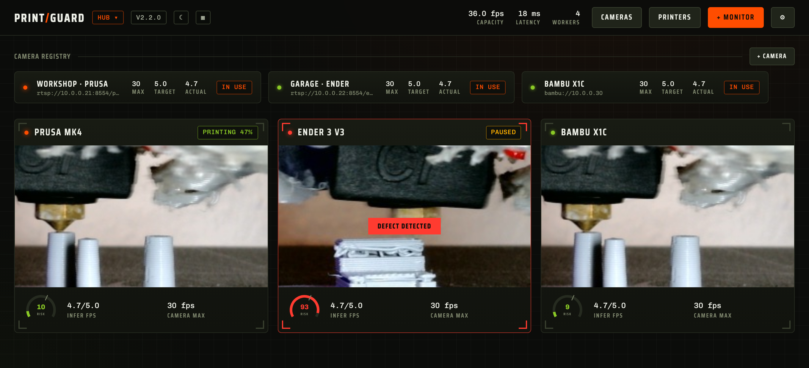
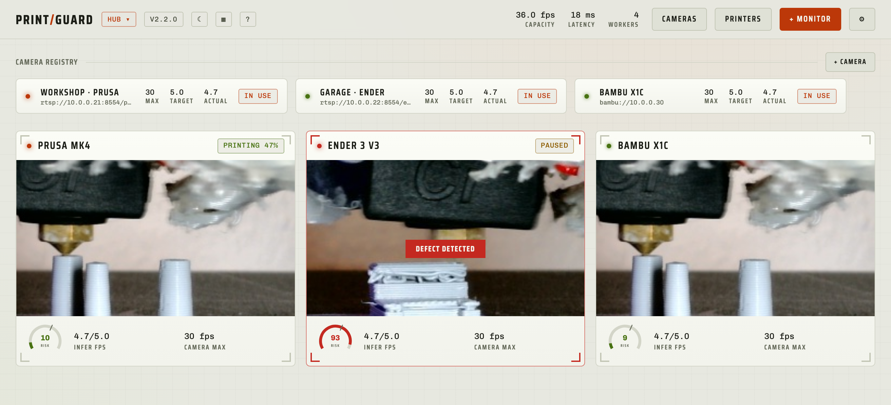
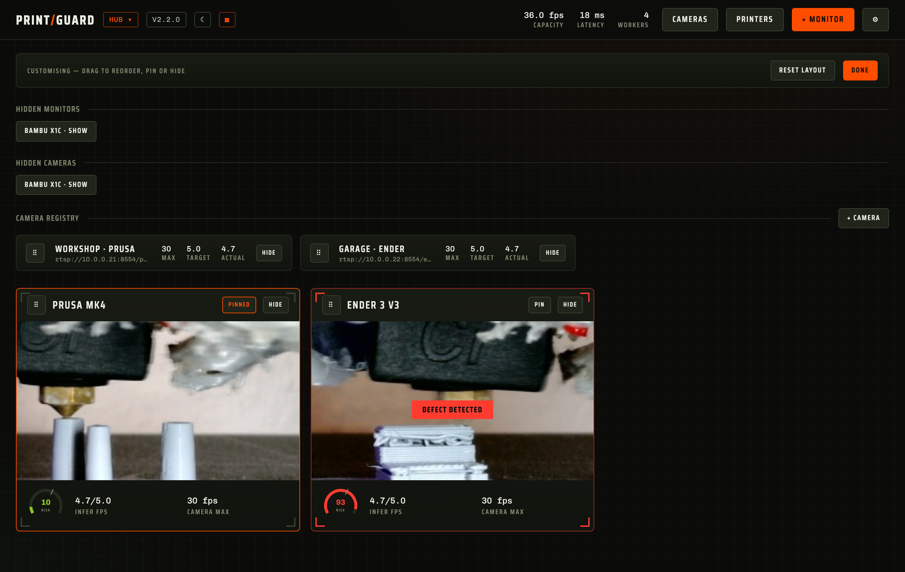
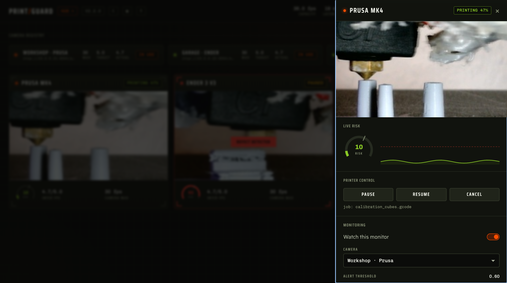

# PrintGuard


[](https://github.com/oliverbravery/PrintGuard/pkgs/container/printguard)
[](https://oliverbravery.github.io/PrintGuard/)

**PrintGuard watches your 3D printer cameras with an on-device vision model, pauses the
printer the moment a print starts to fail, and sends a snapshot to your phone.** No cloud, no
subscription, no account — your camera frames never leave hardware you own.



## Try it now — nothing to install

**[oliverbravery.github.io/PrintGuard](https://oliverbravery.github.io/PrintGuard/)** runs the
*entire* engine in your browser. Point your webcam at a print and watch it score each frame
live. Nothing is installed and no frame leaves your device. When you're ready to run it for
real, [jump to Quick start](#quick-start).

## What you get

- **Failures caught early** — a compact vision model scores every frame and acts the moment a
  defect holds, so spaghetti and detachments don't run for hours (or burn through a spool).
- **Damage stopped for you** — a sustained defect can pause or cancel the print through
  OctoPrint, Klipper or Bambu Lab, with sensitivity, thresholds and cooldowns you set per
  monitor.
- **A heads-up on your phone** — the instant a defect holds, a snapshot lands over ntfy,
  Telegram or Discord.
- **Quiet when nothing's wrong** — printers linked to a service are only watched while they
  actually print; inference rests when they're idle and wakes when a job starts.
- **Loud when something is** — a dropped camera, frozen feed or unresponsive printer warns you
  on the dashboard *and* your phone. If PrintGuard can't tell whether a printer is printing,
  it keeps watching — losing the signal never silently stops monitoring.
- **Every printer on one screen** — one machine shares inference fairly across as many cameras
  as your hardware can sustain.

## Make it yours

Choose a look — **System**, **Light**, **Dark**, or design your own in the built-in theme
editor — from the header. Your themes are saved and synced to every browser that opens the hub.

| Dark | Light |
|:---:|:---:|
|  |  |

Tap **Customise** to arrange the dashboard around how *you* work: drag monitors into any
order, **pin** the ones that matter to the front, and **hide** the rest — with a tray to bring
them back. The camera rail rearranges the same way.



Open any monitor for its live risk score, score history and one-tap printer controls.



## Quick start

### Desktop app — macOS & Windows

The easiest way to run a hub on the computer next to your printer: a native app — no Docker, no
terminal. It lives in your **menu bar / system tray**, so closing the window leaves the hub running
and the printer watched; quit from the tray when you're done. Reach it from your phone on the same
network at `http://<computer>:8000`. Nothing leaves your machine.

[](https://github.com/oliverbravery/PrintGuard/releases/latest/download/PrintGuard-macos-arm64.dmg)
&nbsp;
[](https://github.com/oliverbravery/PrintGuard/releases/latest/download/PrintGuard-windows-x64.zip)

Turn on **Start at login** from the tray menu and forget about it. The builds are unsigned for now,
so the first launch needs a right-click → **Open** on macOS, or **More info → Run anyway** on
Windows. On Linux, run the [Docker hub](#docker--for-an-always-on-server-or-nas) instead.

### Docker — for an always-on server or NAS

PrintGuard is a **single container** — install with one command:

```bash
docker run -d --name printguard --restart unless-stopped \
  -p 8000:8000 -p 8554:8554 -p 1935:1935 \
  -v printguard:/data \
  ghcr.io/oliverbravery/printguard
```

Open `http://<host>:8000`, pick a mode, register a camera and your printer, then add a monitor
that binds them.

- **Unraid** — add **PrintGuard** from Community Applications (or import the
  [template](templates/printguard.xml)) and install from the UI; no terminal needed.
- **Docker Compose** — prefer a file? [`docker-compose.yaml`](docker-compose.yaml): `curl -fsSLO https://raw.githubusercontent.com/oliverbravery/PrintGuard/main/docker-compose.yaml && docker compose up -d`.

Ports `8554`/`1935` only matter for cameras that *push* a stream into PrintGuard — most setups
(URL pull, Bambu, or "this device") can leave them off. Images for `amd64` and `arm64`
(Raspberry Pi 4/5) are published to
[`ghcr.io/oliverbravery/printguard`](https://github.com/oliverbravery/PrintGuard/pkgs/container/printguard)
on every release.

## Two modes, one engine

The same detection engine runs in two places — try it instantly in the browser, then self-host
it when you're ready.

| | Local mode | Hub mode |
|---|---|---|
| Engine runs | in your browser (Pyodide) | on the server (CPython) |
| Model runs | [LiteRT.js (WASM)](https://developers.google.com/edge/litert) | [ai-edge-litert](https://pypi.org/project/ai-edge-litert/) |
| Frames leave the device | never | only to your own server |
| Survives closing the tab | no | yes |

The **desktop app** (macOS and Windows) is hub mode without the setup — the same persistent engine
as the container, in a native window on (and never leaving) your own computer.

## Printers, cameras and alerts

Register your printer — OctoPrint, Klipper (Moonraker) or Bambu Lab — bind it to a monitor,
and choose what a sustained defect does: alert, pause or cancel. If a printer exposes a webcam,
PrintGuard adds it as a camera for you. Turn on ntfy, Telegram or Discord in **Settings** to
get snapshot alerts and watchdog warnings.

Connecting over Docker or HTTPS, or linking a Bambu printer, has a few gotchas — the full
walk-through (and webcam/camera options) lives in **[docs/printers.md](docs/printers.md)**.

## Exposing a hub safely

PrintGuard ships no auth, so put an identity layer in front before anything leaves your trusted
network — never port-forward the hub's ports directly.
**[docs/deployment.md](docs/deployment.md)** has step-by-step setups for **Tailscale**
(recommended), **Cloudflare Tunnel + Access** and **oauth2-proxy**, plus a hardening checklist.

## Home Assistant

Point the hub at your MQTT broker (**Settings → Home Assistant**) and every monitor appears in
Home Assistant automatically through MQTT discovery — a defect sensor, defect score, the latest
failure snapshot, an **Enabled** switch, and, for linked printers, live status with **Pause**,
**Resume** and **Cancel**. Control is two-way, so your automations can drive PrintGuard. The
broker is yours and the bridge runs on the hub, so no frames leave your hardware.

## Automate it — MCP and API

A hub exposes its engine to agents and scripts through the same protocol the dashboard uses, so
anything the UI can do is automatable. Point an MCP client (Claude, an IDE) at
`https://<host>/mcp/`, or use the REST API at `/api/v1` — both can read printer and camera
status, fetch the **current camera frame as an image**, and pause/resume/cancel. Capability is
per token: issue scoped bearer tokens (**read** ⊂ **control** ⊂ **manage**) from **Settings**,
and an agent only gets what you grant. Full reference: **[docs/api.md](docs/api.md)**.

## How it works

The detector is a ShuffleNetV2 encoder classified by nearest prototype, trained for few-shot
FDM fault detection in
[Edge-FDM-Fault-Detection](https://github.com/oliverbravery/Edge-FDM-Fault-Detection) (with an
accompanying technical paper). The sensitivity and threshold sliders map straight onto the
prototype distances, so you can tune for your camera and lighting without retraining.

## For developers

- [docs/architecture.md](docs/architecture.md) — how one engine runs on CPython and in the
  browser, the platform contract, the scheduler and the fail-safe design, with diagrams.
- [docs/printers.md](docs/printers.md) — connecting printers and cameras, and the networking
  gotchas (Docker, CORS, HTTPS, Bambu).
- [docs/api.md](docs/api.md) — the hub's MCP server and REST API: scoped access tokens, every
  endpoint and tool, and client setup.
- [CONTRIBUTING.md](CONTRIBUTING.md) — dev setup, tests, and step-by-step guides for adding
  printer integrations and notification providers.
