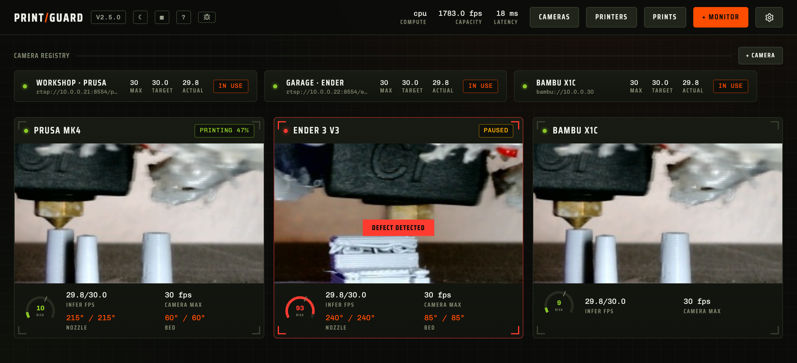
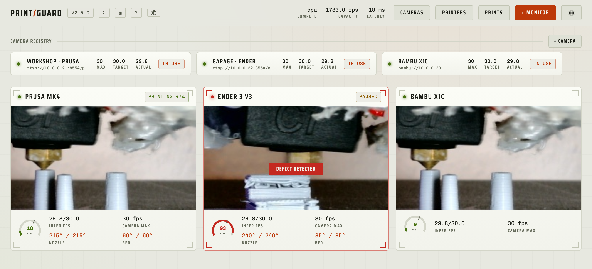
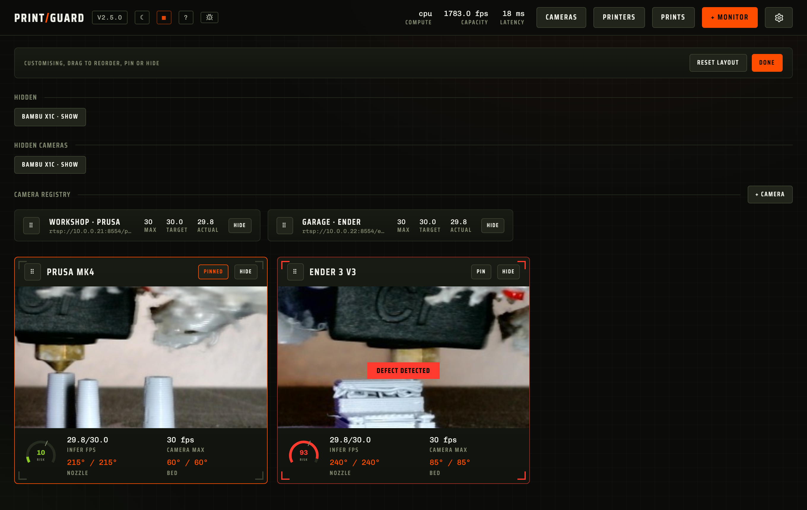
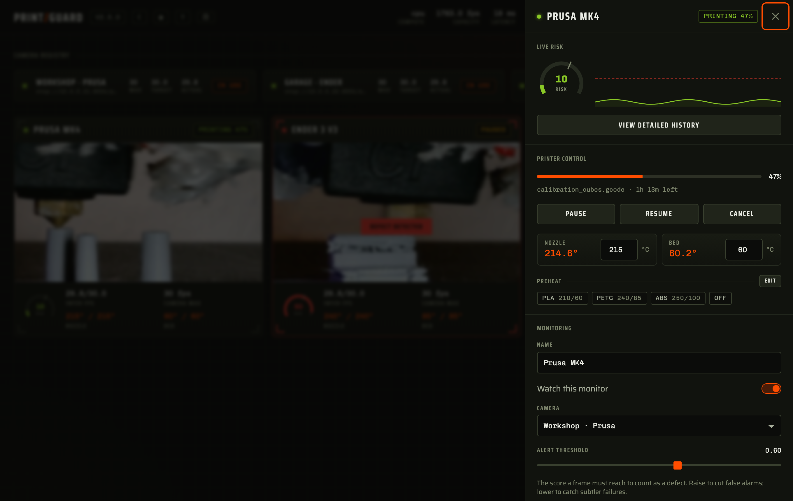

<div align="center">

# PrintGuard

**Catches failing 3D prints on your own hardware, pauses the printer, and tells you why.**

[](https://github.com/oliverbravery/PrintGuard/releases/latest)
[](https://github.com/oliverbravery/PrintGuard/stargazers)
[](LICENSE.md)
[](https://github.com/oliverbravery/PrintGuard/pkgs/container/printguard)
[](https://oliverbravery.github.io/PrintGuard/)
[](https://github.com/sponsors/oliverbravery)

[Live demo](https://oliverbravery.github.io/PrintGuard/) · [Quick start](#quick-start) · [Documentation](docs/README.md) · [Troubleshooting](docs/troubleshooting.md) · [Contributing](CONTRIBUTING.md) · [Sponsor](#sponsor)

</div>

A compact vision model scores every camera frame on the machine you run it on. When a defect
holds for long enough, PrintGuard pauses or cancels the print through your print server and
pushes a snapshot to your phone. No cloud, no subscription, no account, and your camera
frames never leave hardware you own.



## Contents

- [Try it now, nothing to install](#try-it-now-nothing-to-install)
- [What you get](#what-you-get)
- [Quick start](#quick-start)
  - [Desktop app for macOS and Windows](#desktop-app-for-macos-and-windows)
  - [Docker for an always-on server or NAS](#docker-for-an-always-on-server-or-nas)
- [Two modes, one engine](#two-modes-one-engine)
- [Make it yours](#make-it-yours)
- [Printers, cameras and alerts](#printers-cameras-and-alerts)
- [Hardware acceleration](#hardware-acceleration)
- [Exposing a hub safely](#exposing-a-hub-safely)
- [Home Assistant](#home-assistant)
- [Automate it with MCP and the API](#automate-it-with-mcp-and-the-api)
- [How the detector works](#how-the-detector-works)
- [Documentation](#documentation)
- [Contributing](#contributing)
- [Sponsor](#sponsor)
- [Licence](#licence)

## Try it now, nothing to install

**[oliverbravery.github.io/PrintGuard](https://oliverbravery.github.io/PrintGuard/)** runs the
*entire* engine in your browser. Point your webcam at a print and watch it score each frame
live. Nothing is installed and no frame leaves your device. When you are ready to run it for
real, [jump to Quick start](#quick-start).

## What you get

- **Failures caught early.** A compact vision model scores every frame and acts the moment a
  defect holds, so spaghetti and detachments do not run for hours, or burn through a spool.
- **Damage stopped for you.** A sustained defect can pause or cancel the print through
  OctoPrint, Klipper, Elegoo, Prusa or Bambu Lab, with sensitivity, thresholds and cooldowns
  you set per monitor.
- **A heads-up on your phone.** The instant a defect holds, a snapshot lands over ntfy,
  Telegram or Discord.
- **Quiet when nothing is wrong.** Printers linked to a service are only watched while they
  actually print. Inference rests when they are idle and wakes when a job starts.
- **Loud when something is.** A dropped camera, frozen feed or unresponsive printer warns you
  on the dashboard *and* your phone. If PrintGuard cannot tell whether a printer is printing,
  it keeps watching: losing the signal never silently stops monitoring.
- **Every printer on one screen.** One machine shares inference fairly across as many cameras
  as your hardware can sustain.

## Quick start

### Desktop app for macOS and Windows

The easiest way to run a hub on the computer next to your printer: a native app, no Docker
and no terminal. It lives in your menu bar or system tray, so closing the window leaves the
hub running and the printer watched. Reach it from your phone on the same network at
`http://<computer>:8000`.

<div align="center">

[](https://github.com/oliverbravery/PrintGuard/releases/latest/download/PrintGuard-macos-arm64.dmg)
&nbsp;
[](https://github.com/oliverbravery/PrintGuard/releases/latest/download/PrintGuard-windows-x64.zip)

</div>

Turn on **Start at login** from the tray menu and forget about it.

> [!NOTE]
> The builds are unsigned for now, so the first launch needs one approval. On macOS,
> double-click the app, then open **System Settings → Privacy & Security** and click
> **Open Anyway** under *Security*. On Windows, choose **More info → Run anyway**. On Linux,
> run the [Docker hub](#docker-for-an-always-on-server-or-nas) instead.

### Docker for an always-on server or NAS

PrintGuard is a single container:

```bash
docker run -d --name printguard --restart unless-stopped \
  -p 8000:8000 -p 8554:8554 \
  -v printguard:/data \
  ghcr.io/oliverbravery/printguard
```

Open `http://<host>:8000`, register a camera and your printer, then add a monitor that binds
them.

| Platform | How |
|---|---|
| **Unraid** | Add **PrintGuard** from Community Applications, or import the [template](templates/printguard.xml), and install from the UI. No terminal needed |
| **Docker Compose** | `curl -fsSLO https://raw.githubusercontent.com/oliverbravery/PrintGuard/main/docker-compose.yaml && docker compose up -d` |
| **Anything else** | The `docker run` above. Images are published for `amd64` and `arm64`, including Raspberry Pi 4 and 5 |

Port `8554` only matters for cameras that *push* RTSP into PrintGuard, and `-p 1935:1935`
for an RTMP push. Most setups pull from a URL or use a printer's own camera and need neither.

## Two modes, one engine

The same detection engine runs in two places. Try it instantly in the browser, then
self-host it when you are ready.

| | Local mode | Hub mode |
|---|---|---|
| Engine runs | In your browser, on Pyodide | On the server, on CPython |
| Model runs | [LiteRT.js in WASM](https://developers.google.com/edge/litert) | [LiteRT](https://github.com/google-ai-edge/LiteRT) or [ONNX Runtime](https://onnxruntime.ai/) |
| Frames leave the device | Never | Only to your own server |
| Survives closing the tab | No | Yes |
| Cameras | This device's webcams | Any stream, plus printer cameras |
| Printers | OctoPrint and Klipper | All of them |

The **desktop app** is hub mode without the setup: the same persistent engine as the
container, in a native window on your own computer.

## Make it yours

Choose **System**, **Light**, **Dark**, or design your own in the built-in theme editor.
Themes are saved on the hub and follow every browser that opens it.

<table>
<tr>
<td width="50%"></td>
<td width="50%"></td>
</tr>
<tr>
<td align="center"><b>Dark</b></td>
<td align="center"><b>Light</b></td>
</tr>
</table>

Tap **Customise** to arrange the dashboard around how *you* work: drag monitors into any
order, **pin** the ones that matter to the front, and **hide** the rest, with a tray to bring
them back. The camera rail rearranges the same way.



Open any monitor for its live risk score, score history and one-tap printer controls.



## Printers, cameras and alerts

Register your printer, bind it to a monitor, and choose what a sustained defect does: alert,
pause or cancel. If a printer exposes a webcam, PrintGuard adds it as a camera for you.

| | Supported |
|---|---|
| **Print services** | OctoPrint, Klipper via Moonraker, Elegoo, Prusa via PrusaLink, Bambu Lab |
| **Cameras** | Printer webcams, RTSP, RTMP, HTTP/MJPEG, WHEP, anything pushed to the bundled MediaMTX, and the browser's own camera |
| **Alerts** | ntfy, Telegram, Discord, and native notifications in the desktop app |

Connecting over Docker or HTTPS, and linking an Elegoo, Prusa or Bambu printer, each have a
gotcha or two. The full walk-through is in
**[docs/printers.md](docs/printers.md)**.

## Hardware acceleration

Hub and desktop mode carry both LiteRT and ONNX models and benchmark them on your machine at
start, keeping whichever is faster. ONNX Runtime then uses the best provider available: Core
ML on macOS, Windows ML on Windows 11 24H2 or newer, OpenVINO on Intel, TensorRT on NVIDIA.
Two extra image tags exist for GPUs:

```bash
ghcr.io/oliverbravery/printguard:latest-intel    # with --device /dev/dri
ghcr.io/oliverbravery/printguard:latest-nvidia   # with --gpus all
```

Which tag to pull, what each provider needs and how to pin a runtime:
**[docs/hardware.md](docs/hardware.md)**.

## Exposing a hub safely

> [!WARNING]
> PrintGuard ships no authentication. Anyone who can reach the hub sees every camera and can
> pause or cancel your printers. Never port-forward it.

Put an identity layer in front instead. **[docs/deployment.md](docs/deployment.md)** has
step-by-step setups for **Tailscale**, which is the recommendation for a private hub,
**Cloudflare Tunnel with Access**, and **oauth2-proxy**, plus a hardening checklist.

## Home Assistant

Point the hub at your MQTT broker under **Settings → Home Assistant** and every monitor
appears in Home Assistant automatically through MQTT discovery: a defect sensor, the defect
score, the latest failure snapshot, an **Enabled** switch, and for linked printers live
status with **Pause**, **Resume** and **Cancel**. Control is two-way, so your automations can
drive PrintGuard. The broker is yours and the bridge runs on the hub, so no frames leave your
hardware.

## Automate it with MCP and the API

A hub exposes its engine to agents and scripts over the same protocol the dashboard uses, so
anything the UI can do is automatable. Point an MCP client at `https://<host>/mcp/`, or use
the REST API at `/api/v1`. Both read printer and camera status, fetch the **current frame as
an image**, and pause, resume or cancel.

Capability is per token: issue scoped bearer tokens, `read` ⊂ `control` ⊂ `manage`, from
**Settings**, and an agent only gets what you grant. Uptime monitors can poll the
unauthenticated `GET /api/health` for readiness and the installed version. Full reference:
**[docs/api.md](docs/api.md)**.

## How the detector works

The detector is a ShuffleNetV2 encoder classified by nearest prototype, trained for few-shot
FDM fault detection in
[Edge-FDM-Fault-Detection](https://github.com/oliverbravery/Edge-FDM-Fault-Detection), which
has an accompanying technical paper. The sensitivity and threshold sliders map straight onto
the prototype distances, so you can tune for your camera and lighting without retraining.

## Documentation

| Page | Covers |
|---|---|
| [docs/printers.md](docs/printers.md) | Printers, cameras, notification channels, and the networking caveats |
| [docs/hardware.md](docs/hardware.md) | Image variants, model runtimes, GPU and NPU acceleration |
| [docs/deployment.md](docs/deployment.md) | Reaching a hub from outside your LAN, and hardening it |
| [docs/troubleshooting.md](docs/troubleshooting.md) | Symptom-first fixes, and how to pull logs and diagnostics |
| [docs/api.md](docs/api.md) | REST API and MCP server, scoped tokens, every endpoint and tool |
| [docs/architecture.md](docs/architecture.md) | One engine on two runtimes, the platform contract, the scheduler, the fail-safe design |
| [CHANGELOG.md](CHANGELOG.md) | What changed in every release |

## Contributing

Dev setup, tests, and step-by-step guides for adding a printer integration or a notification
provider are in **[CONTRIBUTING.md](CONTRIBUTING.md)**. Issues and pull requests are welcome.

## Sponsor

PrintGuard is free, GPL-2.0, and has no paid tier. It has one cost I cannot design around:
Apple charges $99 a year for the Developer Program, and without it the macOS app cannot be
signed or notarised. That is why macOS warns you that PrintGuard is from an unidentified
developer, and why the first launch takes a trip through System Settings.

[**Sponsoring the project**](https://github.com/sponsors/oliverbravery) fixes that. Sustained
sponsorship of $10 a month covers the licence across the year and removes that warning for
everyone; anything past it goes on the hardware the integrations get tested against. One-off
and monthly both work, and nothing in PrintGuard is ever locked behind it.

## Licence

[GPL-2.0-only](LICENSE.md).
