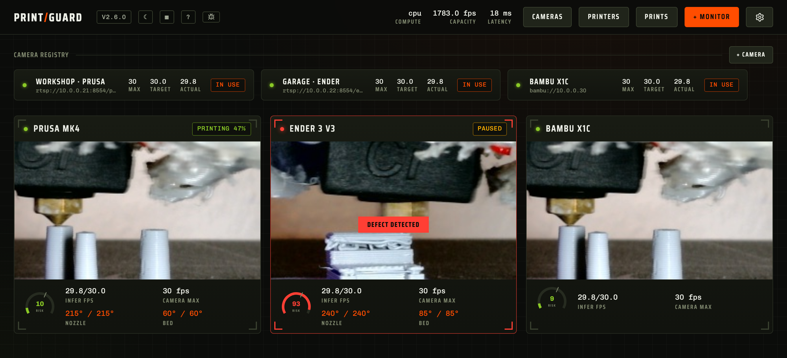
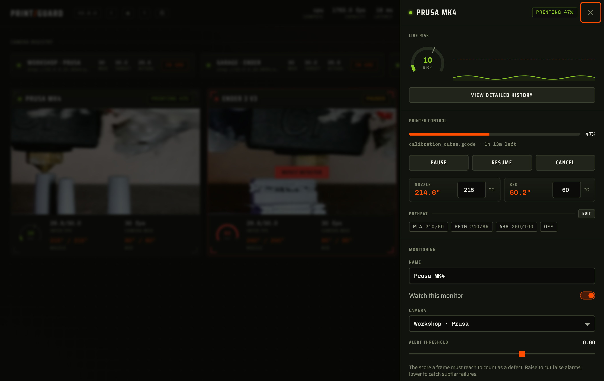
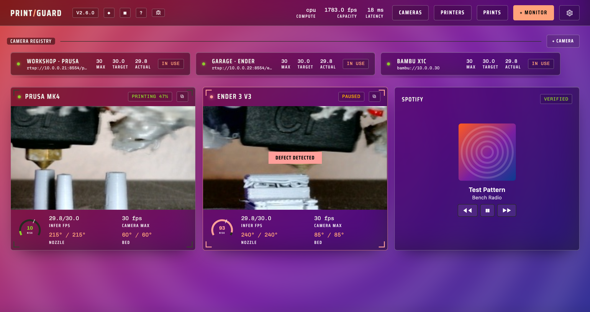
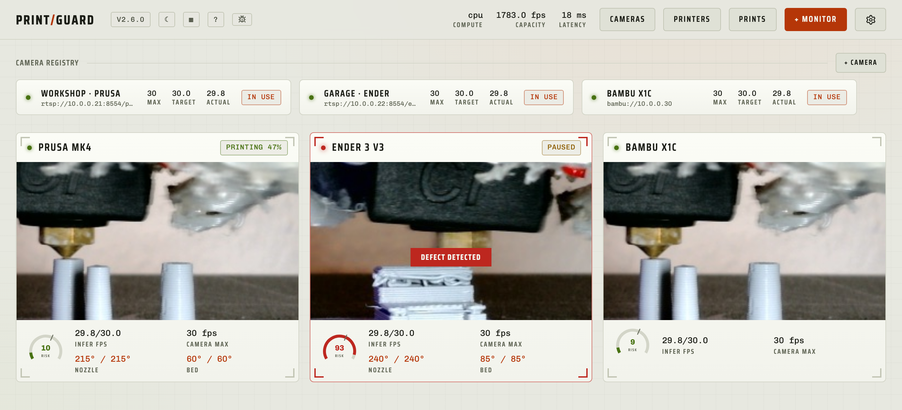
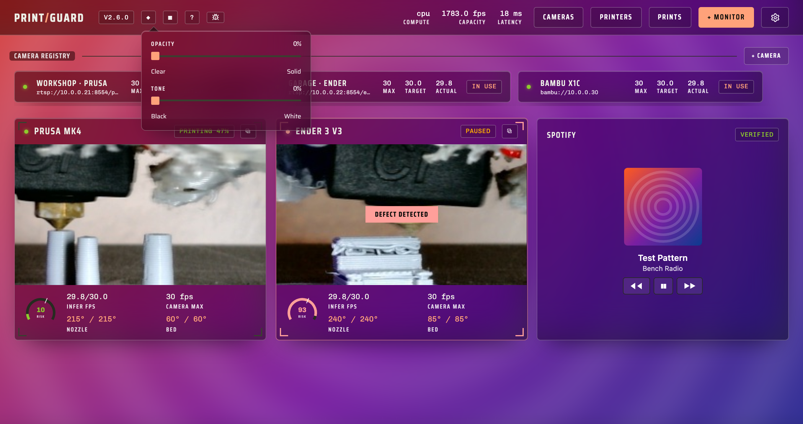
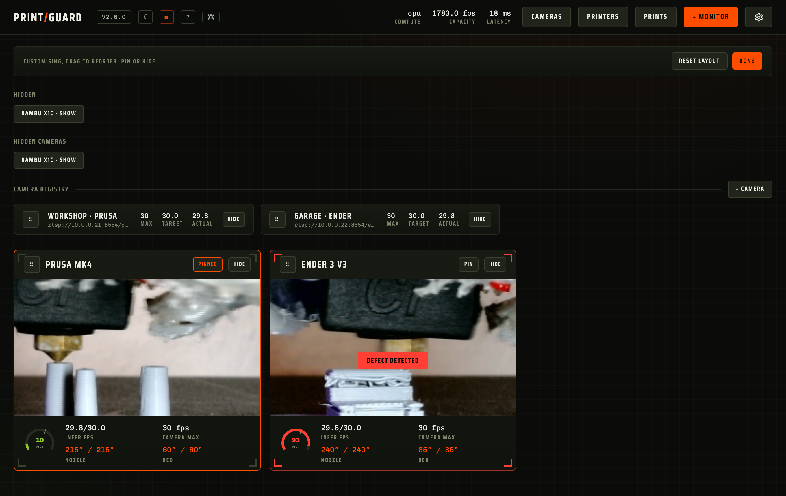

<div align="center">

# PrintGuard

Catches failed 3D prints on your own hardware, pauses the printer and sends you a snapshot alert.

[](https://github.com/oliverbravery/PrintGuard/releases/latest)
[](https://github.com/oliverbravery/PrintGuard)
[](LICENSE.md)
[](https://github.com/oliverbravery/PrintGuard/pkgs/container/printguard)
[](https://oliverbravery.github.io/PrintGuard/)
[](https://github.com/sponsors/oliverbravery)

[Website](https://oliverbravery.github.io/PrintGuard/) · [Quick start](#quick-start) · [Features](#what-it-does) · [Documentation](#documentation) · [Troubleshooting](docs/troubleshooting.md) · [Contributing](CONTRIBUTING.md) · [Sponsor](#sponsor)

</div>

A compact vision model scores every camera frame on the machine you run it on. When a defect
holds for long enough, PrintGuard pauses or cancels the print through your print server and
pushes a snapshot to your phone. There's no cloud and no subscription, and your camera frames
stay on hardware you own unless you choose to [send some to help train the model](docs/feedback.md).

The detector is my own, a ShuffleNetV2 encoder of about 5 MB trained for this in
[Edge-FDM-Fault-Detection](https://github.com/oliverbravery/Edge-FDM-Fault-Detection). Against
Obico's Spaghetti Detective, the only other open model, over the same four unseen test sets:

| On a Raspberry Pi 4B | PrintGuard | Spaghetti Detective |
|---|---|---|
| Accuracy | 93.6% | 53.8% |
| F1 score | 0.937 | 0.411 |
| Images a second | 15.1 | 0.35 |

43x the throughput and more than double the F1. Method and results are in the
[dissertation](https://github.com/oliverbravery/Edge-FDM-Fault-Detection/blob/main/dissertation.pdf).



## What it does

| | |
|---|---|
| Detect | Scores every frame on your own CPU, GPU or NPU and shares one model across as many cameras as the hardware can sustain. Only watches while a linked printer is printing |
| Act | Pauses or cancels the print through OctoPrint, Klipper, Elegoo, Prusa or Bambu Lab once a defect holds |
| Alert | Sends a snapshot over ntfy, Pushover, Telegram or Discord, and warns you when a camera drops, a feed freezes or a printer stops answering |
| Control | Shows temperatures and progress, preheats with one tap, and keeps a library of sliced files you can preview in 3D and start on an idle printer |
| Tune | Sets the threshold, how long a defect must hold and the cooldown for each monitor, against a history of its risk score and a snapshot of every alert |
| Automate | Appears in Home Assistant over MQTT and takes commands from a REST API or an MCP server, with scoped tokens |
| Extend | Runs sandboxed JavaScript plugins from an in-app store, with only the permissions you grant |
| Make it yours | Has light, dark and glass themes with a theme editor, a dashboard you can rearrange, and a layout that fits a phone |

## Quick start

PrintGuard runs as a hub, a small server on a machine you own that keeps watching with every
browser closed. The macOS app is for Apple silicon. The desktop app and the Docker image are the same hub, so pick whichever suits
the machine next to your printer.

### Desktop app for macOS and Windows

A hub on the computer next to your printer, with no Docker and no terminal. It lives in the
menu bar or system tray, so closing the window leaves the printer watched. Reach it from your
phone at `http://<computer>:8000`.

<div align="center">

[](https://github.com/oliverbravery/PrintGuard/releases/latest/download/PrintGuard-macos-arm64.dmg)
&nbsp;
[](https://github.com/oliverbravery/PrintGuard/releases/latest/download/PrintGuard-windows-x64.zip)

</div>

Turn on **Start at login** from the tray menu and forget about it.

> [!NOTE]
> The macOS app is signed and notarised. The Windows build is unsigned for now, so on its
> first launch choose **More info** and then **Run anyway**. On Linux, run the
> [Docker hub](#docker-for-an-always-on-server-or-nas) instead.

### Docker for an always-on server or NAS

PrintGuard is a single container:

```bash
docker run -d --name printguard --restart unless-stopped \
  -p 8000:8000 -p 8554:8554 \
  --add-host host.docker.internal:host-gateway \
  -v printguard:/data \
  ghcr.io/oliverbravery/printguard
```

Then open `http://<host>:8000`.

| Platform | How |
|---|---|
| Unraid | Add **PrintGuard** from Community Applications, or import the [template](templates/printguard.xml), and install from the UI. No terminal needed |
| Docker Compose | `curl -fsSLO https://raw.githubusercontent.com/oliverbravery/PrintGuard/main/docker-compose.yaml && docker compose up -d` |
| Anything else | The `docker run` above. Images are published for `amd64` and `arm64`, including Raspberry Pi 4 and 5 |

GPU images, ports for cameras that push a stream and passing in a USB webcam are covered in
[hardware](docs/hardware.md), [deployment](docs/deployment.md) and [cameras](docs/cameras.md).

> [!WARNING]
> PrintGuard has no authentication of its own, so never port-forward it. To reach it from
> outside your network, see [exposing a hub safely](#exposing-a-hub-safely).

### First five minutes

A walkthrough opens on first load and a checklist on the dashboard tracks these until your first
monitor is watching.

1. Add a camera under **Cameras**, and crop it to the print.
2. Register your printer under **Printers** and test the connection.
3. Enable an alert channel in **Settings**.
4. Add a monitor that binds the camera and printer. Choose whether a defect alerts you, pauses or
   cancels, and turn on its push notifications.

## Printers and cameras

Register your printer once and bind it to a monitor. If it exposes a webcam, PrintGuard adds it
as a camera for you.

| | Supported |
|---|---|
| Print services | OctoPrint, Klipper via Moonraker, Elegoo, Prusa via PrusaLink, Bambu Lab |
| Cameras | Printer webcams, USB cameras plugged into the hub, RTSP, RTMP, HTTP/MJPEG, WHEP and a phone's or laptop's own camera |
| Alerts | ntfy, Pushover, Telegram, Discord, and native notifications in the desktop app |

Bambu, Elegoo and Prusa printers are reached over their local APIs and never their clouds. [docs/printers.md](docs/printers.md) has the setup for each service,
[docs/cameras.md](docs/cameras.md) each camera source and
[docs/notifications.md](docs/notifications.md) each alert channel.

## Tune every monitor

Open a monitor for its live risk score and printer controls. Each one has its own alert
threshold, the number of flagged frames in a row it takes to act, a cooldown and a response of
alert, pause or cancel. Its history page charts the score over the last hour, 6 hours or 24
hours beside a snapshot of every alert, so you can pick values from what your own camera saw.
When a print ends you can label a few of its frames and [send them](docs/feedback.md) to help
train the model.



Each camera can be rotated, cropped to the square the model watches and adjusted for brightness,
contrast and sharpness. Its detection rate can be lowered to cut the load on a shared host.
[docs/monitoring.md](docs/monitoring.md) covers what each setting does and how to choose values.

## Print library

Drop sliced files onto the hub and each one opens in a panel that draws its toolpath on your
device before it's uploaded, where you can name it and correct its nozzle and bed temperatures.
Open a file to orbit the toolpath in 3D, layer by layer, with the print time and filament the
slicer wrote into it.


Tag a file with the printers it was sliced for and it can only start on those, and a printer has
to be idle before a file is sent to it. OctoPrint, Klipper and Elegoo take gcode, PrusaLink also
takes bgcode and Bambu Lab takes a sliced 3mf.
[docs/printers.md](docs/printers.md#sending-prints) has the details.

## Home Assistant

Point the hub at your MQTT broker in Settings and every monitor appears in Home Assistant
through MQTT discovery, with a defect sensor, the score, the latest snapshot and an **Enabled**
switch. A linked printer adds its status, progress and temperatures, with **Pause**, **Resume**
and **Cancel**. Control is two-way, so your automations can drive PrintGuard.
[docs/api.md](docs/api.md#home-assistant) lists every entity.

## MCP and the REST API

An agent or a script can watch and control your printers. Point an MCP client at
`https://<host>/mcp/`, or use the REST API at `/api/v1`. Both read printer and camera status,
fetch the current frame as an image, score a frame you supply, pause, resume or cancel, set a
heater target and start a file from the print library.

Tokens are scoped and issued from Settings. `read` covers status, camera frames and the print
library, `control` adds the printer actions and `manage` adds the rest. `GET /api/health` needs no token and reports readiness and
version. [docs/api.md](docs/api.md) has the full reference.

## Plugins

Plugins are written in JavaScript and run in a sandbox. Install verified ones from the store in
Settings, or from a GitHub repo or a zip. They ask for fine-grained permissions when you enable
them, and you can take those back at any time.

Four are in the store:

- **Picture in picture** floats a camera above your other windows
- **Alert sounds** plays a horn the moment a defect is caught
- **Progress reports** sends a tally of a print through your alert channels
- **Spotify** puts the cover of what you are playing behind the dashboard



[docs/plugins.md](docs/plugins.md) covers installing them and what they can reach. Writing one
takes no build step and no dependencies, and
[docs/plugin-development.md](docs/plugin-development.md) has the API.

## Themes and layout

Choose **System**, **Light**, **Dark** or **Glass**, or design your own in the theme editor.
Themes are saved on the hub and follow every browser that opens it.

<table>
<tr>
<td width="50%"></td>
<td width="50%"></td>
</tr>
<tr>
<td align="center"><b>Light</b></td>
<td align="center"><b>Glass</b></td>
</tr>
</table>

Tap **Customise** to drag monitors into any order, pin the ones that matter to the front and hide
the rest. The camera rail rearranges the same way.



The dashboard fits phones and tablets, works from the keyboard and with a screen reader, and
meets WCAG 2.2 AA contrast. A guide behind the **?** in the header explains every part of it.

## Hardware acceleration

A Raspberry Pi 4 handles a camera or two on its CPU. PrintGuard carries both
[LiteRT](https://github.com/google-ai-edge/LiteRT) and [ONNX Runtime](https://onnxruntime.ai/)
models and benchmarks them on your machine at start, keeping whichever is faster. ONNX Runtime
then uses the best provider available: Core ML on macOS, Windows ML on Windows 11 24H2 or newer,
OpenVINO on Intel, TensorRT on NVIDIA. Two extra image tags exist for GPUs:

```bash
ghcr.io/oliverbravery/printguard:latest-intel    # with --device /dev/dri
ghcr.io/oliverbravery/printguard:latest-nvidia   # with --gpus all
```

[docs/hardware.md](docs/hardware.md) covers which tag to pull, what each provider needs and how
to pin a runtime.

## Exposing a hub safely

Anyone who can reach the hub sees every camera and can pause or cancel your printers, so put an
identity layer in front before it leaves your network. [docs/deployment.md](docs/deployment.md)
walks through Tailscale, which is what I use for a private hub, alongside Cloudflare Tunnel with
Access and oauth2-proxy, and ends with a hardening checklist.

## Updates and support

The hub checks GitHub once a day and the version chip in the header turns into an update badge,
with the changelog for every release behind it. The bug icon beside it sends me an anonymous
report, or downloads the same diagnostics as a zip with every credential stripped.
[docs/troubleshooting.md](docs/troubleshooting.md) lists symptoms and fixes.

## Documentation

| Page | Covers |
|---|---|
| [Printers](docs/printers.md) | Connecting each print service, sending prints, temperatures and preheat |
| [Cameras](docs/cameras.md) | Printer webcams, stream URLs, USB cameras and a browser's own camera |
| [Monitoring](docs/monitoring.md) | Thresholds, defect response, framing the camera and risk history |
| [Notifications](docs/notifications.md) | Alert channels, what gets sent and the fault grace period |
| [Training frames](docs/feedback.md) | Sending labelled frames to help train the model, what's sent and the limits |
| [Hardware](docs/hardware.md) | Image variants, model runtimes, GPU and NPU acceleration |
| [Deployment](docs/deployment.md) | Reaching a hub from outside your LAN, hardening it, environment variables and backups |
| [API & MCP](docs/api.md) | REST API, MCP server and Home Assistant, with scoped tokens |
| [Plugins](docs/plugins.md) | Installing plugins and what they can reach |
| [Writing plugins](docs/plugin-development.md) | The plugin API, both sandboxes and publishing to the catalogue |
| [Architecture](docs/architecture.md) | The engine and its protocol, the platform contract, the scheduler, the fail-safe design |
| [Troubleshooting](docs/troubleshooting.md) | Symptom-first fixes, and how to pull logs and diagnostics |
| [Changelog](CHANGELOG.md) | What changed in every release |

## Contributing

Dev setup, tests, and step-by-step guides for adding a printer integration or a notification
provider are in [CONTRIBUTING.md](CONTRIBUTING.md). Issues and pull requests are welcome.

## Sponsor

PrintGuard is free, GPL-2.0 and has no paid tier.
[Sponsoring the project](https://github.com/sponsors/oliverbravery) helps me keep working on
it and goes on the hardware the integrations get tested against. One-off and monthly both work,
and nothing in PrintGuard is ever locked behind it.

## Licence

[GPL-2.0-only](LICENSE.md).
