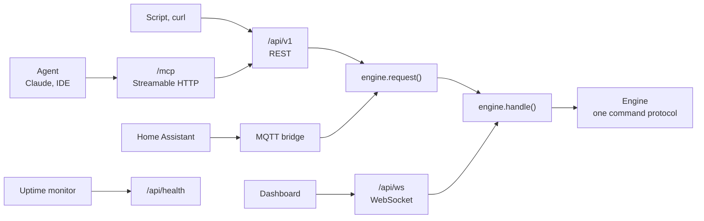

<div align="center">

# API and MCP

[Docs](README.md) · [Printers](printers.md) · [Cameras](cameras.md) · [Monitoring](monitoring.md) · [Notifications](notifications.md) · [Training frames](feedback.md) · [Hardware](hardware.md) · [Deployment](deployment.md) · **API & MCP** · [Plugins](plugins.md) · [Writing plugins](plugin-development.md) · [Architecture](architecture.md) · [Troubleshooting](troubleshooting.md)

</div>

A hub exposes its engine to scripts, agents and Home Assistant. Each transport sends the same
commands the dashboard sends, so none can drift from the UI.

- [Surfaces](#surfaces)
- [Health and version](#health-and-version)
- [Authentication and scopes](#authentication-and-scopes)
- [REST API](#rest-api)
- [MCP server](#mcp-server)
- [Home Assistant](#home-assistant)
- [The resource model](#the-resource-model)
- [Reading detection state](#reading-detection-state)

## Surfaces



| Surface | Endpoint | Auth |
|---|---|---|
| MCP server | `/mcp`, Streamable HTTP | Bearer token |
| REST API | `/api/v1` | Bearer token |
| Health probe | `/api/health` | None |
| Home Assistant | Your MQTT broker | Broker credentials |

The MCP tools are derived from the REST routes and call them in process. The three image tools
are the exception and read the engine directly.

## Health and version

`GET /api/health` is the unauthenticated readiness endpoint for uptime checks and update
monitors. The response is never cached and carries the installed version:

```json
{"ok": true, "version": "X.Y.Z"}
```

It returns `200 OK` only once the engine has started. Camera, printer and notifier health
live behind the authenticated API and deliberately do not affect this probe.

## Authentication and scopes

PrintGuard has no identity layer of its own, so put a proxy in front of the hub first
([Deployment](deployment.md)). On top of that, this surface is gated by capability scopes.

Scopes are cumulative:

| Scope | Grants |
|---|---|
| `read` | Status of monitors, printers and cameras, the current camera frame, risk history and alert snapshots, recent events, the print library, and classifying a frame you supply |
| `control` | Everything in `read`, plus pause, resume and cancel, setting a heater target, and starting a file from the print library |
| `manage` | Everything in `control`, plus adding, editing and removing cameras, printers, monitors and print files, changing settings, testing services and discovering cameras |

Issue tokens from the **API** tab in Settings. Name a token, choose its scope and
press **Generate**. The secret, a string starting `pg_`, is only shown once:

```http
Authorization: Bearer pg_Zr8...agent
```

| Token state | Behaviour |
|---|---|
| No tokens issued, the default | The surface is read-only and trusts whatever fronts it. Control and management stay closed |
| Any token issued | A valid bearer is required for every request, and its scope decides what it reaches. MCP answers `401` before a session opens and hides the tools a token cannot use. The schema at `/api/v1/openapi.json` describes the API and holds nothing from your hub, so it stays open |

> [!IMPORTANT]
> Only a hash of a token is stored, beside its first 10 characters as a hint, so a lost token
> cannot be recovered. Revoke it and issue another. Revocation is immediate. No REST route or
> MCP tool issues or revokes a token, so an agent holding a `manage` token can drive printers
> and cameras but cannot mint or escalate tokens. A plugin you grant
> [`tokens`](plugins.md#permissions) can. Serve the hub over HTTPS so tokens never travel in
> clear.

## REST API

Base path `/api/v1`. JSON in and out, except the camera frame and alert snapshot, which are
`image/jpeg`, the print file download, and the frame and print file you upload as a raw body.
The OpenAPI schema is served at `/api/v1/openapi.json`. There are no interactive docs pages, so the hub loads nothing from a third party.

Adding or removing a camera, printer or monitor returns the collection, as do removing a print
file and `/cameras/refresh-printers`. Every other change returns the one thing it changed, which
for `/prints/{id}/start` is the printer. The two test routes return the engine's `printer_test`
or `notify_test` event as it was sent, `event` and `req_id` included.

| Status | When |
|---|---|
| `400` | The engine refused the command. That covers updating, removing or starting an id nothing matches, binding a monitor to a camera or printer that isn't registered, a value a setting doesn't take such as a `rotation` of 45, a file the library doesn't take and an image that can't be decoded |
| `401` | A missing or invalid token, once a token has been issued. With none issued a missing token is never a `401`, so read routes answer and control and manage routes are a `403` |
| `403` | A token whose scope is too narrow |
| `404` | A read of an id nothing matches, and a printer action or heater target for a printer that isn't registered |
| `413` | A frame over 32 MB or a print file over 512 MB |
| `422` | A body of the wrong shape, which includes `NaN` or `Infinity` anywhere in a JSON body, a printer's `config`, a channel's config, `mqtt` or a preheat preset among them. In an upload's `nozzle` or `bed` it is a `400` |
| `504` | The engine did not finish in time |

A field a body doesn't list is ignored, a field of the body sent as `null` is left as it was,
and a number outside its range is moved to the nearest end of it. A number sent as text or `true`
is refused with a `422`, never converted. Three more are refused instead of moved, a
heater target outside 0 to 350 for the nozzle or 0 to 150 for the bed, an `mqtt` `port` that isn't
a whole number from 1 to 65535 and `mqtt` enabled with no `host`.

The engine sets how long each command may take, so the REST API, MCP server and plugins all wait
the same:

| Request | Waits up to |
|---|---|
| A printer action or heater target | 15 s, and 105 s on an Elegoo printer, since a Centauri Carbon 2 answers a resume only once it has reheated |
| Adding a camera | 40 s, for a first frame |
| `/cameras/refresh-printers` | 115 s, since each printer's cameras open one at a time |
| Switching `inference_runtime` in `PATCH /settings` | 85 s, while the frames in flight finish and the model loads |
| Uploading a print file | 120 s once the body has arrived |
| `/prints/{id}/start` | 600 s, while the file is sent to the printer |
| Any other change, and the risk history | 15 s |

The dashboard's socket applies none of these and waits as long as a command takes.

A hub opened at a name it doesn't know, such as a public domain, answers `403` to every
request, this API included, until that name is in
[`PRINTGUARD_ORIGINS`](deployment.md#host-and-origin-checking).

<details open>
<summary><b>Read</b></summary>

| Method | Path | Description |
|---|---|---|
| `GET` | `/state` | Full snapshot: cameras, printers, monitors, prints, print reviews, plugins, settings, stats, the update status and what the dashboard draws its forms from. `startup_warnings` lists what the hub found wrong at start, such as a GPU it skipped, a setting it reset or a record it dropped, each with its reason, and it is kept until the hub restarts. [Architecture](architecture.md#the-protocol) lists the fields and [the resource model](#the-resource-model) what is left out |
| `GET` | `/monitors` | List monitors with camera, linked printer and latest alert |
| `GET` | `/monitors/{id}` | One monitor |
| `GET` | `/monitors/{id}/history` | Its [risk history](monitoring.md#risk-history): one-minute buckets, each with the seconds `watched` in it, the alert log, the snapshot index and summary stats. `watch_min` in the stats is the time the readings spanned in whole minutes, leaving out gaps of more than 30 seconds |
| `GET` | `/monitors/{id}/snapshots/{snap_id}` | The snapshot taken at one alert, as `image/jpeg`. `404` when the monitor has no such snapshot or its file has gone from the hub, and the answer names no path |
| `GET` | `/printers` | List registered printers with status, progress and job |
| `GET` | `/printers/{id}` | One printer |
| `GET` | `/cameras` | List cameras with rate, health and latest classification |
| `GET` | `/cameras/{id}` | One camera |
| `GET` | `/cameras/{id}/frame` | Freshest frame as `image/jpeg`. `404` while the camera is on standby or offline, since it has no current frame |
| `POST` | `/classify` | Classify a supplied frame, a JPEG or PNG body of up to 32 MB and 50 megapixels. No registered camera needed. A file over 32 MB is a `413`, and one over 50 megapixels or that isn't a JPEG or PNG is a `400` |
| `GET` | `/prints` | List the print library, each file with its format, size, tags and what the slicer wrote into it |
| `GET` | `/prints/{id}` | One print file |
| `GET` | `/prints/{id}/file` | Download a print file as the library keeps it |
| `GET` | `/events` | The last 100 alerts, warnings and errors. A printer's status and progress are in `/printers` |

</details>

<details>
<summary><b>Control</b></summary>

| Method | Path | Description |
|---|---|---|
| `POST` | `/printers/{id}/action` | `{"action": "pause" \| "resume" \| "cancel"}` |
| `POST` | `/printers/{id}/heat` | `{"nozzle", "bed"}` in °C, at least one of them, 0 turning a heater off. A target above 350 for the nozzle or 150 for the bed, or one that isn't a number, is refused with a `400`, as is one for a service that cannot set targets |
| `POST` | `/prints/{id}/start` | `{"printer_id"}`, sends the file to that printer and starts it. Refused unless the printer is idle and prints the format. A file tagged for printers only starts on those, and one with no tags starts on any |

</details>

<details>
<summary><b>Manage</b></summary>

| Method | Path | Description |
|---|---|---|
| `POST` | `/monitors` | Add a monitor, binding a camera and an optional printer |
| `PATCH` | `/monitors/{id}` | Update a monitor |
| `DELETE` | `/monitors/{id}` | Remove a monitor |
| `POST` | `/printers` | Register a printer. Refused with the field named if one the service requires is blank |
| `PATCH` | `/printers/{id}` | Update a printer. `config` replaces the stored one, [keeping the secrets a read left out](#the-resource-model) |
| `DELETE` | `/printers/{id}` | Remove a printer |
| `POST` | `/printers/test` | `{"provider", "config"}`, reachability only. The config is used as sent, so a stored secret is not filled in. Send the key or password with it |
| `POST` | `/cameras` | Add a camera. Refused if its device or stream is already registered, however the address is written, or if the stream delivers no frame. [Cameras](cameras.md#stream-urls) has the errors |
| `PATCH` | `/cameras/{id}` | Update a camera |
| `DELETE` | `/cameras/{id}` | Remove a camera. Refused for one its printer or the deployment manages |
| `POST` | `/cameras/discover` | List attachable, unregistered sources |
| `POST` | `/cameras/refresh-printers` | Register cameras newly exposed by registered printers |
| `POST` | `/prints?filename=` | Upload a sliced file of up to 512 MB as the raw request body. `name`, a comma-separated `printer_ids` and first layer `nozzle` and `bed` temperatures are optional. A file with nothing in it, or a 3mf holding a member compressed with anything but stored or deflate, is refused |
| `PATCH` | `/prints/{id}` | Rename a print file or change the printers it is tagged for |
| `DELETE` | `/prints/{id}` | Remove a print file |
| `PATCH` | `/settings` | Update `notifiers`, `mqtt`, `inference_runtime`, `preheat`, `fault_grace_s`, `update_check` or `feedback`. Each one you send replaces the stored one, [keeping the secrets a read left out](#the-resource-model). A value of the wrong type is a `422`. The theme, layout and plugin catalogue are the dashboard's own and can't be changed here |
| `POST` | `/notifiers/test` | `{"provider", "config"}`, sends a test alert. A secret left out or blank is filled in from the saved channel, [for the address it was saved with](#the-resource-model) |

</details>

The bodies the manage routes take. Every field is optional on a `PATCH`.

| Body | Fields |
|---|---|
| Monitor | `name`, `camera_id`, `printer_id`, `enabled`, `threshold`, `consecutive`, `cooldown_s`, `on_defect`, `notify`. Send `printer_id` as `""` to unlink the printer. [Monitoring](monitoring.md#monitor-settings) has the defaults and ranges |
| New camera | `name` and a `source`, which is `{"kind": "url", "url"}` for a stream or an entry from `/cameras/discover` as it was listed |
| Camera update | `name`, `brightness`, `contrast`, `sharpness`, `rotation` of 0, 90, 180 or 270, `detect_fps`, and `crop` as `{"x", "y", "w", "h"}` in shares of the frame, where the whole frame clears it |
| Printer | `name`, `provider`, `config` |
| Print file update | `name`, `printer_ids` |
| Settings | `notifiers` keyed by channel id, [`mqtt`](#home-assistant), `inference_runtime` of `auto`, `litert` or `onnx`, `preheat` as a list of `{"name", "nozzle", "bed"}`, `fault_grace_s` in seconds (30 to 900, a number outside that is moved to the nearest end), `update_check` as true or false and `feedback` as `ask` or `off` |

`GET /state` lists each printer service and alert channel under `integrations` and `notifiers`,
with the config fields it takes.

```bash
# Status of every printer
curl -H "Authorization: Bearer $TOKEN" https://host/api/v1/printers

# Save the current frame of a camera
curl -H "Authorization: Bearer $TOKEN" https://host/api/v1/cameras/$CAM/frame -o frame.jpg

# Pause a print
curl -X POST -H "Authorization: Bearer $TOKEN" -H "Content-Type: application/json" \
  -d '{"action":"pause"}' https://host/api/v1/printers/$PRINTER/action

# Preheat for PLA
curl -X POST -H "Authorization: Bearer $TOKEN" -H "Content-Type: application/json" \
  -d '{"nozzle":210,"bed":60}' https://host/api/v1/printers/$PRINTER/heat

# Classify a supplied frame, no registered camera needed
curl -X POST -H "Authorization: Bearer $TOKEN" -H "Content-Type: image/jpeg" \
  --data-binary @frame.jpg https://host/api/v1/classify
# gives {"prediction":"success","distances":{...},"margin":1.16,"defect_score":0.08}

# Upload a sliced file tagged for one printer, then start it there
curl -X POST -H "Authorization: Bearer $TOKEN" -H "Content-Type: application/octet-stream" \
  --data-binary @benchy.gcode "https://host/api/v1/prints?filename=benchy.gcode&printer_ids=$PRINTER"
curl -X POST -H "Authorization: Bearer $TOKEN" -H "Content-Type: application/json" \
  -d "{\"printer_id\":\"$PRINTER\"}" https://host/api/v1/prints/$PRINT/start
```

## MCP server

Endpoint `https://<host>/mcp/`, transport **Streamable HTTP**, same bearer token. `/mcp`
without the slash answers the same. Tools mirror the REST operations one to one by
`operation_id`, with the same bodies, answers and refusals, and the list a client sees is
filtered to the scopes its token holds. With no tokens issued that is the `read` tools. Once
any token exists, a request with no valid bearer is a `401` before a session opens.

| Scope | Tools |
|---|---|
| `read` | `get_state`, `list_monitors`, `get_monitor`, `get_monitor_history`, `list_printers`, `get_printer`, `list_cameras`, `get_camera`, `list_prints`, `get_print`, `recent_events` |
| `read` | `get_camera_frame` and `get_monitor_snapshot`, which return the picture as image content an agent can look at. Each fails where its REST route answers `404` |
| `read` | `classify_frame`, which scores a JPEG or PNG of up to 32 MB and 50 megapixels the agent supplies as base64 and needs no registered camera |
| `control` | `control_printer`, `heat_printer`, `start_print` |
| `manage` | `add_monitor`, `update_monitor`, `remove_monitor`, `add_printer`, `update_printer`, `remove_printer`, `test_printer`, `add_camera`, `update_camera`, `remove_camera`, `discover_cameras`, `refresh_printer_cameras`, `update_print`, `remove_print`, `update_settings`, `test_notifier` |

Uploading and downloading a print file carry a binary body, so they are REST only.

Point a client at the endpoint with the token as a bearer header:

```json
{
  "mcpServers": {
    "printguard": {
      "url": "https://host/mcp/",
      "headers": { "Authorization": "Bearer YOUR_TOKEN" }
    }
  }
}
```

Or explore it with the [MCP Inspector](https://github.com/modelcontextprotocol/inspector):

```bash
npx @modelcontextprotocol/inspector
# Transport: Streamable HTTP · URL: https://host/mcp/
# Header: Authorization: Bearer YOUR_TOKEN
```

## Home Assistant

The hub publishes every monitor to your MQTT broker as its own Home Assistant device, through
[MQTT discovery](https://www.home-assistant.io/integrations/mqtt/#device-discovery). It needs
the MQTT integration set up in Home Assistant and no custom component.

1. Open **Settings**, then the **Home Assistant** tab.
2. Turn on **Publish to an MQTT broker** and enter the broker's host.
3. Add a username and password if the broker wants them, and **Use TLS** if it serves it.
4. Press **Save broker settings**, which waits for a host and, if you change the host or port,
   for the password typed again. The devices appear under the MQTT integration.

Leave the port blank for `1883`, or `8883` with TLS. A port that isn't a whole number from 1 to
65535 is refused, and so is turning it on with no host. With TLS the broker's certificate has to be
one the hub's system trusts, so a self-signed one is refused.

| Entity | Type | Appears |
|---|---|---|
| Defect | Binary sensor, problem | Always |
| Defect score | Sensor, 0 to 100% | Always |
| State | Sensor reading `watching`, `idle`, `triggered` or `disabled` | Always |
| Enabled | Switch | Always |
| Snapshot | Camera, the camera's picture as each defect alert fires. Nothing is published if the camera has no frame then | Always |
| Printer | Sensor, the printer's status | With a linked printer |
| Progress | Sensor, % | With a linked printer |
| Pause, Resume, Cancel | Buttons | With a linked printer |
| Nozzle, Bed | Temperature sensors, °C | Once the printer has reported that heater |

Control is two-way, so an automation can arm a monitor or stop a print. A defect or a change in
printer status is published at once, while the score, progress and temperatures are published in
steps of 5, so a monitor never floods Home Assistant's history. Every entity shows as
unavailable while the hub is stopped, the bridge is switched off or the connection is lost.
Commands run side by side, up to 8 at a time and in order for one monitor, so a slow printer holds up only its own buttons.

The base topic defaults to `printguard` and the discovery prefix to `homeassistant`. Change
either in the same tab if your broker is shared. A topic holding `+` or `#` can't be used, and the
bridge reports it once. Give each hub its own base topic if you run two
on one broker, or stopping one marks the other's entities unavailable too.

Removing a monitor removes its device and clears its retained topics. One removed while the
broker is unreachable is cleared when the bridge reconnects, as long as the hub hasn't restarted
in between.

The hub publishes these retained at QoS 1, with `<base>` the base topic and `<prefix>` the
discovery prefix:

| Topic | Carries |
|---|---|
| `<base>/status` | `online` or `offline`, which is also the bridge's last will |
| `<prefix>/device/printguard_<monitor id>/config` | The monitor's discovery payload |
| `<base>/monitor/<monitor id>/state` | JSON the entities read: `enabled`, `watching` and `defect` as `on` or `off`, `state`, `score`, and with a linked printer `printer_status`, `progress`, `job`, `nozzle_temp` and `bed_temp` |
| `<base>/monitor/<monitor id>/snapshot` | The snapshot as a JPEG |

It only subscribes to these two, at QoS 1, and publishes nothing on them:

| Topic | Command |
|---|---|
| `<base>/monitor/<monitor id>/enabled/set` | `on`, `true` or `1` to arm the monitor and `off`, `false` or `0` to disarm it |
| `<base>/monitor/<monitor id>/printer_action/set` | `pause`, `resume` or `cancel` for the linked printer |

Any other payload on a command topic is ignored, as is one for a monitor that doesn't exist. A
command the engine refuses shows as an error in the dashboard.

Over REST the bridge is `mqtt` in `PATCH /settings`, an object of `enabled`, `host`, `port`,
`username`, `password`, `tls`, `base_topic` and `discovery_prefix`. A read leaves `password` out.

> [!WARNING]
> Anyone who can publish to the broker can pause and cancel your prints, so treat broker access
> as you would the dashboard.

## The resource model

Cameras and printers are registered resources, created and deleted only through their own
collection. A monitor binds one camera and optionally one printer by `camera_id` and
`printer_id`, and carries the thresholds and defect-response policy. Removing a resource
clears it from any monitor that referenced it. A camera a printer exposes is removed with its
printer. One the deployment passes in is only un-declared by removing its `devices` entry, so it
stays registered and offline until you remove it.

A print file is a third resource. It carries the printers it is tagged for as `printer_ids`,
and a removed printer stays in them, so a file tagged only for it starts nowhere until its tags
are changed. Its `meta` holds the `slicer`, `time_s`, `filament_g`, `filament_mm`,
`printer_model` and the first layer `nozzle` and `bed` temperatures read from the file, each
`null` where the file did not say, and `thumbnail` is the media type of its preview or `null`.

No stored credential leaves the hub. The dashboard, the REST API and the MCP server all read the
engine's one snapshot, which holds none of them.

| In a response | What you get |
|---|---|
| A printer or notifier config field its adapter marks secret, such as an API key, access code, bot token, ntfy topic URL or Discord webhook | Left out |
| The MQTT password | Left out |
| `secrets_set` on a printer | The names of its secret fields that hold a saved value, such as `["api_key"]` |
| `secrets_set` in `/state` | The same names for each alert channel and for the broker, as `{"notifiers": {"pushover": ["api_token", "user_key"]}, "mqtt": ["password"]}` |
| An address in a config or a camera source | Without its `user:pass@`, which may hold a `/`, `?` or `#` (everything up to the last `@` counts as login, so an address with a later `@` is redacted more than it needs to be), with every query value replaced by `[redacted]`, as is any part of the path that is a UUID or 16 or more letters and digits, which is where UniFi Protect puts a stream's key |
| A custom plugin catalogue URL | Without its login, with every query value replaced and its whole path shown as `[redacted]`. The default catalogue is shown as it is |
| The access code in a Bambu printer camera's source | Left out |
| A notifier this version doesn't know | Left out |
| What a plugin has stored, and the list of API tokens | Left out of `/state`, whatever the token's scope |

A `PATCH` to a printer or to `/settings` takes a config back as you read it. The dashboard's
forms save under the same rules:

| You send | The hub |
|---|---|
| A secret field left out or blank | Keeps the stored value |
| An address unchanged from how you read it | Keeps the stored address, credentials included |
| A secret field as `null` | Clears it, which is how to remove the MQTT password |
| A changed `base_url`, `host`, `port` or `url` without the secrets. A blank broker port is `8883` with TLS and `1883` without, so typing that one isn't a change | Answers `400` with `send API key again, since a stored secret is only kept for the address it was saved with`, naming the fields as the dashboard labels them. The ntfy topic URL and the Discord webhook are themselves the secret, so a new one replaces the old |
| A printer with a different `provider` | Keeps nothing of the old config, so send the new one whole. A config field the provider does not declare is dropped |
| An address holding `[redacted]` | Answers `400` with `the address has a hidden part, type it in full` |
| An address that isn't a valid URL | Answers `400`, since it could not be redacted afterwards |

Every integration is normalised to one shape, so a printer reads and controls the same way
regardless of its service:

| | Values |
|---|---|
| **Status** | `printing`, `paused`, `idle`, `error`, `offline`, `unknown` |
| **State** | `{ "status", "progress" 0-100, "job", "remaining_s", "nozzle", "bed" }`, reported on printers as `device_state`, which is `null` until the printer is first read. A heater is `{ "actual", "target" }` in °C, or `null` where the printer has none, and `remaining_s` is `null` where the service gives no estimate. `online` beside it says whether the last read gave a usable status |
| **Actions** | `pause`, `resume`, `cancel`, and a heater target through `/heat` |

## Reading detection state

Two facts are easy to miss. A camera carries a per-frame classification, and the 0-1 defect
score is reported per monitor rather than per camera, so the camera object has no numeric
score field.

The camera object, from `GET /cameras` and `GET /cameras/{id}`:

```jsonc
{
  "id": "1a2b3c4d",
  "name": "Left printer",
  "source": { /* redacted of any access_code / credentials */ },
  "printer_id": "9c41d7e0" | null,
  "declared": false,                                        // passed in by the deployment
  "max_fps": 5.0, "target_fps": 2.0, "achieved_fps": 1.9,   // rate
  "detect_fps": 60.0,                                       // cap on target_fps, set by the user
  "inferring": true, "in_use": true, "online": true,        // health
  "standby": false,                                         // no monitor is watching it and nobody is viewing it
  "reason": null,                                           // why it could not be opened, until it opens
  "last_result": {                                          // latest classification (per FRAME)
    "prediction": "success",                                //   "success" | "failure" | "unknown"
    "distances": { "success": 0.48, "failure": 1.64 },      //   distance to each class prototype
    "margin": 1.16                                          //   runner-up minus best (confidence)
  },
  "brightness": 1.0, "contrast": 1.0, "sharpness": 0.0, "crop": null, "rotation": 0
}
```

`last_result` is the newest raw classification, or `null` before the camera has been
inferred. `prediction` is the nearest class prototype for that frame with no threshold applied,
which makes it the quickest per-camera "failing?" read. It is `"unknown"` when the frame cannot
be classified, for example when the embedding is not finite. It is kept when the camera stops
being watched, so it is only current while `in_use` is `true`.

The monitor object, from `GET /monitors` and `GET /monitors/{id}`:

```jsonc
{
  "id": "5b20a6f3",
  "camera_id": "1a2b3c4d",
  "printer_id": "9c41d7e0" | "",
  "name": "Left printer", "enabled": true,
  "threshold": 0.6,            // defect score at/above which a frame counts as a failure
  "consecutive": 3, "cooldown_s": 60,
  "on_defect": "pause",        // "none" | "pause" | "cancel"
  "notify": true,
  "watching": true,            // whether it is actively inferring right now
  "result": {                  // latest per-monitor score, or null before the first inference
    "score": 0.42, "ts": 1720000000.0
  },
  "alert": {                   // set while a sustained defect holds, null again at the first frame under the threshold
    "score": 0.82, "action": "pause", "ts": 1720000000.0   // action: "none" | "pause" | "cancel" | "failed"
  }
}
```

`alert.action` is `failed` when the printer did not take the pause or cancel. In `/state` a
monitor has no `alert` field until its first alert.

### Prediction against defect score

The 0-1 defect score is the model's probability that a frame shows a failing print, the
softmax over negative squared prototype distances the network was trained with, so `0.5` is
the decision boundary. It appears in:

- `result` events on the WebSocket:
  `{ "event": "result", "monitor_id", "camera_id", "score", "prediction", "margin", "ms", "ts" }`,
  where `prediction` has that monitor's `threshold` applied, sampled at up to 5 Hz per
  monitor,
- the monitor object's latest `result`, also carried by every full `state` snapshot,
- a monitor's `alert.score` once it trips,
- the MQTT **Defect score** sensor, published as 0-100.

To poll one camera's current verdict, read `GET /cameras/{id}` and take
`last_result.prediction`. For the score or a threshold-applied verdict, read the monitor or
the `result` events.
