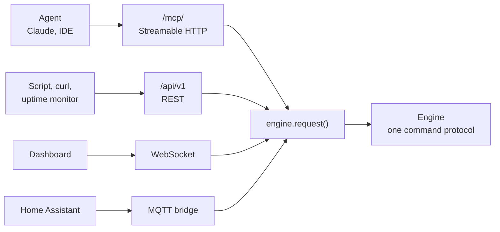

<div align="center">

# API and MCP

[Docs](README.md) · [Printers](printers.md) · [Cameras](cameras.md) · [Monitoring](monitoring.md) · [Notifications](notifications.md) · [Training frames](feedback.md) · [Hardware](hardware.md) · [Deployment](deployment.md) · **API & MCP** · [Plugins](plugins.md) · [Writing plugins](plugin-development.md) · [Architecture](architecture.md) · [Troubleshooting](troubleshooting.md)

</div>

A hub exposes its engine to scripts, agents and Home Assistant. Each transport sends the same
commands the dashboard sends, so none can drift from the UI.

- [Surfaces](#surfaces)
- [Health and version](#health-and-version)
- [Authentication and scopes](#authentication-and-scopes)
- [REST API](#rest-api)
- [MCP server](#mcp-server)
- [Home Assistant](#home-assistant)
- [The resource model](#the-resource-model)
- [Reading detection state](#reading-detection-state)

## Surfaces



| Surface | Endpoint | Auth |
|---|---|---|
| MCP server | `/mcp/`, Streamable HTTP | Bearer token |
| REST API | `/api/v1` | Bearer token |
| Health probe | `/api/health` | None |
| Home Assistant | Your MQTT broker | Broker credentials |

## Health and version

`GET /api/health` is the unauthenticated readiness endpoint for uptime checks and update
monitors. The response is never cached and carries the installed version:

```json
{"ok": true, "version": "X.Y.Z"}
```

It returns `200 OK` only once the engine has started. Camera, printer and notifier health
live behind the authenticated API and deliberately do not affect this probe.

## Authentication and scopes

PrintGuard has no identity layer of its own, so put a proxy in front of the hub first
([Deployment](deployment.md)). On top of that, this surface is gated by capability scopes.

Scopes are cumulative:

| Scope | Grants |
|---|---|
| `read` | Status of monitors, printers and cameras, the current camera frame, recent events, the print library |
| `control` | Everything in `read`, plus pause, resume and cancel, setting a heater target, and starting a file from the print library |
| `manage` | Everything in `control`, plus adding, editing and removing cameras, printers, monitors and print files, changing settings, testing services and discovering cameras |

Issue tokens from the **API** tab in Settings. Name a token, choose its scope and
press **Generate**. The secret, a string starting `pg_`, is only shown once:

```http
Authorization: Bearer pg_Zr8...agent
```

| Token state | Behaviour |
|---|---|
| No tokens issued, the default | The surface is read-only and trusts whatever fronts it. Control and management stay closed |
| Any token issued | A valid bearer is required for every request, and its scope decides what it reaches. MCP additionally hides tools a token cannot use. The schema at `/api/v1/docs` and `/api/v1/openapi.json` describes the API and holds nothing from your hub, so it stays open |

> [!IMPORTANT]
> Only a hash is stored, so a lost token cannot be recovered. Revoke it and issue another.
> Revocation is immediate. Tokens are managed from the UI only, never over the API, so an
> agent holding a `manage` token can drive printers and cameras but cannot mint or escalate
> tokens. Serve the hub over HTTPS so tokens never travel in clear.

## REST API

Base path `/api/v1`. JSON in and out, except the camera frame and alert snapshot, which are
`image/jpeg`, the print file download, and the frame and print file you upload as a raw body.
Adding or removing a camera, printer or monitor returns the collection, as do removing a print
file and `/cameras/refresh-printers`. Every other change returns the one thing it changed, which
for `/prints/{id}/start` is the printer. The two test routes return the engine's `printer_test`
or `notify_test` event as it was sent, `event` and `req_id` included. A rejected command is a
`400`, a timeout a `504`, and a missing or under-scoped token a `401` or `403`. An id nothing
matches is a `404` on a read and a `400` on a change. A body of the wrong shape is a `422`, which
includes a number sent as `NaN` or `Infinity`. Adding a camera or refreshing the printer cameras waits up to 40 seconds for
a first frame. A printer action or heater target waits 15 seconds, and 105 on an Elegoo printer,
since a Centauri Carbon 2 answers a resume only once it has reheated. The interactive OpenAPI schema is served at `/api/v1/docs`.

A hub opened at a domain name answers `403` to every request, this API included, until that
name is in [`PRINTGUARD_ORIGINS`](deployment.md#host-and-origin-checking).

<details open>
<summary><b>Read</b></summary>

| Method | Path | Description |
|---|---|---|
| `GET` | `/state` | Full snapshot: cameras, printers, monitors, prints, settings, stats and what the dashboard draws its forms from |
| `GET` | `/monitors` | List monitors with camera, linked printer and latest alert |
| `GET` | `/monitors/{id}` | One monitor |
| `GET` | `/monitors/{id}/history` | Its [risk history](monitoring.md#risk-history): one-minute buckets, the alert log, the snapshot index and summary stats |
| `GET` | `/monitors/{id}/snapshots/{snap_id}` | The snapshot taken at one alert, as `image/jpeg` |
| `GET` | `/printers` | List registered printers with status, progress and job |
| `GET` | `/printers/{id}` | One printer |
| `GET` | `/cameras` | List cameras with rate, health and latest score |
| `GET` | `/cameras/{id}` | One camera |
| `GET` | `/cameras/{id}/frame` | Freshest frame as `image/jpeg`. `404` while the camera is on standby or offline, since it has no current frame |
| `POST` | `/classify` | Classify a supplied frame, body `image/jpeg` of up to 32 MB. No registered camera needed |
| `GET` | `/prints` | List the print library, each file with its format, size, tags and what the slicer wrote into it |
| `GET` | `/prints/{id}` | One print file |
| `GET` | `/prints/{id}/file` | Download a print file as the library keeps it |
| `GET` | `/events` | The last 100 alerts, warnings, device changes and errors |

</details>

<details>
<summary><b>Control</b></summary>

| Method | Path | Description |
|---|---|---|
| `POST` | `/printers/{id}/action` | `{"action": "pause" \| "resume" \| "cancel"}` |
| `POST` | `/printers/{id}/heat` | `{"nozzle", "bed"}` in °C, either optional, 0 turning a heater off. Refused by a service that cannot set targets |
| `POST` | `/prints/{id}/start` | `{"printer_id"}`, sends the file to that printer and starts it. Refused unless the printer is idle, prints the format and is one the file is tagged for |

</details>

<details>
<summary><b>Manage</b></summary>

| Method | Path | Description |
|---|---|---|
| `POST` | `/monitors` | Add a monitor, binding a camera and an optional printer |
| `PATCH` | `/monitors/{id}` | Update a monitor |
| `DELETE` | `/monitors/{id}` | Remove a monitor |
| `POST` | `/printers` | Register a printer. Refused with the field named if one the service requires is blank |
| `PATCH` | `/printers/{id}` | Update a printer. `config` replaces the stored one, [keeping the secrets a read left out](#the-resource-model) |
| `DELETE` | `/printers/{id}` | Remove a printer |
| `POST` | `/printers/test` | `{"provider", "config"}`, reachability only |
| `POST` | `/cameras` | Add a camera |
| `PATCH` | `/cameras/{id}` | Update a camera |
| `DELETE` | `/cameras/{id}` | Remove a camera |
| `POST` | `/cameras/discover` | List attachable, unregistered sources |
| `POST` | `/cameras/refresh-printers` | Register cameras newly exposed by registered printers |
| `POST` | `/prints?filename=` | Upload a sliced file as the raw request body. `name`, a comma-separated `printer_ids` and first layer `nozzle` and `bed` temperatures are optional |
| `PATCH` | `/prints/{id}` | Rename a print file or change the printers it is tagged for |
| `DELETE` | `/prints/{id}` | Remove a print file |
| `PATCH` | `/settings` | Update `notifiers`, `mqtt`, `inference_runtime` or `preheat`. Each one you send replaces the stored one, [keeping the secrets a read left out](#the-resource-model) |
| `POST` | `/notifiers/test` | `{"provider", "config"}`, sends a test alert |

</details>

```bash
# Status of every printer
curl -H "Authorization: Bearer $TOKEN" https://host/api/v1/printers

# Save the current frame of a camera
curl -H "Authorization: Bearer $TOKEN" https://host/api/v1/cameras/$CAM/frame -o frame.jpg

# Pause a print
curl -X POST -H "Authorization: Bearer $TOKEN" -H "Content-Type: application/json" \
  -d '{"action":"pause"}' https://host/api/v1/printers/$PRINTER/action

# Preheat for PLA
curl -X POST -H "Authorization: Bearer $TOKEN" -H "Content-Type: application/json" \
  -d '{"nozzle":210,"bed":60}' https://host/api/v1/printers/$PRINTER/heat

# Classify a supplied frame, no registered camera needed
curl -X POST -H "Authorization: Bearer $TOKEN" -H "Content-Type: image/jpeg" \
  --data-binary @frame.jpg https://host/api/v1/classify
# gives {"prediction":"success","distances":{...},"margin":1.16,"defect_score":0.08}

# Upload a sliced file tagged for one printer, then start it there
curl -X POST -H "Authorization: Bearer $TOKEN" -H "Content-Type: application/octet-stream" \
  --data-binary @benchy.gcode "https://host/api/v1/prints?filename=benchy.gcode&printer_ids=$PRINTER"
curl -X POST -H "Authorization: Bearer $TOKEN" -H "Content-Type: application/json" \
  -d "{\"printer_id\":\"$PRINTER\"}" https://host/api/v1/prints/$PRINT/start
```

## MCP server

Endpoint `https://<host>/mcp/`, transport **Streamable HTTP**, same bearer token. Tools
mirror the REST operations one to one by `operation_id`, and the list a client sees is
filtered to the scopes its token holds.

| Scope | Tools |
|---|---|
| `read` | `get_state`, `list_monitors`, `get_monitor`, `get_monitor_history`, `list_printers`, `get_printer`, `list_cameras`, `get_camera`, `list_prints`, `get_print`, `recent_events` |
| `read` | `get_camera_frame` and `get_monitor_snapshot`, which return the picture as image content an agent can look at |
| `read` | `classify_frame`, which scores an image the agent supplies as base64 and needs no registered camera |
| `control` | `control_printer`, `heat_printer`, `start_print` |
| `manage` | `add_monitor`, `update_monitor`, `remove_monitor`, `add_printer`, `update_printer`, `remove_printer`, `test_printer`, `add_camera`, `update_camera`, `remove_camera`, `discover_cameras`, `refresh_printer_cameras`, `update_print`, `remove_print`, `update_settings`, `test_notifier` |

Uploading and downloading a print file carry a binary body, so they are REST only.

Point a client at the endpoint with the token as a bearer header:

```json
{
  "mcpServers": {
    "printguard": {
      "url": "https://host/mcp/",
      "headers": { "Authorization": "Bearer YOUR_TOKEN" }
    }
  }
}
```

Or explore it with the [MCP Inspector](https://github.com/modelcontextprotocol/inspector):

```bash
npx @modelcontextprotocol/inspector
# Transport: Streamable HTTP · URL: https://host/mcp/
# Header: Authorization: Bearer YOUR_TOKEN
```

## Home Assistant

The hub publishes every monitor to your MQTT broker as its own Home Assistant device, through
[MQTT discovery](https://www.home-assistant.io/integrations/mqtt/#device-discovery). It needs
the MQTT integration set up in Home Assistant and no custom component.

1. Open **Settings**, then the **Home Assistant** tab.
2. Turn on **Publish to an MQTT broker** and enter the broker's host.
3. Add a username and password if the broker wants them, and **Use TLS** if it serves it.
4. Press **Save broker settings**. The devices appear under the MQTT integration.

Leave the port blank for `1883`, or `8883` with TLS.

| Entity | Type | Appears |
|---|---|---|
| Defect | Binary sensor, problem | Always |
| Defect score | Sensor, 0 to 100% | Always |
| State | Sensor reading `watching`, `idle`, `triggered` or `disabled` | Always |
| Enabled | Switch | Always |
| Snapshot | Camera, the frame from the latest defect | Always |
| Printer | Sensor, the printer's status | With a linked printer |
| Progress | Sensor, % | With a linked printer |
| Pause, Resume, Cancel | Buttons | With a linked printer |
| Nozzle, Bed | Temperature sensors, °C | Once the printer has reported that heater |

Control is two-way, so an automation can arm a monitor or stop a print. A defect or a change in
printer status is published at once, while the score, progress and temperatures are published in
steps of 5, so a monitor never floods Home Assistant's history. Every entity shows as
unavailable while the hub is stopped, the bridge is switched off or the connection is lost.

The base topic defaults to `printguard` and the discovery prefix to `homeassistant`. Change
either in the same tab if your broker is shared. Give each hub its own base topic if you run two
on one broker, or stopping one marks the other's entities unavailable too.

Removing a monitor removes its device and clears its retained topics. One removed while the
broker is unreachable is cleared when the bridge reconnects, as long as the hub hasn't restarted
in between.

An **Enabled** command is `on`, `true` or `1` to arm a monitor and `off`, `false` or `0` to
disarm it. Anything else is ignored.

> [!WARNING]
> Anyone who can publish to the broker can pause and cancel your prints, so treat broker access
> as you would the dashboard.

## The resource model

Cameras and printers are registered resources, created and deleted only through their own
collection. A monitor binds one camera and optionally one printer by `camera_id` and
`printer_id`, and carries the thresholds and defect-response policy. Removing a resource
clears it from any monitor that referenced it.

A print file is a third resource. It carries the printers it is tagged for as `printer_ids`,
and a removed printer stays in them, so a file tagged only for it starts nowhere until its tags are changed. Its `meta` holds the slicer, `time_s`,
`filament_g`, `filament_mm` and `printer_model` read from the file, each `null` where the file
did not say, and `thumbnail` is the media type of its preview or `null`.

> [!NOTE]
> Credentials are redacted from this surface. Any printer or notifier config field its
> adapter marks secret, such as API keys, access codes, bot tokens and an ntfy topic URL, is stripped from
> every REST and MCP response, and any address in a config or a camera source loses its
> `user:pass@` and has its query values replaced with `[redacted]`, as is any part of its path
> that is 16 or more letters and digits, which is where UniFi Protect puts a stream's key. A
> notifier this version doesn't know is left out. Only the dashboard's own WebSocket, behind
> your proxy, receives them.
>
> What a plugin has stored is left out of `/state` as well, whatever the token's scope.
>
> You can send a config back as you read it. A secret field you leave out or blank, and an
> address you send back unchanged, keep the stored value. To clear a secret such as the MQTT
> password, send it as `null`.

Every integration is normalised to one shape, so a printer reads and controls the same way
regardless of its service:

| | Values |
|---|---|
| **Status** | `printing`, `paused`, `idle`, `error`, `offline`, `unknown` |
| **State** | `{ "status", "progress" 0-100, "job", "remaining_s", "nozzle", "bed" }`, reported on printers as `device_state`. A heater is `{ "actual", "target" }` in °C, or `null` where the printer has none, and `remaining_s` is `null` where the service gives no estimate |
| **Actions** | `pause`, `resume`, `cancel`, and a heater target through `/heat` |

## Reading detection state

Two facts are easy to miss. A camera carries a per-frame classification, and the 0-1 defect
score is reported per monitor rather than per camera, so the camera object has no numeric
score field.

The camera object, from `GET /cameras` and `GET /cameras/{id}`:

```jsonc
{
  "id": "1a2b3c4d",
  "name": "Left printer",
  "source": { /* redacted of any access_code / credentials */ },
  "printer_id": "9c41d7e0" | null,
  "declared": false,                                        // passed in by the deployment
  "max_fps": 5.0, "target_fps": 2.0, "achieved_fps": 1.9,   // rate
  "detect_fps": 60.0,                                       // cap on target_fps, set by the user
  "inferring": true, "in_use": true, "online": true,        // health
  "standby": false,                                         // no monitor is watching it and nobody is viewing it
  "last_result": {                                          // latest score (per FRAME)
    "prediction": "success",                                //   "success" | "failure" | "unknown"
    "distances": { "success": 0.48, "failure": 1.64 },      //   distance to each class prototype
    "margin": 1.16                                          //   runner-up minus best (confidence)
  },
  "brightness": 1.0, "contrast": 1.0, "sharpness": 0.0, "crop": null, "rotation": 0
}
```

`last_result` is the newest raw classification, or `null` before the camera has been
inferred. `prediction` is the nearest class prototype for that frame with no threshold applied, which makes it the quickest per-camera "failing?" read. It is `"unknown"` when the
frame cannot be classified, for example when the embedding is not finite.

The monitor object, from `GET /monitors` and `GET /monitors/{id}`:

```jsonc
{
  "id": "5b20a6f3",
  "camera_id": "1a2b3c4d",
  "printer_id": "9c41d7e0" | "",
  "name": "Left printer", "enabled": true,
  "threshold": 0.6,            // defect score at/above which a frame counts as a failure
  "consecutive": 3, "cooldown_s": 60,
  "on_defect": "pause",        // "none" | "pause" | "cancel"
  "notify": true,
  "watching": true,            // whether it is actively inferring right now
  "result": {                  // latest per-monitor score, or null before the first inference
    "score": 0.42, "ts": 1720000000.0
  },
  "alert": {                   // set while a sustained defect holds, null again at the first frame under the threshold
    "score": 0.82, "action": "pause", "ts": 1720000000.0   // action: "none" | "pause" | "cancel" | "failed"
  }
}
```

### Prediction against defect score

The 0-1 defect score is the model's probability that a frame shows a failing print, the
softmax over negative squared prototype distances the network was trained with, so `0.5` is
the decision boundary. It appears in:

- `result` events on the WebSocket:
  `{ "event": "result", "monitor_id", "camera_id", "score", "prediction", "margin", "ms", "ts" }`,
  where `prediction` has that monitor's `threshold` applied, sampled at up to 5 Hz per
  monitor,
- the monitor object's latest `result`, also carried by every full `state` snapshot,
- a monitor's `alert.score` once it trips,
- the MQTT **Defect score** sensor, published as 0-100.

To poll one camera's current verdict, read `GET /cameras/{id}` and take
`last_result.prediction`. For the score or a threshold-applied verdict, read the monitor or
the `result` events.
