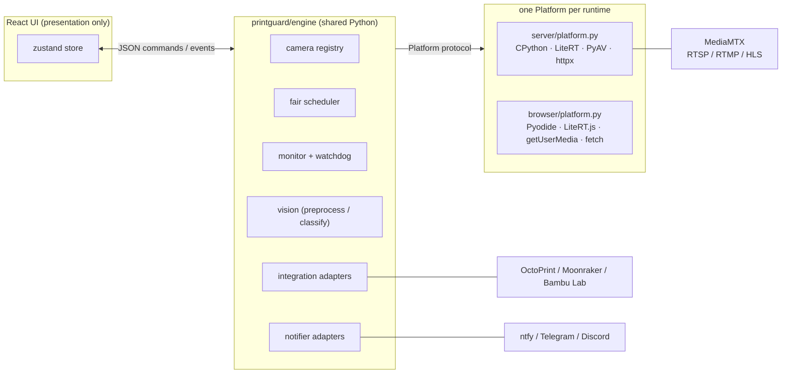
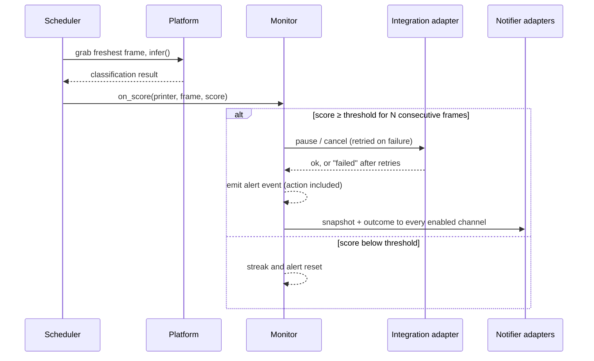

# Architecture

PrintGuard is a monolith where the engine is shared code and runs unchanged on
CPython (hub mode) and on Pyodide in the browser (local mode). Everything
mode-specific is confined to one `Platform` implementation per runtime. The two modes
cannot drift apart because there is nothing to drift — they execute the same files.



## The platform contract

[`engine/platform.py`](../printguard/engine/platform.py) defines everything the engine
needs but cannot implement portably. Identical signatures, different runtimes:

| Method | Hub (CPython) | Local (browser) |
|---|---|---|
| `infer(rgb)` | ai-edge-litert on CPU threads | LiteRT.js in WASM via a JS bridge |
| `discover_cameras()` | MediaMTX path list | `enumerateDevices()` |
| `open_camera(id, source)` | PyAV reader thread per RTSP stream | `getUserMedia` + canvas grabs |
| `http(...)` | httpx | `fetch` (CORS applies) |
| `encode_jpeg(rgb)` | PyAV mjpeg | canvas `toBlob` |
| `load_state` / `save_state` | `data/state.json` | `localStorage` |

The UI is presentation-only and speaks one JSON command/event protocol — over a WebSocket
in hub mode, over an in-page Pyodide bridge in local mode. The engine cannot tell which
transport it is on. **Never add mode-specific logic anywhere else**; if a feature needs a
runtime service, extend the Platform contract on both sides.

## The protocol

Commands (UI → engine): `discover`, `camera.add/update/remove`,
`printer.add/update/remove`, `printer.action`, `device.test`, `notify.test`,
`settings.update`. Every command may carry a `req_id`, echoed on the responding event so
the UI can resolve pending requests.

Events (engine → UI): a full `state` snapshot (on connect, after every command, and on a
1 s ticker), plus incremental `result`, `alert`, `warning`, `device`, `discovered`,
`device_test`, `notify_test` and `error` events.

## The programmatic surface (hub only)

The MCP server and REST API are thin transports over the same commands the UI sends —
they add no logic of their own, so they cannot drift from the dashboard. Both are hub only
(they need a server runtime, like `server/publish.py`); local mode never mounts them.

- [`engine.request()`](../printguard/engine/engine.py) turns the broadcast protocol into
  request/response by correlating a `req_id`; `engine.snapshot()` encodes a camera's
  freshest frame as JPEG. Both are mode-agnostic engine methods.
- [`server/api.py`](../printguard/server/api.py) is a FastAPI sub-app at `/api/v1`; each
  route delegates to those methods and is tagged with the scope it requires.
- [`server/mcp.py`](../printguard/server/mcp.py) derives its tools from that app with
  `FastMCP.from_fastapi`, adds a camera-frame tool that returns native image content, and
  enforces the route scope tags so a caller only sees the tools its token may use.

Access is gated by cumulative scopes (`read` ⊂ `control` ⊂ `manage`); see
[docs/api.md](api.md).

## Scheduling inference

When a camera is registered its native frame rate is measured once. From then on
allocation is fully dynamic:

1. A smoothed estimate of observed inference latency continuously yields the sustainable
   total rate (`workers / latency`).
2. That capacity is water-filled across in-use cameras (max-min fairness): no camera is
   allocated beyond its native fps, and surplus flows to cameras that can use it.
3. A free worker takes the most overdue camera and grabs its **freshest** frame at
   dispatch time. Frames carry a sequence identity, so the same frame is never inferred
   twice and results always describe the present, not a backlog.

MediaMTX bursts the buffered GOP on RTSP connect, so stream fps istrusted from the SDP `average_rate`, else measured only after a warm-up.

## The defect pipeline



A failed device action is retried, then reported in the alert, the UI error feed and the push notification.

## Failing safely

A printer's **watching** state gates inference
([`printers.printer_watching`](../printguard/engine/printers.py)):

| Linked service reports | Watched? | Why |
|---|---|---|
| no service linked | yes | nothing to gate on |
| `printing` | yes | the job needs eyes |
| no state yet / `unknown` | yes | can't tell → watch |
| `offline` (unreachable) | yes | losing the signal must not stop monitoring |
| `idle` / `paused` / `error` | no (standby) | positively not printing |

Only a *positive* "not printing" stands inference down. The monitor's watchdog loop then
keeps the whole pipeline honest — each sustained condition warns exactly once (after a
grace period, so reconnecting sources don't flap) and announces recovery:

- a watched camera goes **offline**,
- a watched camera stays online but stops producing fresh frames (**stalled** — a frozen
  RTSP feed must not pass for monitoring),
- a linked printer service becomes **unreachable** (defects could no longer pause it).

Warnings surface as dashboard toasts and go out through the notification channels.
Notifier delivery failures and inference crashes emit `error` events — there is no
silent `except: pass` anywhere in the alert path.

## Repository layout

```
printguard/
  engine/            shared engine — runs on CPython and Pyodide
    integrations/    printer service adapters (OctoPrint, Klipper, Bambu Lab, …)
    notifiers/       alert channel adapters (ntfy, Telegram, Discord, …)
    adapters.py      shared adapter contract (id, label, docs_url, JSON-schema config)
  server/            hub platform: FastAPI, MediaMTX, LiteRT, PyAV
    api.py           REST API (/api/v1) over the engine protocol, scoped by token
    mcp.py           MCP server for agents, derived from the REST API
  browser/           local platform: Pyodide bridge to LiteRT.js and getUserMedia
  pysrc.py           builds the engine source archive Pyodide unpacks
web/                 React + Tailwind UI (presentation only)
models/              TFLite encoder, normalisation metadata, class prototypes
tests/               engine simulation + adapter contract tests (pytest)
```

## The static demo

Local mode needs no backend at all, so the same `web/dist` build deploys to GitHub Pages:
the release workflow zips the engine source (`printguard/pysrc.py`), copies `models/`
into the bundle, and every asset is fetched base-relative. The mode picker probes
`api/health` — when no hub answers, the hub card becomes a Docker self-host link.
