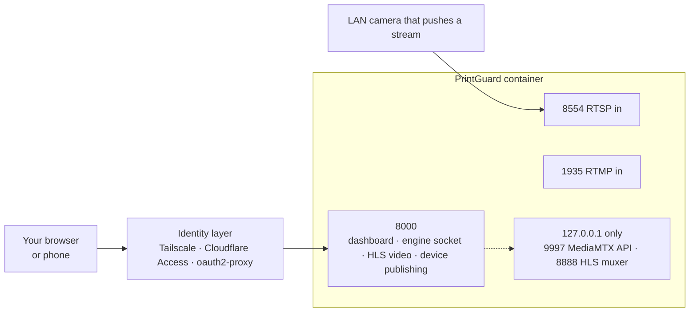

<div align="center">

# Deploying a hub securely

[Docs](README.md) · [Architecture](architecture.md) · [Printers & cameras](printers.md) · [Hardware](hardware.md) · **Deployment** · [API & MCP](api.md) · [Troubleshooting](troubleshooting.md)

</div>

PrintGuard ships **no authentication**. Anyone who can reach `:8000` sees every camera and
can pause or cancel your printers. Put an identity layer in front before anything leaves
your trusted network.

- [What listens where](#what-listens-where)
- [Choosing an approach](#choosing-an-approach)
- [Option 1: Tailscale](#option-1-tailscale)
- [Option 2: Cloudflare Tunnel and Access](#option-2-cloudflare-tunnel-and-access)
- [Option 3: oauth2-proxy on your own domain](#option-3-oauth2-proxy-on-your-own-domain)
- [Origin checking](#origin-checking)
- [Hardening checklist](#hardening-checklist)
- [Staying up to date](#staying-up-to-date)

> [!CAUTION]
> Never port-forward `8000`, `8554` or `1935` from the internet. Each option below keeps
> full functionality, live video included, because video is plain HTTP over the same port.

## What listens where



| Port | Direction | Publish it when |
|---|---|---|
| `8000` | In | Always. Dashboard, engine WebSocket, live video, device publishing |
| `8554` | In | A camera *pushes* RTSP into PrintGuard |
| `1935` | In | A camera pushes RTMP |
| `9997`, `8888` | Internal | Never. They bind to `127.0.0.1` inside the container |

Cameras that PrintGuard *pulls* from, and printers it talks to, need no published ports at
all.

## Choosing an approach

| | [Tailscale](#option-1-tailscale) | [Cloudflare](#option-2-cloudflare-tunnel-and-access) | [oauth2-proxy](#option-3-oauth2-proxy-on-your-own-domain) |
|---|---|---|---|
| Reachable from the public internet | No | Yes, behind an Access policy | Yes, behind your proxy |
| Open inbound ports | None | None | None if tunnelled, else 443 |
| Identity | Your tailnet | Email code or your SSO | GitHub, Google, any OIDC |
| Own a domain | Not needed | Needed | Needed |
| HTTPS for camera access | `tailscale serve` | Included | You terminate TLS |
| Best for | A private hub for you and people you invite | Sharing outside your network | A homelab you already reverse-proxy |

## Option 1: Tailscale

Recommended for private hubs. Nothing is reachable from the public internet and
authentication is your tailnet identity.

1. Install [Tailscale](https://tailscale.com/download) on the hub machine and your devices,
   then run `tailscale up` on each.
2. Open `http://<hub-machine-name>:8000` from any device on the tailnet. Invite others from
   the Tailscale admin console if they should have access.
3. For HTTPS, which browsers require before granting camera access, so it is needed for
   local mode and **This device** publishing from phones:

   ```bash
   sudo tailscale serve --bg --https=443 8000
   ```

   Then open `https://<hub-machine-name>.<tailnet>.ts.net`.

## Option 2: Cloudflare Tunnel and Access

A public HTTPS URL with no open ports. Every request, WebSockets and video included, must
pass a Cloudflare Access policy first.

1. In [Zero Trust](https://one.dash.cloudflare.com) → Networks → Tunnels, create a tunnel
   and copy its token, then add the connector to `docker-compose.yaml`:

   ```yaml
     cloudflared:
       image: cloudflare/cloudflared:latest
       restart: unless-stopped
       command: tunnel run --token ${TUNNEL_TOKEN}
   ```

2. Give the tunnel a public hostname, for example `hub.example.com`, pointing at
   `http://printguard:8000`.
3. In Zero Trust → Access → Applications, add a self-hosted application for that hostname
   with a policy such as *Allow → Emails →* the people you trust. Visitors now authenticate
   before anything reaches PrintGuard.
4. If the host machine sits on a network you do not fully trust, bind the local port so
   only the tunnel can reach the app: `"127.0.0.1:8000:8000"`.

## Option 3: oauth2-proxy on your own domain

For a hub behind a reverse proxy you manage.
[oauth2-proxy](https://oauth2-proxy.github.io/oauth2-proxy/) authenticates against
GitHub, Google or any OIDC provider and proxies everything, WebSockets included:

```yaml
  oauth2-proxy:
    image: quay.io/oauth2-proxy/oauth2-proxy:latest
    restart: unless-stopped
    command:
      - --http-address=0.0.0.0:4180
      - --upstream=http://printguard:8000
      - --provider=github
      - --github-user=your-github-username
      - --email-domain=*
      - --redirect-url=https://hub.example.com/oauth2/callback
      - --cookie-secure=true
      - --reverse-proxy=true
    environment:
      OAUTH2_PROXY_CLIENT_ID: "…"
      OAUTH2_PROXY_CLIENT_SECRET: "…"
      OAUTH2_PROXY_COOKIE_SECRET: "…"   # openssl rand -base64 32 | tr -- '+/' '-_'
    ports:
      - "4180:4180"
```

Terminate TLS in front with Caddy, nginx or a Cloudflare Tunnel pointed at `:4180`, and bind
PrintGuard's own port to localhost so the proxy is the only way in.

## Origin checking

The hub rejects any WebSocket whose `Origin` is not its own. This matters because an auth
proxy checks the session cookie, and the browser attaches that cookie to sockets opened by
*other* sites too, so origin checking is what stops a logged-in user's unrelated tabs from
driving the engine.

The hub recognises the dashboard automatically when the proxy preserves `Host` or sends
`X-Forwarded-Host`. Tailscale, Cloudflare and oauth2-proxy all do. If yours rewrites the
host, list your public origin:

```yaml
    environment:
      PRINTGUARD_ORIGINS: "https://hub.example.com"   # comma-separate several
```

## Hardening checklist

| Check | Why |
|---|---|
| No router port-forwards for `8000`, `8554` or `1935` | The hub has no authentication of its own |
| Only admit people you would hand the printer to | There are no per-user roles: anyone who authenticates sees every camera and controls every printer |
| Bind ports to `127.0.0.1:…` when a proxy on the same host is the only client | Keeps the app unreachable except through the proxy |
| Leave `9997` and `8888` unpublished | The MediaMTX control API and HLS muxer bind to loopback inside the container; the hub proxies HLS out through `:8000` |
| Set `PRINTGUARD_ORIGINS` only if your proxy rewrites the host header | Otherwise the automatic origin check already covers you |
| Serve over HTTPS if you issue API tokens | Bearer tokens must never travel in clear. See [API & MCP](api.md) |
| Keep the image current | `latest` moves on every release |

## Staying up to date

The hub checks GitHub releases once a day and the header's version chip turns into an update
badge. Open it to read the changelog for any release, then update:

```bash
docker compose pull && docker compose up -d
```

PrintGuard never updates its own container, and deliberately never asks for the Docker
socket: a process with the socket has root-equivalent control of the host, which is not a
trade worth making for a camera watcher. If you want unattended updates, run an external
image-update tool alongside your stack, or use your NAS platform's own update check.

The desktop app checks the same releases and links the download for its platform.
