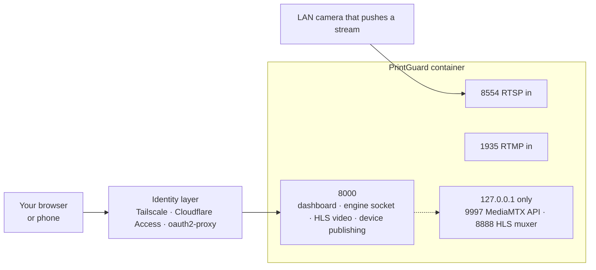

<div align="center">

# Deploying a hub securely

[Docs](README.md) · [Printers](printers.md) · [Cameras](cameras.md) · [Monitoring](monitoring.md) · [Notifications](notifications.md) · [Training frames](feedback.md) · [Hardware](hardware.md) · **Deployment** · [API & MCP](api.md) · [Plugins](plugins.md) · [Writing plugins](plugin-development.md) · [Architecture](architecture.md) · [Troubleshooting](troubleshooting.md)

</div>

PrintGuard has no authentication of its own. Anyone who can reach `:8000` sees every camera and
can pause or cancel your printers. Put an identity layer in front before anything leaves
your trusted network.

- [What listens where](#what-listens-where)
- [Choosing an approach](#choosing-an-approach)
- [Option 1: Tailscale](#option-1-tailscale)
- [Option 2: Cloudflare Tunnel and Access](#option-2-cloudflare-tunnel-and-access)
- [Option 3: oauth2-proxy on your own domain](#option-3-oauth2-proxy-on-your-own-domain)
- [Host and origin checking](#host-and-origin-checking)
- [Plugins](#plugins)
- [Hardening checklist](#hardening-checklist)
- [What the hub reaches out to](#what-the-hub-reaches-out-to)
- [Environment variables](#environment-variables)
- [Your data and backups](#your-data-and-backups)
- [Staying up to date](#staying-up-to-date)

> [!CAUTION]
> Never port-forward `8000`, `8554` or `1935` from the internet. Each option below keeps
> full functionality, live video included, because video is plain HTTP over the same port.

## What listens where


```mermaid
flowchart LR
    phone["Your browser<br/>or phone"] --> proxy["Identity layer<br/>Tailscale · Cloudflare Access · oauth2-proxy"]
    proxy --> p8000

    subgraph container["PrintGuard container"]
        p8000["8000<br/>dashboard · engine socket · HLS video · device publishing"]
        p8554["8554 RTSP in"]
        p1935["1935 RTMP in"]
        loop["127.0.0.1 only<br/>9997 MediaMTX API · 8888 HLS muxer"]
        p8000 -.-> loop
    end

    lancam["LAN camera that pushes a stream"] --> p8554
```

| Port | Direction | Publish it when |
|---|---|---|
| `8000` | In | Always. Dashboard, engine WebSocket, live video, device publishing |
| `8554` | In | A camera pushes RTSP into PrintGuard |
| `1935` | In | A camera pushes RTMP |
| `9997`, `8888` | Internal | Never. They bind to `127.0.0.1`, inside the container or on the computer the desktop app runs on |

Cameras that PrintGuard pulls from, and printers it talks to, need no published ports at
all. The compose file publishes `8000` and `8554`, so add `"1935:1935"` for an RTMP push.

Ports `8554` and `1935` take no login. Anyone who can reach them can read any camera's stream
by its id and publish a stream of their own, because cameras push to the hub that way. Remove `"8554:8554"` from the compose file if no camera pushes to the hub.

The desktop app listens on the same three ports on every interface of the computer it runs on,
so the same rule applies to it on a network you don't trust.

On the desktop app `9997` and `8888` are that computer's own loopback, which a web page open in
its browser can reach. The MediaMTX control API on `9997` only answers a login the hub makes up
each time it starts and passes to MediaMTX in its environment, so it is never on disk. Neither
port sends CORS headers, so a page from another origin can't read a reply from them.

## Choosing an approach

| | [Tailscale](#option-1-tailscale) | [Cloudflare](#option-2-cloudflare-tunnel-and-access) | [oauth2-proxy](#option-3-oauth2-proxy-on-your-own-domain) |
|---|---|---|---|
| Reachable from the public internet | No | Yes, behind an Access policy | Yes, behind your proxy |
| Open inbound ports | None | None | None if tunnelled, else 443 |
| Identity | Your tailnet | Email code or your SSO | GitHub, Google, any OIDC |
| Own a domain | Not needed | Needed | Needed |
| HTTPS for camera access | `tailscale serve` | Included | You terminate TLS |
| Best for | A private hub for you and people you invite | Sharing outside your network | A homelab you already reverse-proxy |

## Option 1: Tailscale

Recommended for private hubs. Nothing is reachable from the public internet and
authentication is your tailnet identity.

1. Install [Tailscale](https://tailscale.com/download) on the hub machine and your devices,
   then run `tailscale up` on each.
2. Open `http://<hub-machine-name>:8000` from any device on the tailnet. Invite others from
   the Tailscale admin console if they should have access.
3. Browsers only grant camera access on secure pages, so publishing a phone's camera from
   **This browser** needs HTTPS:

   ```bash
   sudo tailscale serve --bg --https=443 8000
   ```

   Then open `https://<hub-machine-name>.<tailnet>.ts.net`, after
   [naming it to the hub](#host-and-origin-checking):

   ```yaml
       environment:
         PRINTGUARD_ORIGINS: "https://<hub-machine-name>.<tailnet>.ts.net"
   ```

## Option 2: Cloudflare Tunnel and Access

A public HTTPS URL with no open ports. Every request, WebSockets and video included, must
pass a Cloudflare Access policy first.

1. In [Zero Trust](https://one.dash.cloudflare.com), under Networks and then Tunnels, create
   a tunnel and copy its token, then add the connector to `docker-compose.yaml`:

   ```yaml
     cloudflared:
       image: cloudflare/cloudflared:latest
       restart: unless-stopped
       command: tunnel run --token ${TUNNEL_TOKEN}
   ```

2. Give the tunnel a public hostname, for example `hub.example.com`, pointing at
   `http://printguard:8000`, and [name it to the hub](#host-and-origin-checking) with
   `PRINTGUARD_ORIGINS: "https://hub.example.com"` in the `printguard` service's environment.
3. In Zero Trust, under Access and then Applications, add a self-hosted application for that
   hostname, with a policy that allows the emails of the people you trust. Visitors now authenticate
   before anything reaches PrintGuard.
4. If the host machine sits on a network you do not fully trust, bind the local port so
   only the tunnel can reach the app: `"127.0.0.1:8000:8000"`.

## Option 3: oauth2-proxy on your own domain

For a hub behind a reverse proxy you manage.
[oauth2-proxy](https://oauth2-proxy.github.io/oauth2-proxy/) authenticates against
GitHub, Google or any OIDC provider and proxies everything, WebSockets included:

```yaml
  oauth2-proxy:
    image: quay.io/oauth2-proxy/oauth2-proxy:latest
    restart: unless-stopped
    command:
      - --http-address=0.0.0.0:4180
      - --upstream=http://printguard:8000
      - --provider=github
      - --github-user=your-github-username
      - --email-domain=*
      - --redirect-url=https://hub.example.com/oauth2/callback
      - --cookie-secure=true
      - --reverse-proxy=true
    environment:
      OAUTH2_PROXY_CLIENT_ID: "…"
      OAUTH2_PROXY_CLIENT_SECRET: "…"
      OAUTH2_PROXY_COOKIE_SECRET: "…"   # openssl rand -base64 32 | tr -- '+/' '-_'
    ports:
      - "4180:4180"
```

Terminate TLS in front with Caddy, nginx or a Cloudflare Tunnel pointed at `:4180`, and bind
PrintGuard's own port to localhost so the proxy is the only way in. Then
[name the public address to the hub](#host-and-origin-checking) with
`PRINTGUARD_ORIGINS: "https://hub.example.com"`.

## Host and origin checking

The hub only answers requests addressed to a name it knows. Without that, a web page you visit
could point its own domain at your hub's address and read it as if it were the same site, which
is called DNS rebinding.

| You open the hub as | Setup |
|---|---|
| An IP address, such as `http://192.168.1.20:8000` | None |
| `localhost`, which is what the desktop app uses | None |
| A name with no dot in it, such as `http://tower:8000` or a Tailscale machine name | None |
| A name ending `.local`, `.lan`, `.home`, `.internal` or `.localhost` | None |
| Any other name, such as `hub.example.com` or `<machine>.<tailnet>.ts.net` | List it in `PRINTGUARD_ORIGINS` |

```yaml
    environment:
      PRINTGUARD_ORIGINS: "https://hub.example.com"   # comma-separate several
```

Every request for a name that isn't covered gets a `403` that says which line to add, and the
hub logs the same line once for each name. That includes the REST API, the MCP server and
`/api/health`, so point an uptime check at the hub's address or list the name it uses.

The check reads both `Host` and `X-Forwarded-Host`, so it works whether your proxy keeps the
host or forwards it. Tailscale, Cloudflare and oauth2-proxy all do one or the other.

The hub also rejects any WebSocket, print upload or camera stream request a browser sends from an
`Origin` that is not the address the request was for or one listed in `PRINTGUARD_ORIGINS`. A request with no
`Origin`, which is what a script sends, is let through. An auth proxy checks the session cookie,
and the browser attaches that cookie to sockets opened by other sites too, so this is what stops
a signed-in user's other tabs from driving the engine.

## Plugins

Plugins run in a sandbox and reach only what you grant them, which
[permissions](plugins.md#permissions) lists. Two permissions change what an exposed hub looks
like:

| Permission | What it means for an exposed hub |
|---|---|
| **Serve its own pages** | The plugin answers requests under `/plugins/<id>/`. Those responses go out through your proxy like anything else, so whatever it serves is as exposed as the dashboard. It is served into a sandboxed origin, so it can never act as the dashboard |
| **Authorise every request** | The plugin sees every request to the hub except `/api/health` and its own pages, with its cookie and authorisation headers, and can refuse it. That is how an accounts plugin can protect a hub, and it also means a broken one can lock you out. One that fails is disabled and every request is refused until you deal with it |

To start the hub with every plugin switched off, add this and then remove the plugin or enable it again:

```yaml
    environment:
      PRINTGUARD_PLUGINS: "off"
```

Install only plugins you trust as far as the permissions you grant them, and prefer
**verified** ones, which match a reviewed entry in the catalogue by hash. See
[Plugins](plugins.md).

## Hardening checklist

| Check | Why |
|---|---|
| No router port-forwards for `8000`, `8554` or `1935` | The hub has no authentication of its own |
| Only admit people you would hand the printer to | There are no per-user roles, so anyone who authenticates sees every camera and controls every printer |
| Bind ports to `127.0.0.1:…` when a proxy on the same host is the only client | Keeps the app unreachable except through the proxy |
| Leave `9997` and `8888` unpublished | The MediaMTX control API and HLS muxer bind to loopback, and the hub proxies HLS out through `:8000`. The control API only answers the hub's own login, but the HLS muxer takes none |
| List in `PRINTGUARD_ORIGINS` only the addresses you open the hub at | Every name in it is one a web page may reach the hub under. See [host and origin checking](#host-and-origin-checking) |
| Publish `8554` and `1935` only to a network you trust, or not at all | The streaming server takes no login. Anyone who can reach those ports can watch any camera's stream and publish one of their own. A hub that only pulls from its cameras needs neither port published |
| Serve over HTTPS if you issue API tokens | Bearer tokens must never travel in clear. See [API & MCP](api.md) |
| Grant a plugin nothing you would not grant its author | Especially **Control printers** and **Authorise every request**. `PRINTGUARD_PLUGINS=off` is the way back from a lockout |
| Keep the image current | `latest` moves on every release |

## What the hub reaches out to

| Host | When |
|---|---|
| `api.github.com` | Once a day for the update check, when you press **Check now**, and to resolve a plugin's commit when you install or update it |
| `raw.githubusercontent.com` | The plugin catalogue and a plugin's files, when you browse the store or install one |
| `*.ingest.de.sentry.io` | Only when you send a bug report |
| `printguard-feedback.oliverbravery.uk` | Only when you [send a print's frames](feedback.md) |
| Your printers, cameras, notification services and MQTT broker | As you configure them |
| The addresses a plugin's manifest lists, and the service it signs you in to | Only for a plugin you granted [`net` or `oauth`](plugins.md#permissions). A redirect from one of them is not followed |

## Environment variables

Everything else is set from the dashboard. These are the ones a deployment sets.

| Variable | Default | Does |
|---|---|---|
| `PRINTGUARD_ORIGINS` | Unset | The addresses you open the hub at when they are not an IP address or a local name, comma-separated, such as `https://hub.example.com`. See [host and origin checking](#host-and-origin-checking) |
| `PRINTGUARD_PLUGINS` | On | `off` starts the hub with every plugin switched off |
| `PRINTGUARD_CAMERAS` | `auto` in the image | Anything else, such as `off`, leaves [cameras passed into the container](cameras.md#cameras-plugged-into-the-hub) to be added by hand |
| `PORT` | `8000` | The port the hub listens on |
| `DATA_DIR` | `/data` in the image | Where state and print files are kept |
| `LOG_LEVEL` | `INFO` | `DEBUG` adds command traces and exception tracebacks |
| `LOG_FILE` | Unset in the image | Also writes a rotating log file at this path. The desktop app sets it |
| `NVIDIA_VISIBLE_DEVICES` | Every GPU | Picks one card on the [`latest-nvidia`](hardware.md#nvidia-gpu) image |

## Your data and backups

Everything PrintGuard keeps is in its data directory.

| Path | Holds |
|---|---|
| `state.json` | Cameras, printers, monitors, settings, themes, layout, installed plugins and the record of each print's kept frames, with printer passwords, notifier keys, plugin credentials and API token hashes. Written readable only by the account running the hub |
| `state.json.corrupt` | A `state.json` the hub could not read at start, [kept so you can recover it](troubleshooting.md#starting-up). It's only there after that has happened |
| `prints/` | The [print library](printers.md#sending-prints), and the [frames kept from each print](feedback.md#whats-kept-on-your-hub) |

| Install | Data directory |
|---|---|
| Docker | The `/data` volume |
| macOS app | `~/Library/Application Support/PrintGuard` |
| Windows app | `%LOCALAPPDATA%\PrintGuard\PrintGuard` |

The desktop app also keeps `printguard.log` and its window's own storage there.

To back up, copy that directory with the hub stopped. To move to another machine, put the copy
in place before the first start. The risk chart and the alert log are held in memory and aren't
part of it.

## Staying up to date

The hub checks GitHub releases once a day and the header's version chip turns into an update
badge. Open it to read the changelog for any release, then update. The check sends nothing about
you, and **Automatically check for updates** in the **Updates** tab in Settings turns the daily
one off.

```bash
docker compose pull && docker compose up -d --wait
```

The image checks `/api/health` every 30 seconds, so `--wait` returns once the new hub is ready
and `docker ps` shows it as healthy.

PrintGuard never updates its own container, and deliberately never asks for the Docker
socket. A process with that socket has root-equivalent control of the host, which is not a
trade worth making for a camera watcher. If you want unattended updates, run an external
image-update tool alongside your stack, or use your NAS platform's own update check.

The desktop app checks the same releases and links the download for its platform.
