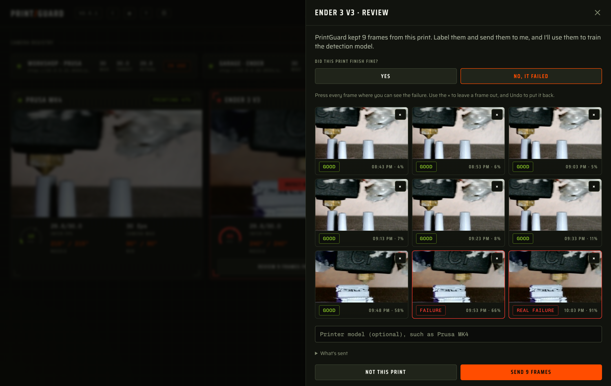

# Training frames

[Docs](README.md) · [Printers](printers.md) · [Cameras](cameras.md) · [Monitoring](monitoring.md) · [Notifications](notifications.md) · **Training frames** · [Hardware](hardware.md) · [Deployment](deployment.md) · [API & MCP](api.md) · [Plugins](plugins.md) · [Writing plugins](plugin-development.md) · [Architecture](architecture.md) · [Troubleshooting](troubleshooting.md)

PrintGuard keeps a few frames from each print on your hub. When a print ends you can label them
and send them to me, and I use them to train the detection model on more printers, cameras and
lighting than the public datasets cover. Nothing is sent unless you review a print and press
Send.

- [What's kept on your hub](#whats-kept-on-your-hub)
- [Reviewing a print](#reviewing-a-print)
- [What's sent](#whats-sent)
- [Limits](#limits)
- [Having your frames deleted](#having-your-frames-deleted)
- [Switching it off](#switching-it-off)

## What's kept on your hub

| Frames | How many per print |
|---|---|
| The frame that fired each alert | The last 40 |
| The highest scoring frames that didn't alert | 5 |
| Ordinary frames spread evenly over the print | Up to 19, starting at one a minute |

Frames are scaled to 512px and stored in the hub's data directory, so they survive a restart.
The hub keeps the last 20 prints or 200 MB and drops the oldest first. The alert frames are the
ones the risk history shows under **Risky moments**.

A print ends when its printer reports idle or an error, or when you switch its monitor off, so a
paused print stays open. A monitor
with no printer has no way to know a print ended, so it closes one every 24 hours.

## Reviewing a print

When a print ends its monitor shows a button to review the frames from the last print. Older prints are
listed under **Prints** on the monitor's detailed history page. A print with no frames kept
isn't offered for review.

1. Answer whether the print finished fine.
2. Press any frame to change its label. An alert frame is a real failure or a false alarm, and
   any other frame is good or a failure.
3. Use the × on a frame to leave it out, and **Undo** to put it back.
4. Add your printer model if you like, then press **Send**.

## What's sent

- The frames you kept, with the label you gave each one.
- Each frame's risk score, time and which of the three kinds above it is.
- A random ID for the print and for each frame.
- The monitor's alert threshold.
- The type of printer connection, such as `klipper`, and the printer model if you typed one.
- The PrintGuard version.
- A random ID for your hub, issued the first time you send.

No names, camera URLs or credentials are sent. Frames go to a private Cloudflare R2
bucket in the EU through [a small Worker](../feedback-worker) you can read. I download them,
re-encode them and delete them from the bucket, and anything I haven't collected is deleted
after 30 days. They are used only to train PrintGuard's detection model.

Your hub doesn't send its address, but the Worker sees the public IP address every request
comes from, as any server does. It uses it only for the per-network limit below.

| What the Worker holds | For how long | Why |
|---|---|---|
| A keyed hash of your IPv4 address, or of the /48 of your IPv6 address, with a count of today's frames and new hubs | Until 03:00 UTC the next day | The per-network daily limit |
| Your hub ID with a count of today's frames, and the ID and size of each frame sent today | Until 03:00 UTC the next day | The per-hub daily limit, and counting a frame sent twice once |

The address itself is never stored, and the hash can't be turned back into one without the
Worker's secret key. The Worker's request logs are switched off.

## Limits

The inbox runs on Cloudflare's free tier, which has a fixed amount of room, so the Worker caps
what it takes. A frame that hits a limit stays on your hub and sends by itself once the limit resets, unless
20 newer prints or 200 MB push its print out first.

| Limit | Value | What you see |
|---|---|---|
| One hub | 60 frames a day | "You've sent as many frames as one PrintGuard can in a day." |
| One network | 120 frames a day, and 3 new hubs | "Your network has sent as many frames as it can today." |
| Everyone | 1,000 frames a day | "PrintGuard has had all the frames it can take today." |
| The inbox | 5 GB | "The inbox for training frames is full." |
| One frame | 150 KB | Nothing. The hub shrinks the frame once and skips it if it's still too big |

Daily limits reset at midnight UTC, and the review sheet shows that time in your own time zone.
A print that is waiting has **Try now** and **Cancel sending** on its sheet. A frame the hub
skips isn't counted as sent, and sending a frame again doesn't count twice.

The limit for everyone is shared, so a handful of busy networks can use it up for the day.
Your frames wait on your hub until it resets.

## Having your frames deleted

Your hub ID is in **Settings**, under **Advanced**, once you've sent a print. Ask by
[raising an issue on GitHub](https://github.com/oliverbravery/PrintGuard/issues/new) with that
ID and I'll delete every frame sent under it. The ID is random and says nothing about you.

Your hub gets a new ID if I ever replace the key the inbox signs IDs with. Frames sent under the
old ID can't be traced to your hub after that, so I couldn't find them to delete.

## Switching it off

Turn off **Ask me to review frames after a print** in **Settings**, under **Advanced**. The hub
then keeps only alert frames, for the risk history, and never prompts.

Switching it off also settles the prints the hub already holds. A print waiting for a review or
waiting to send is dismissed, and every frame that isn't an alert is deleted from the hub. A
print that is uploading stops after the frame it's on. Frames already sent stay in the inbox.
