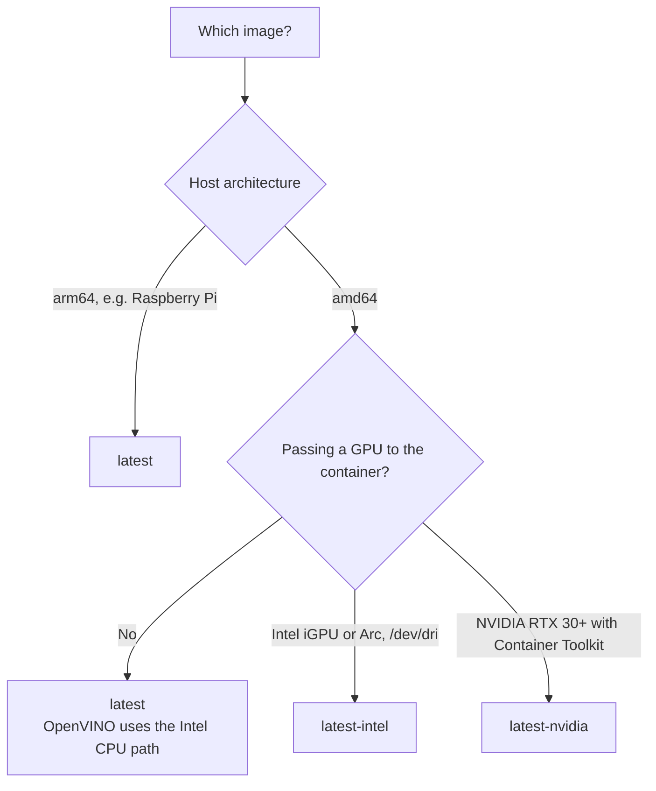

<div align="center">

# Hardware and model runtimes

[Docs](README.md) · [Architecture](architecture.md) · [Printers & cameras](printers.md) · **Hardware** · [Deployment](deployment.md) · [API & MCP](api.md) · [Troubleshooting](troubleshooting.md)

</div>

Which image to pull, how PrintGuard picks a model runtime, and how to give it a GPU or NPU.

- [How much hardware you need](#how-much-hardware-you-need)
- [Image variants](#image-variants)
- [Choosing a variant](#choosing-a-variant)
- [Model runtimes](#model-runtimes)
- [Execution providers by platform](#execution-providers-by-platform)
- [Intel GPU](#intel-gpu)
- [NVIDIA GPU](#nvidia-gpu)
- [Reading and pinning the runtime](#reading-and-pinning-the-runtime)

## How much hardware you need

The detector is a compact encoder, not a large model. A Raspberry Pi 4 handles a camera or
two, and any modern x86 mini PC handles several. Inference is only one part of the load:
decoding video costs more than classifying it, so frame rate and resolution matter more
than raw model throughput.

PrintGuard never needs a fixed frame rate. The scheduler measures what the host can
sustain and shares that capacity across the cameras in use, so adding a camera lowers each
camera's rate rather than falling behind. See
[scheduling inference](architecture.md#scheduling-inference).

> [!TIP]
> The dashboard's **capacity** and **latency** readouts show what your host actually
> sustains. If capacity sits far above the sum of your cameras' rates, you have headroom
> for more cameras.

## Image variants

Every release publishes three tags. All three carry the same engine and UI; they differ
only in the acceleration runtime they bundle.

| Tag | Platforms | Adds | Use it when |
|---|---|---|---|
| `latest` | `amd64`, `arm64` | Nothing. Smallest download | Default choice, including Raspberry Pi 4/5 |
| `latest-intel` | `amd64` | Intel GPU compute runtime | You pass `--device /dev/dri` for an Intel iGPU or Arc card |
| `latest-nvidia` | `amd64` | TensorRT RTX execution provider | You have an RTX 30 series or newer and the NVIDIA Container Toolkit |

Versioned tags exist alongside them: `X.Y.Z`, `X.Y`, and the same three suffixes, for
example `2.3.8-intel`. Pin `X.Y` if you want patch updates without surprises.

> [!NOTE]
> The Intel GPU compute runtime is roughly 290 MB of compiler and driver libraries that do
> nothing unless a GPU device is passed in, which is why it lives in its own tag rather
> than the default image. Intel **CPU** acceleration through OpenVINO is in the standard
> `amd64` image and needs no extra tag.

## Choosing a variant



macOS and Windows users running the desktop app do not choose a variant: the app ships the
runtimes for its platform.

## Model runtimes

Hub and desktop mode carry the model twice, once for each runtime, and pick between them:

| Runtime | What it is | Path used |
|---|---|---|
| [LiteRT](https://github.com/google-ai-edge/LiteRT) | Google's on-device runtime, formerly TensorFlow Lite | Optimised CPU |
| [ONNX Runtime](https://onnxruntime.ai) | Cross-platform runtime with pluggable execution providers | The fastest provider available on the host |

**Automatic** is the default: on start, PrintGuard benchmarks both runtimes for concurrent
throughput on the machine it is actually running on and keeps the faster one. The choice is
logged, so `docker logs printguard` shows what won and by how much.

The same benchmark also decides **how many frames PrintGuard infers at once**. It adds
workers while each one still pays for itself and stops at the host's real ceiling, which is
not the core count: an accelerator serialises on one device, a runtime's Python binding may
hold the interpreter lock, and a container may be under a CPU quota. Measuring covers all
three, and the result is the `workers` term the scheduler divides by latency to get
[capacity](architecture.md#scheduling-inference).

Local mode is different: the browser runs
[LiteRT.js](https://developers.google.com/edge/litert) in WebAssembly, which is the only
option a browser tab has.

## Execution providers by platform

ONNX Runtime selects the fastest provider it can use. What is available depends on the
platform:

| Platform | Provider | Notes |
|---|---|---|
| macOS, desktop app | Core ML | Uses CPU, GPU and the Neural Engine |
| Windows 11 24H2 or newer, desktop app | Windows ML | Installs the certified Intel, NVIDIA, AMD or Qualcomm provider on first launch |
| Older Windows, desktop app | Optimised CPU | No provider install |
| Linux `amd64`, standard image | OpenVINO | Intel CPU path out of the box; GPU needs `latest-intel` and `/dev/dri` |
| Linux `amd64`, `latest-nvidia` | TensorRT RTX | Needs the NVIDIA Container Toolkit and `--gpus all` |
| Linux `arm64`, standard image | Optimised CPU | Raspberry Pi 4/5 and similar |

If no accelerator is usable, ONNX Runtime falls back to its CPU provider and PrintGuard
keeps working.

## Intel GPU

Use the Intel image and pass the render device:

```bash
docker run -d --name printguard --restart unless-stopped \
  --device /dev/dri \
  -p 8000:8000 -p 8554:8554 \
  -v printguard:/data \
  ghcr.io/oliverbravery/printguard:latest-intel
```

Compose:

```yaml
    image: ghcr.io/oliverbravery/printguard:latest-intel
    devices:
      - /dev/dri:/dev/dri
```

On Unraid, set the repository to `ghcr.io/oliverbravery/printguard:latest-intel` and add
the template's **Intel GPU** device.

## NVIDIA GPU

Needs an RTX 30 series card or newer and the
[NVIDIA Container Toolkit](https://docs.nvidia.com/datacenter/cloud-native/container-toolkit/latest/install-guide.html)
on the host:

```bash
docker run -d --name printguard --restart unless-stopped \
  --gpus all \
  -p 8000:8000 -p 8554:8554 \
  -v printguard:/data \
  ghcr.io/oliverbravery/printguard:latest-nvidia
```

Compose, v2.30 or newer:

```yaml
    image: ghcr.io/oliverbravery/printguard:latest-nvidia
    gpus: all
```

On Unraid, set the repository to the `-nvidia` tag and add `--runtime=nvidia --gpus all` to
*Extra Parameters*.

## Reading and pinning the runtime

The header's **compute** readout names the active provider, for example `intel openvino` or
`apple core ml`, and clicking it opens the setting. **Settings → Advanced** offers:

| Setting | Effect |
|---|---|
| **Automatic** | Benchmark both runtimes on start and keep the faster |
| **LiteRT** | Always use LiteRT |
| **ONNX Runtime** | Always use ONNX Runtime and its best provider |

Pinning skips the comparison between runtimes, not the benchmark: the one you pin is still
measured for how many workers it sustains. Pin a runtime when a benchmark result surprises
you. If a GPU you expect is not being used, [Troubleshooting](troubleshooting.md) has the
checks.
