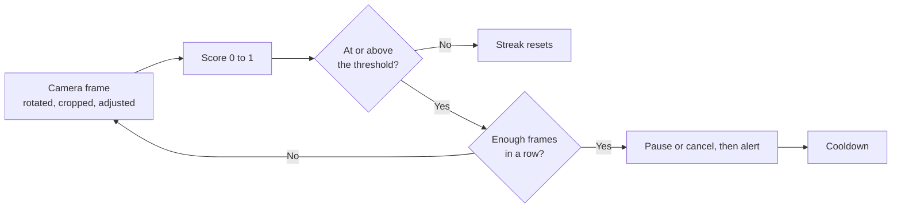

# Monitoring and tuning

[Docs](README.md) · [Printers](printers.md) · [Cameras](cameras.md) · **Monitoring** · [Notifications](notifications.md) · [Training frames](feedback.md) · [Hardware](hardware.md) · [Deployment](deployment.md) · [API & MCP](api.md) · [Plugins](plugins.md) · [Writing plugins](plugin-development.md) · [Architecture](architecture.md) · [Troubleshooting](troubleshooting.md)

A monitor binds a camera to an optional printer and decides when a defect is real and what to do
about it. This page covers its settings, the camera settings that change what the model sees, and
the risk history you tune them against.

- [How a defect becomes an alert](#how-a-defect-becomes-an-alert)
- [Monitor settings](#monitor-settings)
- [When a monitor watches](#when-a-monitor-watches)
- [Tuning the camera](#tuning-the-camera)
- [Risk history](#risk-history)
- [Reviewing a print](#reviewing-a-print)
- [Choosing values](#choosing-values)

## How a defect becomes an alert

The score is the model's own confidence that the frame shows a failing print, so 0.5 is where it
changes its mind. It only ever approaches 1, and few frames of a real failure pass 0.95, which is
why the threshold stops there. At the default settings one bad frame does nothing. A defect has
to hold for a run of frames before the monitor acts, and the cooldown keeps one failure from
alerting twice.

## Monitor settings

Open a monitor from the dashboard to change these. They save as you move them.

| Setting | Default | Range | What it does |
|---|---|---|---|
| **Watch this monitor** | On | | Turns the monitor off without deleting it. A switched-off monitor reads **off** on its tile |
| **Camera** | The one chosen when the monitor is made | Any registered camera, or none | The camera whose frames the monitor scores. With none the monitor doesn't watch |
| **Printer** | The one chosen when the monitor is made | Any registered printer, or none | The printer the monitor follows and can pause or cancel. With none it only alerts |
| **Alert threshold** | 0.75 | 0.05 to 0.95 | The score a frame has to reach to count as a defect |
| **Consecutive detections to alert** | 3 | 1 to 30 | How many flagged frames in a row it takes to act |
| **On sustained defect** | Alert only | | Alert only, pause the print or cancel the print. Without a linked printer the last two only alert |
| **Cooldown (seconds)** | 60 | 0 to 600 | The quiet gap after acting before the monitor can act again. At 0 the next flagged frame acts once the last response has finished. It ends when the print does, and a pause or cancel the printer didn't take is tried again after 30 seconds at most |
| **Push notifications** | Off | | Sends this monitor's alerts and warnings to your [alert channels](notifications.md) |

> [!IMPORTANT]
> A new monitor only shows a defect on the dashboard. Turn on **Push notifications** to hear about
> it, and choose pause or cancel if you want the print stopped.

The same panel pauses, resumes or cancels the print by hand, and sets the printer's
[temperatures](printers.md#temperatures-and-preheat).

## When a monitor watches

A monitor with a camera and no printer watches all the time. A monitor with a printer watches
unless the printer reports idle, paused or an error, so it also watches before the printer has
answered. One with no camera, or switched off, doesn't watch.
Losing contact, or a state PrintGuard can't read, keeps whatever the printer last reported, so
one that drops off mid-print is still watched and one switched off after a print stays in
standby. [Failing safely](architecture.md#failing-safely) has the reasoning.

## Tuning the camera

These settings live on the camera, under **Cameras**, so every monitor using that camera gets
them. They apply to the live view, the frames the model scores, the snapshots in your alerts and
the frames the [API](api.md) returns.

| Setting | Default | Range | What it does |
|---|---|---|---|
| **Rotation** | 0° | 0°, 90°, 180°, 270° | Sets a camera mounted sideways or upside down upright |
| **Crop region** | The middle square | Any square | The square of the view the model is given |
| **Brightness** | 1 | 0.25 to 2 | Lifts a dim chamber or tames a bright one |
| **Contrast** | 1 | 0.25 to 2 | Separates the print from a background of a similar shade |
| **Sharpness** | 0 | 0 to 2 | Brings out strands on a soft camera. The live view sharpens the picture at the size it's shown, so it looks stronger there than in the frame the model gets |
| **Detection rate** | 60 a second | 0.5 up to the camera's own frame rate, never above 60, or from 0.1 over the API | The most frames a second the model scores from this camera |

The model only watches a square of each camera's view. Until you crop a camera that square is the
middle of the frame, so on a wide camera the sides of the bed go unwatched. Crop it to a square
the print fills, leaving a little room: the model trims a sixteenth off each edge of the square
before it scores it. Rotation is applied first, so you draw the crop on the picture as you see it.

Detection normally runs as often as the hardware and the camera allow. Lower **Detection rate**
to cut the load PrintGuard puts on a shared host. A defect takes longer to confirm at a lower
rate, since the consecutive count is in frames.

## Risk history

A monitor's panel shows the live score on a gauge beside its last 240 readings, which is 48
seconds at best since the dashboard hears of five results a second at most.
**View detailed history** opens the full page.

| Part | Shows |
|---|---|
| Stat tiles | Average and peak score, the share of frames over the threshold, frames scored, alerts and watch time |
| Risk per period | The score charted over the last hour, 6 hours, 24 hours or everything kept |
| Prints | Each finished print kept from this monitor, with its frame count and review status. A print still running isn't listed |
| Risky moments | A snapshot of what the camera saw each time the monitor raised an alert |

Watch time is how long the readings spanned, in whole minutes. A gap of more than 30 seconds
between two readings, such as the monitor standing down or losing its camera, isn't counted.

The chart is kept in memory as one-minute buckets covering the last 24 hours of watching, with
the last 50 alerts, so restarting the hub clears it. The alert snapshots are kept on disk with
the other [frames kept from each print](feedback.md#whats-kept-on-your-hub), up to 40 a print,
and survive a restart. Deleting a monitor deletes every print kept from it, including ones still waiting for a
review. The [REST API](api.md#rest-api)
serves the same history and snapshots.

## Reviewing a print

PrintGuard keeps a few frames from each print on your hub. When a print ends its monitor offers
a button to review the frames from the last print, where you can label them and send them to help train the
detection model. Nothing is sent unless you press **Send**.
[Training frames](feedback.md) covers what's kept, what's sent and how to switch the prompt off.

## Choosing values

Start with the defaults and one real print, then read the history.

| You see | Change |
|---|---|
| Alerts on a good print | Raise the threshold, or raise the consecutive count so brief blips are ridden out |
| A failure caught late | Lower the threshold or the consecutive count |
| A failure that barely moves the score | Crop the camera so the print fills the square, then check the lighting with brightness and contrast |
| A score that sits high on an empty bed | Crop out whatever the model is reacting to, such as cables or a cluttered background |
| The same failure alerting again and again | Raise the cooldown |
| A busy processor on a shared host | Lower the camera's detection rate |

[Troubleshooting](troubleshooting.md#detection-and-alerts) covers alerts that never arrive.
