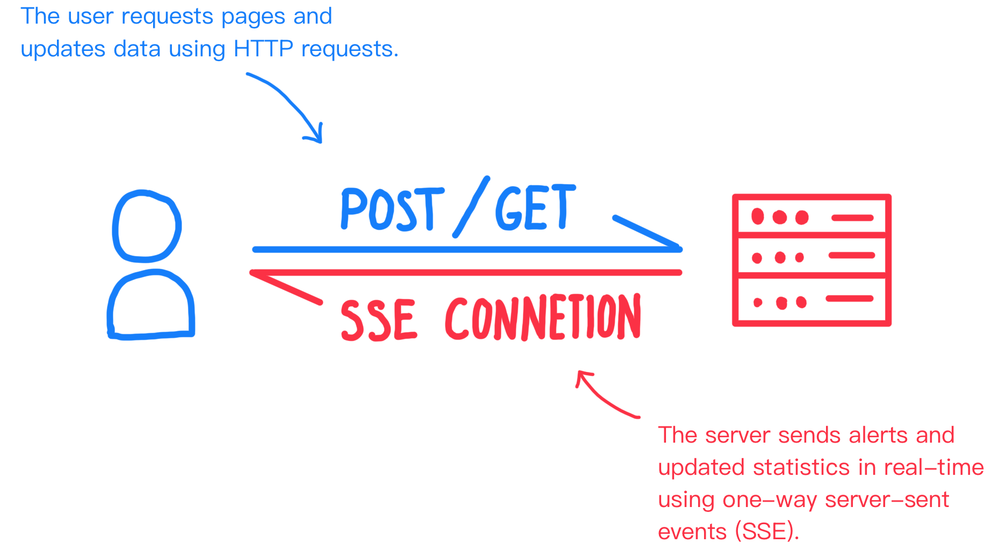

# Documentation
> This is the technical documentation for PrintGuard, if you are looking for guides on how to install and use PrintGuard, please refer to the [README](../README.md).

## Pages
- [Overview](overview.md)
- [API Documentation](api.md)
- [Setup Documentation](setup.md)

## Table of Contents
- [Overview](#overview)
- [Downstream Communication (SSE)](#downstream-communication-sse)
- [Upstream Communication (API)](#upsteam-communication-api)
- [Alerts and Notifications](#alerts-and-notifications)
- [Camera Feeds](#camera-feeds)
- [Data Storage](#data-storage)
- [Inference](#inference)
- [Detection Process](#detection-process)

## Overview

The main web interface is built with Python using the [FastAPI framework](https://fastapi.tiangolo.com). Communication between the web interface and the backend is handled through a RESTful API, with real-time updates provided via Server-Sent Events (SSE). This means that the user requests pages and updates data through the API, while the backend processes requests and sends updates back to the client in real-time via SSE. 

### Downstream Communication (SSE)
Server-Sent Events (SSE) are used for one-way communication from the backend to the client to update real-time metrics and alerts. On the server, when a packet needs to be sent to the client, it is enqueued to an asyncio queue which ensures packets are sent in the order they are received.

The backend can send three different types of packets to the client through SSE:
- **Alerts**: Data packets sent to the client when a print failure has been detected. It contains a snapshot of the camera feed alongside all other relevant data such as the countdown time for the alert. When received by the client, an alert popup will be displayed on the web interface, where the user can choose to dismiss the alert or suspend/cancel the print job if a printer is linked to the camera.
- **Camera State**: Packets sent to the client when detection metric updates, such as the most recent detection status, total detections, and frame rate. This data is used to keep the web interface updated with the current state of each camera feed in real-time.
- **Printer State**: Packets sent when metrics for a linked printer change, obtained by polling printer services such as Octoprint. This data, such as the current print job status and component temperatures, is used to update the linked printer's modal in the web interface.

### Upsteam Communication (API)
The backend provides a RESTful API for the client to interact with. The API, used by the web interface, allows the client to start and stop live detection, configure camera settings, link printers, and manage alerts. The API is designed to be simple and intuitive, with clear endpoints for each action. Find out more about the API endpoints in the [API Documentation](api.md).

### Alerts and Notifications
PrintGuard supports web push notifications for real-time alerts. When a print failure is detected, the backend sends a web push notification to the client, which can be subscribed to via the web interface in the settings menu. During setup, VAPID keys are generated and stored securely, which are used to authenticate the web push notifications, alongside SSL certificates for secure communication. The web push notifications are sent to the client when a detection alert is triggered, allowing users to receive real-time updates on print failures even when the web interface is not open. 

The notifications say which camera the alert was triggered on alongside a message describing the issue. When the user clicks on the notification, it opens the web interface and displays the alert in the alerts modal, where the user can choose to dismiss the alert or suspend/cancel the print job if a printer is linked to the camera.

When a print failure is detected, an alert is added to the alerts list and a alert packet is sent over SSE to the client. The alert contains a snapshot of the camera feed at the time of the detection, which is displayed in the alerts modal alongside the detection status and other relevant data. When an alert is created, a background task is started to automatically perform actions such as suspending or cancelling the print job if a printer is linked to the camera after a countdown time, which can be configured in the camera settings. The alert is automatically dismissed, cancelled, or suspended by if the user does not take action within the countdown time. The alert modal, showing the snapshot and detection data contains buttons to suspend, cancel or dismiss the alert which stops the alert countdown and re-enables alerts to be sent for that camera feed.

### Camera Feeds
PrintGuard supports multiple camera feeds, allowing users to monitor multiple printers simultaneously. Each camera has independent camera settings, detection thresholds, and alert configurations. An endpoint in the [API](api.md#get-camerafeedcamera_index) allows for streaming frames from a camera feed. The frames for the camera feed are generated by capturing images from the camera using OpenCV. Each frame undergoes a series of transformations, including adjustments for brightness, contrast, and focus, based on the camera's settings. To optimise bandwidth performance, frames are resized to a maximum width and the frame rate is limited. Finally, the frames are encoded as JPEGs and sent to the client as a continuous stream.

### Data Storage
Data in PrintGuard is primarily stored in a `config.json` file within a user-specific data directory named `printguard`. This file holds general configuration, camera states, and other application settings. For sensitive information, such as SSL private keys and other credentials, PrintGuard utilizes the system's keyring for secure storage through the [keyring](https://pypi.org/project/keyring/) library, which provides a unified interface to access the system's keyring across different platforms (Windows, macOS, Linux).

Updates to the configuration are managed through dedicated functions that handle reading from and writing to the `config.json` file. To prevent data corruption from simultaneous access, file locks are used during these operations. Camera-specific data, including settings and detection history, is managed by a `CameraStateManager`. This manager loads data from the configuration file at startup, keeps it in memory for quick access, and periodically saves it back to the file to ensure persistence.

### Inference
> The computer vision model used in Printguard is based on a custom-trained prototypical network. For it's training code and research paper, please refer to [This Repository](https://github.com/oliverbravery/Edge-FDM-Fault-Detection) by [Oliver Bravery](https://github.com/oliverbravery).

PrintGuard employs a sophisticated inference process to detect printing failures in real-time, leveraging a custom-trained prototypical network with a ShuffleNetv2 backbone making it edge-friendly. This approach allows the model to learn from a small number of example images, making it highly adaptable to different printers, materials, and environments.

The core of the inference system is a PyTorch-based model that analyses frames from the camera feed. At startup, the system computes class prototypes by processing a support set of images representing both successful and failed prints. These prototypes serve as idealised representations for each class. To boost performance, these computed prototypes are cached, eliminating the need for re-computation unless the support image set is modified.

During live detection, each frame from the camera undergoes a series of transformations: it is resized, converted to grayscale, and normalised before being passed to the model. The model then calculates the embedding for the frame and compares its Euclidean distance to the pre-computed class prototypes. The frame is classified based on the closest prototype.

To prevent false positives from transient errors, a majority voting system is implemented. An alert is only triggered if a specified number of frames within a sliding window are classified as failures. Once the conditions for an alert are met, the system saves a snapshot of the triggering frame, sends a notification to the user via SSE and web push, and initiates a configurable countdown for further action, such as pausing or canceling the print job. 

### Detection Process
The detection process in PrintGuard is initiated through an API call that starts a dedicated, asynchronous loop for a specific camera. This loop continuously captures frames, runs them through the inference model, and evaluates the results to identify potential print failures.

1.  **Starting Detection**: A user initiates the process via the API, which triggers the `_live_detection_loop` for the selected camera. This clears any previous detection history and errors for that camera.

2.  **Frame Processing**: Inside the loop, each captured frame is transformed—resized, converted to grayscale, and normalised to match the input requirements of the inference model.

3.  **Prediction and History**: The processed frame is passed to the model, which predicts whether it represents a "success" or a "failure." This result, along with a timestamp, is recorded in the camera's detection history.

4.  **Majority Voting**: To ensure accuracy and avoid false alarms from isolated glitches, a majority voting system analyses the recent detection history. An alert is only triggered if the number of "failure" predictions within a configurable window meets a specified threshold.

5.  **Alert Generation**: Once the majority vote confirms a failure, the system creates an alert. This involves:
    *   Generating a unique ID for the alert.
    *   Taking a snapshot of the frame that triggered the alert.
    *   Sending the alert data, including the snapshot, to the web interface via Server-Sent Events (SSE).
    *   Dispatching a web push notification to subscribed devices.
    *   Starting a background countdown timer that will automatically perform a pre-configured action (e.g., pause the print, dismiss the alert) if the user doesn't intervene.

6.  **Stopping Detection**: The process can be stopped at any time through another API call, which safely terminates the background detection loop.