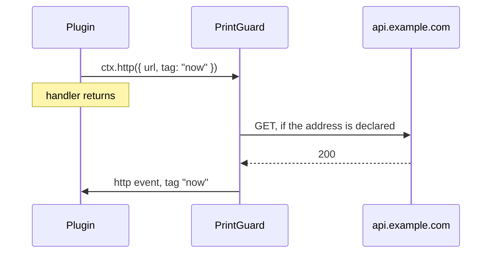

<div align="center">

# Writing plugins

[Docs](README.md) · [Printers](printers.md) · [Cameras](cameras.md) · [Monitoring](monitoring.md) · [Notifications](notifications.md) · [Training frames](feedback.md) · [Hardware](hardware.md) · [Deployment](deployment.md) · [API & MCP](api.md) · [Plugins](plugins.md) · **Writing plugins** · [Architecture](architecture.md) · [Troubleshooting](troubleshooting.md)

</div>

A plugin is a folder with a manifest and up to three source files. There's no build step and
nothing to minify, so what you publish is what people read. [Plugins](plugins.md) covers
installing them and the sandbox they run in.

- [A minimal plugin](#a-minimal-plugin)
- [The manifest](#the-manifest)
- [The three halves](#the-three-halves)
- [The ctx API](#the-ctx-api)
- [Events](#events)
- [Nodes](#nodes)
- [Effects](#effects)
- [Credentials](#credentials)
- [Talking to other plugins](#talking-to-other-plugins)
- [Routes and gate](#routes-and-gate)
- [Limits](#limits)
- [Editor setup](#editor-setup)
- [The shipped plugins](#the-shipped-plugins)
- [Publishing](#publishing)

## A minimal plugin

Two files make a plugin that lists your monitors in a panel of its own.

```
hello-monitors/
  plugin.json
  plugin.js
```

```json
{
  "$schema": "https://raw.githubusercontent.com/oliverbravery/PrintGuard/main/plugins/plugin.schema.json",
  "id": "hello-monitors",
  "name": "Hello monitors",
  "version": "1.0.0",
  "permissions": ["state:read"],
  "reasons": {
    "state:read": "To list your monitors and whether each is watching."
  }
}
```

```js
plugin.render((ctx) => ({
  type: "col",
  children: (ctx.state.monitors || []).map((monitor) => ({
    type: "row",
    children: [
      { type: "text", value: monitor.name },
      { type: "chip", value: monitor.watching ? "watching" : "idle", tone: monitor.watching ? "ok" : undefined },
    ],
  })),
}));
```

Zip the folder and install it with **Import a .zip** in the Plugins tab in Settings, then
enable it. While you work, point PrintGuard at your repo instead and press **Update** as you
push.

## The manifest

`plugin.json` says what the plugin is and everything it asks for. Only `id` and `version` are
required, and a key PrintGuard does not recognise is dropped.

```
my-plugin/
  plugin.json     the manifest
  plugin.js       draws a panel from nodes     (optional)
  panel.html      draws its own panel instead  (optional)
  worker.js       runs in the background       (optional)
  alarm.mp3       anything it ships            (optional)
  README.md       its page in the catalogue    (optional)
  icon.png        shown beside its name        (optional)
  shots/*.png     its screenshots or GIFs      (optional)
```

A plugin needs at least one of the three source files.

```json
{
  "$schema": "https://raw.githubusercontent.com/oliverbravery/PrintGuard/main/plugins/plugin.schema.json",
  "id": "bed-clearance",
  "name": "Bed clearance",
  "version": "1.0.0",
  "description": "One line about what it does.",
  "author": "you",
  "homepage": "https://github.com/you/bed-clearance",
  "icon": "icon.png",
  "media": ["shots/panel.png", "shots/alert.gif"],
  "permissions": ["state:read", "notify", "sound", "net"],
  "reasons": {
    "state:read": "To see which monitors are printing.",
    "notify": "To tell you when the bed needs clearing.",
    "sound": "To play an alarm when it does.",
    "net": "To log each clearance with the service you use."
  },
  "surfaces": ["panel"],
  "platforms": ["docker", "windows"],
  "assets": ["alarm.mp3"],
  "urls": ["https://api.example.com/v1/*"],
  "secrets": { "api_key": "The key from your account page" },
  "events": ["alert", "http"],
  "tick_s": 300
}
```

| Key | Rule |
|---|---|
| `id` | Required. 3 to 40 lowercase letters, digits or hyphens, starting and ending with a letter or digit |
| `version` | Required. Up to 32 letters, digits, underscores, dots, hyphens or plus signs |
| `name` | Falls back to the id |
| `description` | Cut at 400 characters |
| `author` | Cut at 80 characters |
| `homepage` | An `http` or `https` link |
| `icon`, `media` | Image paths inside the folder, as `png`, `jpg`, `jpeg`, `webp`, `gif` or `svg`. 8 media at most |
| `permissions` | Names from the [permissions table](plugins.md#permissions) |
| `reasons` | One line for every permission asked for, cut at 200 characters |
| `surfaces` | `panel`, `monitor` or `settings`. Leaving it out means `panel` |
| `platforms` | Where it runs. Leaving it out means everywhere |
| `assets` | Files it ships beside its code |
| `urls` | The only addresses it may reach. Needs `net` |
| `secrets` | Up to 8 credentials the user fills in, each a short name against a line saying what it is |
| `oauth` | A sign-in PrintGuard runs for it. Needs `oauth` |
| `provides` | Up to 8 channels it answers other plugins on. Needs `link:provide` |
| `consumes` | Up to 16 `plugin-id:channel` names it calls. Needs `link:consume` |
| `events` | The events that wake it |
| `tick_s` | How often its worker runs anyway, 5 to 86400 seconds. Under 5 switches the timer off |

A permission without a reason, `urls` without `net`, `oauth` without the `oauth` permission, or
`provides` and `consumes` without their link permission each refuse the install.

### Reasons

`reasons` is one line per permission, shown to whoever is deciding whether to enable it. Say
what your plugin does with it, not what the permission is.

### Icon, media and README

`icon`, `media` and a `README.md` are how a plugin presents itself. The icon sits beside its
name, the media images open the plugin's page as a gallery, and the README renders under them
the way GitHub renders it, relative image paths included. For a repository install these files
are read from the repository at the pinned commit. A zip carries them inside it. Either way
they add nothing to what runs, which is why an SVG is allowed here and not in `assets`.

The README is shown as Markdown and little else. Headings, paragraphs, lists, links, images,
code, tables and blockquotes are kept, with `align` on a table cell or paragraph and `width` and
`height` on an image. Any other HTML is dropped and its text kept, so forms, `<details>`, video,
inline SVG, `style`, `class` and task-list checkboxes do not render. Relative links and images
resolve against the README's own folder.

### Surfaces

| Surface | Where it puts you |
|---|---|
| `panel` | A panel of its own on the dashboard |
| `monitor` | Drawn on every monitor tile |
| `settings` | Drawn in every monitor's settings, under its own heading |

Anything that belongs to one monitor goes in `settings`.

### Platforms

`platforms` says where it runs. The store filters the catalogue by the one you are on, and an
install from a repository or a zip is refused on any other.

| Platform | |
|---|---|
| `docker` | The self-hosted hub, on any image |
| `docker-nvidia`, `docker-intel` | Only that image, for a plugin that needs the GPU it has |
| `macos`, `windows` | The desktop app |

Naming `docker` covers the images built from it, so declare a variant only when a plainer
image would not do.

### Assets

`assets` names the files it ships beside its code. They are hashed and pinned the same way.

| Kind | Extensions | Used by |
|---|---|---|
| Images | `png`, `jpg`, `jpeg`, `webp`, `gif` | An `image` node, or a `panel.html` |
| Audio | `mp3`, `ogg`, `wav` | `ctx.sound("alarm.mp3")` |
| Text | `json`, `csv`, `txt` | `ctx.assets`, as a string |
| Video | `mp4`, `webm` | A `panel.html` |

A name is up to 40 lowercase letters, digits, dots, underscores or hyphens, with no folders.
The type comes from the extension and the file has to start like the format it claims, so a
script renamed to `.png` is refused. SVG is not on the list, since it is markup.

### Addresses

`urls` lists the only addresses a plugin may reach, each a match pattern of
`scheme://host/path`, the same grammar a browser extension uses.

| Pattern | Reaches |
|---|---|
| `https://api.example.com/v1/*` | Anything under `/v1/` on that one host |
| `https://*.example.com/*` | `example.com` and every subdomain of it |
| `*://example.com/*` | That host over http or https |
| `wss://hub.local:8123/api/*` | That endpoint over a WebSocket, on that port |
| `*://*/*` | Anywhere at all, which is the widest thing you can ask for |

A `*` scheme covers http and https, and `ws`, `wss`, `rtsp` and `rtsps` are named in full. A
missing port means any port. An IPv6 address goes in brackets, as `http://[fd00::1]/*`.

The scheme and host match in any case. The path matches as written, so
`https://api.telegram.org/bot*/sendMessage` does not cover `/bot1/sendmessage`. A `*` in a path
stands for any run of characters, `/` and the query string included.

A URL with a `.` or `..` segment in its path matches no pattern, percent-encoded or not.

A pattern on this machine or the network around it needs `net:local` as well as `net`. A
wildcard host counts, since it covers both. So does an address in any spelling a browser takes,
such as `127.1` or `2130706433`. PrintGuard resolves the name and checks the address
it resolves to, so a public name pointing somewhere private is caught.

## The three halves

Each source file is one half of a plugin, and all three share one store. A `panel.html` reads
the store as it was when the panel opened, so it doesn't see what the other two write after
that.

| | `plugin.js` | `panel.html` | `worker.js` |
|---|---|---|---|
| Runs in | A hidden iframe in the dashboard | A visible iframe in the dashboard | QuickJS in WebAssembly on the hub |
| Runs while | A dashboard is open | A dashboard is open | The plugin is enabled |
| Draws | A tree of nodes PrintGuard renders | Its own markup, styles and scripts | Nothing |
| Registers with | `plugin` | `pg` | `plugin` |
| `render`, `action` | Yes | No | No |
| `on`, `serve` | Yes | `on` only | Yes |
| `route`, `gate` | No | No | Yes |
| Keeps top-level values | Until the dashboard reloads | Until the dashboard reloads | Never, each call gets a fresh VM |

`plugin.js` and `worker.js` each run inside a function with `plugin` in scope. `import` is a
syntax error and there's no network. The `plugin.js` iframe does have a `document`, but the
frame is hidden and its policy allows no styles or images, so nothing put there is shown. The
opaque origin refuses storage. The worker has no DOM at all.

Neither frame has `fetch`, `WebSocket` or `RTCPeerConnection`, and a frame made inside one runs
no script of its own. [What a browser still allows](plugins.md#what-a-browser-still-allows)
lists what is left.

### plugin.js

`plugin.render` returns a tree of [nodes](#nodes). PrintGuard draws them with its own
components, so a plugin matches the dashboard and inherits the user's theme.

`render` runs on every state change and after every action, so keep it a plain function of the
`ctx` it is handed. On the `monitor` and `settings` surfaces it is called once more per
monitor, with `ctx.target` naming which and `ctx.surface` naming where. It runs whether or not
there is a panel, and returning `null` draws nothing.

`plugin.action` takes every press and choice, named by the node's `action`.

```js
plugin.action((name, arg, ctx) => {
  if (name === "watch") ctx.command({ cmd: "monitor.update", id: arg, patch: { enabled: true } });
});

plugin.render((ctx) => ({
  type: "col",
  children: (ctx.state.monitors || []).map((monitor) => ({
    type: "row",
    children: [
      { type: "text", value: monitor.name },
      { type: "chip", value: monitor.enabled ? "watching" : "idle", tone: monitor.enabled ? "ok" : undefined },
      { type: "button", label: "Watch", action: "watch", arg: monitor.id },
    ],
  })),
}));
```

That needs `state:read` and `monitor:control`.

### panel.html

A node tree matches the dashboard, which is what most plugins want. Add a `panel.html` and you
draw the panel yourself, with your own markup, styles and scripts. It replaces the node tree on
the `panel` surface.

```html
<style>
  .risk { font-family: var(--font-display); color: var(--color-accent); font-size: 32px; }
</style>
<p class="risk" id="worst">0</p>
<video id="loop" autoplay muted loop></video>
<script>
  document.getElementById("loop").src = pg.asset("loop.mp4");
  pg.on("state", (state) => {
    const scores = (state.monitors || []).map((m) => (m.result ? m.result.score : 0));
    document.getElementById("worst").textContent = Math.max(0, ...scores).toFixed(2);
  });
</script>
```

It runs in an opaque origin with `connect-src 'none'`, so `pg` is the only way out.

Scripts go in `<script>` elements. An inline handler such as `onclick="..."` is refused, so use
`addEventListener`. The frame cannot leave the page either: a link or a `location` change to
another address stops the plugin with "sandbox navigated away".

| On `pg` | |
|---|---|
| `pg.on("ready", fn)` | Called with the state once the panel is drawn |
| `pg.on("state", fn)` | Called with the state on every change |
| `pg.state` | The last state, for reading outside a handler |
| `pg.store` | Your own data. It saves when you assign the whole object, so `pg.store = { ...pg.store, on: true }` |
| `pg.theme` | The dashboard's colours and fonts, by custom property name |
| `pg.asset(name)` | A URL for a file you shipped, good inside your panel only |

The dashboard's colours and fonts are also set as the custom properties it uses itself, so
`var(--color-accent)` is the accent the user picked. The background is transparent and the
panel is as tall as it draws itself, up to 900px.

A panel can show a picture but not fetch one. Pull it through `pg.http` with `binary: true` and
it arrives base64 encoded, ready to be a `data:` URL.

### worker.js

`worker.js` runs without a UI. It wakes on the events its manifest lists, on its own timer and
for requests to its routes. It gets a fresh VM each time, so anything it needs to remember goes
in `ctx.store`.

```js
plugin.on("alert", (event, ctx) => {
  ctx.store.alerts = (ctx.store.alerts || 0) + 1;
});

plugin.on("tick", (event, ctx) => ctx.log(`${ctx.store.alerts || 0} alerts so far`));
```

That needs `alert` in `events` and a `tick_s`.

A worker still busy with the last event is skipped, so a slow plugin drops events instead of
falling behind. One that fails or runs past its limits is disabled and reported, and so is one
whose answer is not the store and effects PrintGuard asked for, such as a worker that has
redefined `toJSON` on a built-in prototype.

A worker has `plugin` and the JavaScript built-ins in scope and nothing else. There is no
`console` or `print`, so log with `ctx.log`. A call ends when your handler returns, so a promise
or an `import()` never resolves.

## The ctx API

Every handler in `plugin.js` and `worker.js` gets a `ctx`. In a `panel.html` the same calls
are on `pg`, checked against the same permissions.

| On `ctx` | | Needs |
|---|---|---|
| `ctx.state` | The state your permissions allow, refreshed each call | |
| `ctx.store` | Your own data. Assign to it and PrintGuard saves it | |
| `ctx.assets` | The text files you shipped, keyed by name. Not on `pg` | |
| `ctx.target`, `ctx.surface` | The monitor and surface being drawn, in `render` only | |
| `ctx.command(cmd)` | Ask PrintGuard to run an engine command | The command's permission |
| `ctx.http(request)` | Ask PrintGuard to make a request, to an address you declared | `net` |
| `ctx.socket({ url, tag })` | Ask PrintGuard to hold a WebSocket open for you | `net` |
| `ctx.socketSend(tag, text)` | Write one text frame to a socket you opened | |
| `ctx.socketClose(tag)` | Close a socket you opened | |
| `ctx.call(request)` | Ask another plugin for something | `link:consume` |
| `ctx.publish(request)` | Publish on one of your own channels | `link:provide` |
| `ctx.notify(text)` | Show a message in the dashboard | `notify` |
| `ctx.sound(tones)` | Sound your own tones through the speakers, or name an audio asset | `sound` |
| `ctx.background(image)` | Put a picture behind the dashboard, or nothing to clear it | `background` |
| `ctx.log(text)` | Write a line to PrintGuard's log | |

`ctx.state` holds only what a permission names.

| Permission | Adds to `ctx.state` |
|---|---|
| `state:read` | `monitors`, `cameras` and `printers` |
| `printer:manage` | `integrations`, the printer integrations and their config forms |
| `settings` | `notifiers`, the alert channels and their config forms |

`ctx.state.version` is always there. [`plugin.d.ts`](../plugins/plugin.d.ts) types the fields, apart from the `integrations` and
`notifiers` lists that `printer:manage` and `settings` add.

A plugin runs and returns, so nothing on `ctx` hands an answer back on the spot. A call that
has one names it with a `tag`, and the answer arrives later as an event carrying that tag.



## Events

`plugin.on(name, handler)` hooks an event in `plugin.js` and `worker.js`, and `pg.on(name,
handler)` does in a `panel.html`. An event reaches every half that hooks it, as long as the
manifest's `events` names it. `tick` is the exception. It is the worker's own timer, set by
`tick_s`, and needs no entry in `events`.

| Event | Fires | Carries | Needs |
|---|---|---|---|
| `http` | An answer to one of your own `ctx.http` calls | `tag`, `status`, `body` | |
| `socket` | A socket you opened coming up, carrying a frame, or ending | `tag`, `state`, `text` | |
| `frame` | A still asked for with `camera.snapshot` | `camera_id`, `jpeg` | `camera:frames` |
| `history` | A monitor's risk history, answering `history.get` | `monitor_id`, `now`, `buckets`, `alerts`, `stats` | `history:read` |
| `call` | Another plugin asking on a channel you offer | `from`, `channel`, `body`, `call_id` | `link:provide` |
| `answer` | The answer to one of your own `ctx.call`s | `tag`, `from`, `channel`, `body` | `link:consume` |
| `message` | Something a plugin you named published | `from`, `channel`, `body` | `link:consume` |
| `result` | Every inference on a watched monitor, capped at 5 per second per monitor | `monitor_id`, `camera_id`, `score`, `prediction`, `margin`, `ms`, `ts` | `state:read` |
| `alert` | A defect held long enough to act on | `monitor_id`, `score`, `action`, `ts` | `state:read` |
| `warning` | A watchdog condition, and its recovery | `monitor_id`, `message`, `recovered` | `state:read` |
| `device` | A printer's status changed | `printer_id`, `status`, `progress`, `job`, `remaining_s`, `nozzle`, `bed` | `state:read` |
| `error` | Anything that failed | `message` | `state:read` |
| `state` | The full snapshot, once a second | Everything your permissions allow | `state:read` |
| `tick` | Your worker's own timer | Nothing | A `tick_s` |

An event with a permission in the last column is dropped for a plugin that does not hold it.
`call`, `answer` and `message` are added to `events` for you when the manifest has `provides`
or `consumes`.

Each half keeps one handler per event name, so a second `on` for the same name replaces the
first. A handler in `plugin.js` or `worker.js` gets `(event, ctx)`, and one in a `panel.html`
gets the event alone.

`result` is the one for "do something when the risk goes over x". It fires per inference with
the raw score, before the monitor's threshold or streak logic.

```js
plugin.on("result", (event, ctx) => {
  if (event.score < (ctx.store.limit || 0.8)) return;
  ctx.command({ cmd: "printer.action", id: ctx.store.printer, action: "pause" });
  ctx.notify(`${event.monitor_id} hit ${event.score}`);
});
```

That needs `printer:control` and `notify`, and it acts on a single frame. A monitor waits for a
streak, so this will be twitchier. Count consecutive hits in `ctx.store` to match it.

## Nodes

| Node | Fields |
|---|---|
| `row`, `col` | `children` |
| `text` | `value`, `muted` |
| `chip` | `value`, `tone`: `ok`, `warn`, `bad`, `accent` |
| `camera` | `camera_id` |
| `image` | `asset`, `label` |
| `float` | `camera_id`, `label`, `value` |
| `button` | `label`, `action`, `arg` |
| `select` | `value`, `options`, `action`, `label` |
| `input` | `value`, `action`, `label`, `kind`: `text` or `number`, `placeholder`, `secret` |
| `toggle` | `on`, `action`, `label` |

A `false` or `null` child is dropped, which is how a node appears only once something else is
switched on. A node of any other type is dropped too.

A `button` press calls `action` with the node's `action` name and `arg`, and a `select` change
calls it with the option chosen.
An `input` commits on blur or Enter, and a `toggle` hands you `true` or `false`. An `input` and
a `select` draw their `label` above the field, so give them one.

`camera` and `float` need `camera:view`. A `camera` node is a placeholder PrintGuard fills with
its own player, so the video never enters the sandbox.

A `float` node acts on the press itself, since a browser only floats a video for something the
user did and a trip through the sandbox loses that. It draws nothing where the browser cannot
float one, and the floating window shows the camera unadjusted, without the brightness, crop or
rotation the dashboard draws.

## Effects

Every call on `ctx` queues an effect. PrintGuard carries them out after the handler returns,
checking each against the granted permissions first. One that fails the check is refused and
the rest still run.

### Commands

`ctx.command` runs an engine command, the same ones the dashboard sends. Each belongs to one
permission, and a command in no permission is refused.

| Permission | Commands |
|---|---|
| `monitor:control` | `monitor.update` |
| `monitor:manage` | `monitor.add`, `monitor.remove` |
| `camera:control` | `camera.update` |
| `camera:manage` | `camera.add`, `camera.remove`, `discover` |
| `camera:frames` | `camera.snapshot` |
| `history:read` | `history.get` |
| `printer:control` | `printer.action` |
| `printer:manage` | `printer.add`, `printer.update`, `printer.remove`, `printer.test`, `printer.cameras.refresh` |
| `settings` | `settings.update`, `notify.test` |
| `tokens` | `token.create`, `token.remove` |
| `alert:send` | `notify.send` |

[Architecture](architecture.md#the-protocol) lists the protocol these belong to.

Camera stills and risk history are asked for with a command and answered on an event.

```js
plugin.on("tick", (event, ctx) => {
  for (const monitor of ctx.state.monitors || []) ctx.command({ cmd: "history.get", monitor_id: monitor.id });
  ctx.command({ cmd: "camera.snapshot", camera_id: "cam-1" });
});

plugin.on("history", (event, ctx) => { ctx.store.peak = event.stats.max; });
plugin.on("frame", (event, ctx) => { ctx.store.last = event.jpeg.length; });
```

`history.get` answers with the same rollups the monitor page draws. `camera.snapshot` hands
over a base64 JPEG. The manifest needs `history` and `frame` in `events`.

### Requests

`ctx.http` takes `method`, `url`, `headers`, `json`, `tag` and `binary`. The method defaults to
`GET`, and `json` is the only body it sends.

```js
plugin.on("tick", (event, ctx) => ctx.http({ url: "https://api.example.com/v1/now", tag: "now" }));

plugin.on("http", (event, ctx) => {
  if (event.tag === "now") ctx.store.latest = event.body;
});
```

A JSON answer arrives parsed. Anything else arrives as a string, and `binary: true` asks for
it base64 encoded. The manifest needs `http` in `events`, or the answer never reaches you.

A redirect is not followed. Its 3xx status arrives as the answer, so ask for the address the
service finally answers on.

A body over 256 KB fails the request, whether it is JSON, text or `binary`. The size is counted
after decompression and before base64. PrintGuard asks for gzip or nothing, and an answer in any
other encoding fails the same way. Nothing is cut short, so no `http` event arrives and the
dashboard shows an error naming the host.

### Sockets

`ctx.socket` opens a WebSocket under a tag and `socket` events carry it, with `state` saying
`open`, `message` or `closed`. PrintGuard drops it when the plugin is disabled, reinstalled or removed, is stopped for failing, or loses `net` or `net:local`. A socket still connecting at that moment is closed as soon as it opens. The manifest needs `socket` in `events` and a `ws` or `wss` pattern in `urls`.

A redirect is not followed here either. The socket fails to open, so declare the address the
service finally answers on.

```js
plugin.on("tick", (event, ctx) => ctx.socket({ url: "wss://hub.local:8123/api/websocket", tag: "hub" }));

plugin.on("socket", (event, ctx) => {
  if (event.state === "open") ctx.socketSend("hub", JSON.stringify({ type: "ping" }));
  if (event.state === "message") ctx.store.last = event.text;
});
```

Opening a tag that is already open does nothing.

### Notices, sound and the background

A worker has no screen and no speakers of its own, so its `ctx.notify`, `ctx.sound` and
`ctx.background` are carried out by whichever dashboards are open. Nothing happens while none
are.

`ctx.sound` takes a list of tones or the name of an audio asset.

```js
plugin.on("alert", (event, ctx) => {
  ctx.sound([
    { hz: 880, ms: 1400 },
    { hz: 1320, ms: 1100, together: true },
  ]);
});
```

Call it from an event, since `render` runs again every second.

Each tone follows the one before unless it says `together`, and `shape` picks `sine`, `square`,
`sawtooth` or `triangle`. It stays quiet until the user has pressed something in the page.

`ctx.background` takes a base64 `data:` URL of a PNG, JPEG, WebP or GIF and clears when passed
anything else. The Glass theme frosts the panels over it.

## Credentials

Declare a credential in `secrets` and PrintGuard draws the form, holds the value and fills it
in as your requests leave.

```json
"secrets": {
  "api_key": "The key from your account page"
}
```

```js
ctx.http({ url: "https://api.example.com/v1/me", headers: { Authorization: "Bearer {{secret.api_key}}" }, tag: "me" });
```

The reference is all your code holds, in a header, a JSON body or the URL's path and query. A
request naming a secret the user has not filled in is refused, and so is one with a reference
in the URL's scheme, user or host. The URL is checked against your patterns again once it is
filled in.

For a service with a sign-in, declare `oauth` and PrintGuard runs the authorisation code flow
with PKCE and no client secret. The access token arrives as `{{secret.oauth}}` and is refreshed
before it expires.

```json
"permissions": ["net", "oauth"],
"oauth": {
  "label": "Spotify",
  "authorize_url": "https://accounts.spotify.com/authorize",
  "token_url": "https://accounts.spotify.com/api/token",
  "register_url": "https://developer.spotify.com/dashboard",
  "scopes": ["user-read-playback-state"]
}
```

No client id goes in there, and one written in is dropped at install. A shipped id would be one
app shared by everyone who installs the plugin, which is what providers hand out quota and terms
against. Whoever installs it [registers their own](plugins.md#credentials), and PrintGuard shows
them the redirect URI to give the provider and links `register_url`.

`authorize_url` and `token_url` are each one `https` address with no wildcards. An
`authorize_url` may carry a query of its own, which is kept. A `token_url`
on this machine or the network around it needs `net:local`. An update that changes either one
signs its users out and has to be accepted again.

## Talking to other plugins

Plugins reach each other only where both sides said so and the user agreed. A plugin offering
something declares the channels it answers on, and a plugin wanting them names the exact
plugin and channel it will call. PrintGuard carries the message, and neither one sees the
other's code or its store.

```json
"permissions": ["link:provide"],
"provides": { "now-playing": "The track playing right now" }
```

```js
plugin.serve((request, ctx) => ({ track: ctx.store.track, artist: ctx.store.artist }));
```

The other side names it in full, so `spotify:now-playing` is one channel of one plugin.

```json
"permissions": ["link:consume"],
"consumes": ["spotify:now-playing"]
```

```js
plugin.on("tick", (event, ctx) => ctx.call({ to: "spotify", channel: "now-playing", tag: "np" }));

plugin.on("answer", (event, ctx) => { ctx.store.track = event.body.track; });
```

To say something without being asked, publish instead. Every plugin that named the channel
hears it as a `message` event.

```js
plugin.on("tick", (event, ctx) => ctx.publish({ channel: "now-playing", body: { track: "Blue" } }));
```

Both sides show up in the consent dialog. A disabled plugin answers nobody, and a call nobody
answers expires after 30 seconds.

## Routes and gate

Both live in `worker.js`.

`plugin.route` answers everything under `/plugins/<id>/` and needs `routes`.

```js
plugin.route((request, ctx) => ({
  status: 200,
  type: "text/html",
  body: `<h1>${ctx.store.alerts || 0} alerts</h1>`,
}));
```

| A request has | |
|---|---|
| `method` | `GET`, `POST`, `PUT` or `DELETE` |
| `path`, `query` | The full path and the query as an object |
| `headers` | `cookie`, `authorization`, `accept`, `content-type`, `x-forwarded-for` and `user-agent`, where present |
| `body` | A string, cut at 64 KB |

| A response has | |
|---|---|
| `status` | 200 unless you say otherwise |
| `type` | The content type, `text/plain` unless you say otherwise |
| `body` | A string |
| `headers` | `set-cookie`, `location` and `cache-control`. Anything else is dropped |

Every response goes out under a content security policy with `sandbox allow-forms allow-scripts`
and `frame-ancestors 'none'`. The page gets an opaque origin, so it cannot act as the dashboard or
be framed by it. The same policy keeps the page to what its own response carries.

| A page | |
|---|---|
| Scripts and styles | Inline only. A `<script src>` or a stylesheet link is refused, your own routes included |
| Images, audio, video and fonts | `data:` addresses, and `blob:` for all but fonts |
| `fetch`, `XMLHttpRequest`, `WebSocket`, `sendBeacon` | Refused. A page talks to its worker by posting a form or following a link |
| Forms | Post to the hub only, so to your own routes |
| Links and `location` | Go anywhere. The browser does not stop a tab leaving |

`plugin.gate` sees every other request to the hub and needs `gate`.

```js
plugin.gate((request, ctx) => request.path.startsWith("/api/") || Boolean(ctx.store.session));
```

| Gate rule | |
|---|---|
| What refuses | Anything but `true`, and a gate that throws or runs out of fuel or memory. The request gets a 403. A gate that fails is then disabled like any other plugin, and every request is refused until it is enabled again, reinstalled or removed, or the hub starts with `PRINTGUARD_PLUGINS=off` |
| What it sees | The same request shape a route gets, with no body. WebSocket handshakes are asked about too, as a `GET` |
| Under load | A request that waits more than 5 seconds for the gate to be free is refused on its own. The gate is not disabled for it |
| What stays open | `/api/health` and the gating plugin's own pages, so uptime checks keep working and it can serve its own sign-in page |
| Caching | An approval is cached for 10 seconds per cookie, authorization header, method and path. A refusal is never cached, so signing in takes effect at once |

## Limits

| What | Limit |
|---|---|
| Source file | 256 KB each |
| Asset | 4 MB each, 12 MB across a plugin. An install is refused at the file that passes either |
| README in a zip | 64 KB |
| Media | 8 images |
| Secrets | 8, each value 4 KB |
| OAuth scopes | 20 |
| Channels | 8 in `provides`, 16 in `consumes` |
| Store | 16 KB |
| Body of a call, answer or publish | 16 KB |
| `tick_s` | 5 to 86400 seconds, fired on a 5 second clock, so 7 means 10 |
| Effects | 32 per call. The rest are dropped |
| `plugin.js` call | 4 seconds, then the plugin is stopped |
| Worker call | 96 MB of memory and 400 million units of wasmtime fuel, then the plugin is disabled. A call that waits more than 5 seconds to start is dropped |
| Worker output | 512 KB per call, the store and effects together, then the plugin is disabled. So is one whose output is not an object carrying a list of effects |
| Node tree | 400 nodes |
| Node text | `label` 80 characters, `action` 60, `placeholder` 60 |
| `select` options | 60 |
| `panel.html` height | 900px |
| `ctx.http` | 60 requests a minute per plugin, 10 seconds each. A refused request gets no `http` event |
| `ctx.http` answer | 256 KB once decompressed, whatever its type. A larger one fails the request and no `http` event arrives |
| Sockets | 4 open per plugin, 64 KB per text frame sent, 256 KB per frame received, 10 seconds to open |
| Sandbox start | 8 seconds for `plugin.js` or `panel.html` to load |
| OAuth sign-in | 10 minutes to finish it |
| `ctx.notify` | Cut at 200 characters |
| `ctx.log` from a worker | Cut at 400 characters |
| `ctx.sound` | 24 tones, 4 seconds, 20 to 12000 Hz |
| `ctx.background` | 3 MB |
| Route request body | Cut at 64 KB |
| Unanswered `ctx.call` | Expires after 30 seconds, checked when the next call is made |

## Editor setup

The `$schema` key completes and checks the manifest as you type, in VS Code, JetBrains, Zed or
anything else with a JSON language server. Nothing to install.

For the JavaScript, drop these two next to your plugin and any editor with TypeScript completes
`plugin`, `ctx` and `pg`.

```bash
curl -O https://raw.githubusercontent.com/oliverbravery/PrintGuard/main/plugins/plugin.d.ts
curl -O https://raw.githubusercontent.com/oliverbravery/PrintGuard/main/plugins/jsconfig.json
```

[`plugin.d.ts`](../plugins/plugin.d.ts) documents the members, so the hover is the reference.
It doesn't yet type `binary` on `ctx.http`.
Without a `jsconfig.json`, `// @ts-check` at the top of a file does the same for that file.

## The shipped plugins

The four in [`plugins/`](../plugins) are commented throughout, so copy the closest one.

| Plugin | Files | Shows how to |
|---|---|---|
| [`picture-in-picture`](../plugins/picture-in-picture) | `plugin.js` | Take the `monitor` surface and return one `float` node per monitor. It is the whole plugin in five lines |
| [`alert-sounds`](../plugins/alert-sounds) | `plugin.js` | Add a switch and a sound picker to each monitor's settings, watch each monitor's `alert` between renders and sound its own tones. Its main view returns nothing |
| [`progress-reports`](../plugins/progress-reports) | `plugin.js`, `worker.js` | Share one store between two halves. The panel half adds a switch and an interval to each monitor's settings, and the worker counts `result` and `alert` events and sends the tally through `notify.send` on its own timer |
| [`spotify`](../plugins/spotify) | `panel.html` | Draw its own panel, sign in with `oauth`, poll an API through `pg.http`, fetch the cover with `binary: true` and put it behind the dashboard |

## Publishing

Push the folder to a public repo and people can install it by name.

The Plugins tab reads a plugin's code against its manifest before anyone enables it, and says
where a permission is asked for and never used, or used and never asked for. Clear those first.

For a review and a catalogue listing, open a pull request adding the folder under `plugins/` in
[PrintGuard](https://github.com/oliverbravery/PrintGuard), then pin it.

```bash
cd web && npm install && cd ..
uv run python plugins/pin.py
```

| `pin.py` | |
|---|---|
| Checks first | It runs the same code check over every plugin under `plugins/`, which is what needs `npm install` in `web/` |
| Refuses on disagreement | A plugin whose code and manifest disagree stops the run. A command or address built at run time is printed and pinned anyway |
| Rewrites every entry | `plugins/catalogue.json` is written whole, each plugin at the last commit that touched its folder |

Commit first, since a pin describes bytes already in history, and run it again after every
change or the plugin stops verifying.

An entry carries what the store shows and what a verified install has to match.

```json
{
  "version": 1,
  "plugins": [
    {
      "id": "picture-in-picture",
      "name": "Picture in picture",
      "description": "Puts a button on every monitor that floats its camera above your other windows.",
      "author": "oliverbravery",
      "version": "1.0.0",
      "icon": "icon.png",
      "media": ["shots/monitor.png"],
      "permissions": ["state:read", "camera:view"],
      "surfaces": ["monitor"],
      "platforms": [],
      "repo": "oliverbravery/PrintGuard",
      "path": "plugins/picture-in-picture",
      "ref": "4ee94e695f798434a6524480f538abb20085676d",
      "digests": {
        "plugin.json": "c6675a27abbf6c09fdbfabaff7dd8283ae2124796cfadccc44cc26dee9887d39",
        "plugin.js": "9625952af0f6765e172104bea611cf27eb48fed6034cea4a154ca98ac6ccf233"
      }
    }
  ]
}
```

| Key | |
|---|---|
| `repo`, `path`, `ref` | Where the store installs it from, at a full commit SHA |
| `digests` | The SHA-256 of the manifest in canonical form, then of every source file and asset. An install shows as verified when its id and all of these match |

For your own catalogue, set `catalogue_url` to a JSON file of the same shape. Settings has no
field for it and neither does the REST API, so it takes a `settings.update` command on the
[engine protocol](architecture.md#the-protocol).
