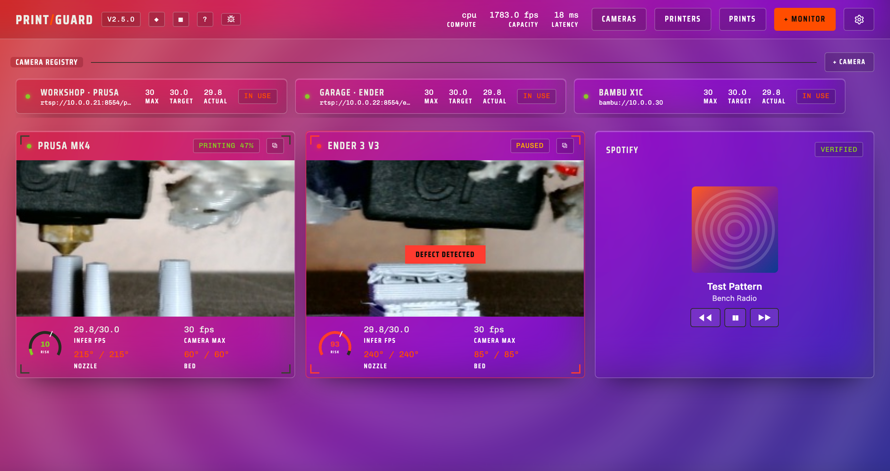
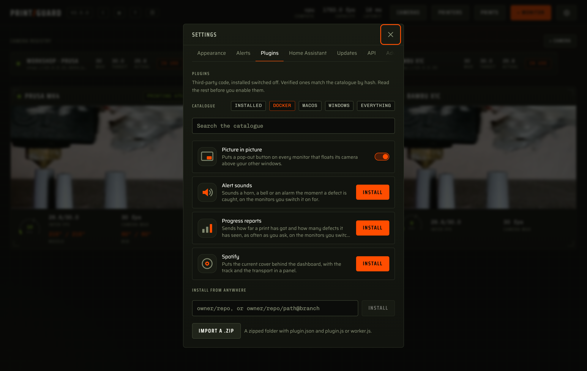

<div align="center">

# Plugins

[Docs](README.md) · [Architecture](architecture.md) · [Printers & cameras](printers.md) · [Hardware](hardware.md) · [Deployment](deployment.md) · [API & MCP](api.md) · **Plugins** · [Troubleshooting](troubleshooting.md)

</div>

Plugins are written in JavaScript and run in a sandbox. One can draw a panel on your dashboard,
run a job on the hub, or both. They get fine-grained permissions to an internal API, so you can
add features without waiting on a release.



- [Installing a plugin](#installing-a-plugin)
- [What a plugin can and cannot do](#what-a-plugin-can-and-cannot-do)
- [Permissions](#permissions)
- [Writing a plugin](#writing-a-plugin)
- [The panel half](#the-panel-half)
- [The worker half](#the-worker-half)
- [Publishing](#publishing)

## Installing a plugin



The Plugins tab in Settings lists what you have installed and what the catalogue offers. Three
ways in.

| From | How |
|---|---|
| The catalogue | Open a plugin's page for its screenshots, README and the permissions it will ask for, then install from there. These are the ones I have reviewed |
| A GitHub repository | Paste `owner/repo`, or `owner/repo/path@branch` for one inside a larger repo |
| A file | Import a `.zip` of the plugin's folder |

Before you enable one, PrintGuard reads its code and shows where the code and the manifest
disagree.

| It says | Meaning |
|---|---|
| Asks for something it never uses | The manifest is wider than the code needs |
| Uses something it never asked for | The sandbox refuses it anyway, so this is early notice |
| Builds a command or an address as it runs | Its reach cannot be read from the code |

It says what it found, it does not pass a verdict. A plugin that builds a URL as it runs is not
a bad plugin, and the check that stops anything is the one at the sandbox edge. It does settle
the catalogue though, since `pin.py` will not pin a plugin whose code and manifest disagree.

Verified means the manifest and every file hash to what the catalogue pins at a commit.
Anything else is third party, so read it first. Both run under the same restrictions.

A repository install pins the commit it resolved to. **Update** re-resolves the branch and
re-checks the hashes.

A plugin arrives switched off. **Enable** lists what it asks for, what each permission allows
and the author's reason for it. It is all or nothing. Disabling keeps what you accepted.

An update that asks for more stands the plugin down until you accept the wider list. More means
a permission, an address or another plugin it calls.

Grants, stored data and credentials carry across an update from the same repository. A bundle
from anywhere else, a zip included, starts from scratch.

## What a plugin can and cannot do

A plugin gets the state its permissions allow and hands back what to draw and a list of things
to do. PrintGuard does them, checking each against your permissions first.

| Half | Runs in | On a hub | In local mode |
|---|---|---|---|
| `plugin.js` | An iframe with an opaque origin and `default-src 'none'` | ✅ | ✅ |
| `panel.html` | The same, with your own markup, styles and scripts allowed | ✅ | ✅ |
| `worker.js` | [QuickJS](https://github.com/quickjs-ng/quickjs) compiled to WebAssembly, under wasmtime | ✅ | The browser sandbox, headless |

Only a hub can serve a plugin's routes or let one gate requests. Local mode has no server.

| Attack | What stops it |
|---|---|
| Take your credentials somewhere | Neither sandbox has sockets. The browser half's policy is `connect-src 'none'`; the hub half has no WASI network and no filesystem. The only way out is a request through PrintGuard, to addresses the plugin declared |
| Read your credentials at all | State is cut down to the fields a permission names. Printer configuration, notifier settings, MQTT credentials and API tokens are in no permission |
| Read your camera frames | A `camera` node is a placeholder PrintGuard fills with its own player, and the video never enters the sandbox. Reading the picture itself is `camera:frames`, which is its own thing to agree to, and a plugin's own pages are refused the live stream |
| Hang or exhaust the hub | The worker runs against a memory cap and a CPU budget, and traps in milliseconds. A plugin that fails is disabled and reported |
| Do something it was not granted | Every command maps to a permission, checked at the sandbox edge before it goes anywhere |
| Pretend to be PrintGuard | Plugins have no styling and no markup of their own, and PrintGuard draws every node itself. A plugin's own pages are served into a sandboxed origin that is not the dashboard's |
| Change after review | The manifest and every source file are pinned by SHA-256 at a commit |

A plugin holding **Authorise every request** can lock you out. To start the hub with plugins
off, add `PRINTGUARD_PLUGINS=off` to its environment, then remove the plugin.

## Permissions

| Permission | Lets the plugin | Hub only |
|---|---|---|
| `state:read` | Read monitor names, scores and alerts, and camera and printer status | |
| `camera:view` | Put a live feed in its own panel | |
| `sound` | Sound a short alert through the speakers | |
| `monitor:control` | Enable, disable and retune any monitor | |
| `printer:control` | Pause, resume and cancel prints | |
| `notify` | Raise a message in the dashboard | |
| `alert:send` | Send through your own ntfy, Pushover, Telegram or Discord | |
| `net` | Reach the addresses its manifest lists | |
| `net:local` | Reach addresses on this machine and the network around it | |
| `monitor:manage` | Add monitors and delete them | |
| `camera:control` | Retune any camera's brightness, crop, rotation and frame rate | |
| `camera:manage` | Register cameras and delete them | |
| `camera:frames` | Take a still of any camera and read the picture itself | |
| `history:read` | Read a monitor's score history and past alerts | |
| `printer:manage` | Connect and delete printers, setting their credentials | |
| `settings` | Change alert channels, theme and the rest of Settings | |
| `tokens` | Mint and revoke API tokens | |
| `oauth` | Sign you in to a service and use the result | |
| `link:provide` | Answer other plugins on the channels it offers | |
| `link:consume` | Ask the plugins and channels it names, and hear them | |
| `background` | Put a picture behind the dashboard and make the panels see-through | |
| `routes` | Answer requests under `/plugins/<id>/`, reading each request's headers | ✅ |
| `gate` | See and refuse every other request to the hub | ✅ |

Every permission a manifest asks for needs a line in `reasons` saying why, in the plugin
author's own words, and one without a reason will not install. That line sits under
PrintGuard's own description of the permission when you are asked to accept it, so you get
both what it allows and what this plugin claims to want it for.

Storing its own data needs no permission. The store is capped at 16 KB and saved with your
PrintGuard state.

## Credentials

A plugin can set a credential and never read one back. Printer passwords, notifier keys and API
tokens go in and do not come out.

Its own credentials work the same way. Declare them in `secrets`, and PrintGuard draws the form,
holds the values and fills them in as your requests leave.

```json
"secrets": {
  "api_key": "The key from your account page"
}
```

```js
ctx.http({ url: "https://api.example.com/v1/me", headers: { Authorization: "Bearer {{secret.api_key}}" }, tag: "me" });
```

The reference is all your code holds, in the URL, a header or a JSON body. Eight secrets at
most.

Be clear on what that buys. The value never enters the sandbox, the plugin's stored data, the
state the dashboard reads or a bug report. It does not stop a plugin you granted the network
from sending a secret to an address it declared. Those addresses are in front of you before you
enable it, the code check holds them against what it calls, and a listed plugin has been
reviewed. That is the control.

For a service with a sign-in, declare `oauth` and PrintGuard runs the flow with PKCE and no
client secret. The access token arrives as `{{secret.oauth}}` and is refreshed before it
expires.

```json
"permissions": ["net", "oauth"],
"oauth": {
  "label": "Spotify",
  "authorize_url": "https://accounts.spotify.com/authorize",
  "token_url": "https://accounts.spotify.com/api/token",
  "register_url": "https://developer.spotify.com/dashboard",
  "scopes": ["user-read-playback-state"]
}
```

No client id goes in there, and one written in is dropped at install. A shipped id would be one
app shared by everyone who installs the plugin, which is what providers hand out quota and terms
against. Whoever installs it registers their own, and PrintGuard shows them the redirect URI to
give the provider and links `register_url`.

That URI is the hub's address with `/oauth/callback` on the end, written as `127.0.0.1` since
providers stopped accepting `localhost`.

Sign-in is hub only.

## Writing a plugin

A plugin is a folder with a manifest and one or two JavaScript files. There's no build step and
nothing to minify, so what you publish is what people read. The four that ship live in
[`plugins/`](../plugins) and are commented throughout, so copy the closest one.

```
my-plugin/
  plugin.json     the manifest
  plugin.js       draws a panel from nodes     (optional)
  panel.html      draws its own panel instead  (optional)
  worker.js       runs in the background       (optional)
  alarm.mp3       anything it ships            (optional)
  README.md       its page in the catalogue    (optional)
  icon.png        shown beside its name        (optional)
  shots/*.png     its screenshots or GIFs      (optional)
```

```json
{
  "$schema": "https://raw.githubusercontent.com/oliverbravery/PrintGuard/main/plugins/plugin.schema.json",
  "id": "bed-clearance",
  "name": "Bed clearance",
  "version": "1.0.0",
  "description": "One line about what it does.",
  "author": "you",
  "homepage": "https://github.com/you/bed-clearance",
  "icon": "icon.png",
  "media": ["shots/panel.png", "shots/alert.gif"],
  "permissions": ["state:read", "notify"],
  "reasons": {
    "state:read": "To see which monitors are printing.",
    "notify": "To tell you when the bed needs clearing."
  },
  "surfaces": ["panel"],
  "platforms": ["docker", "windows"],
  "assets": ["alarm.mp3"],
  "urls": ["https://api.example.com/v1/*"],
  "secrets": { "api_key": "The key from your account page" },
  "events": ["alert"],
  "tick_s": 300
}
```

`reasons` is one line per permission, required for every one you ask for, shown to whoever is
deciding whether to enable it. Say what your plugin does with it, not what the permission is.

`icon`, `media` and a `README.md` are how a plugin presents itself. The icon sits beside its
name, the media images open the plugin's page as a gallery, and the README renders under
them the way GitHub renders it, relative image paths included. Every installed plugin's page
opens from its card. For a repository install these files are read from the repository at the
pinned commit; a zip carries them inside it. Either way they add nothing to what runs.

`surfaces` says where the panel appears.

| Surface | Where it puts you |
|---|---|
| `panel` | A panel of its own on the dashboard |
| `monitor` | Drawn on every monitor tile |
| `settings` | Drawn in every monitor's settings, under its own heading |

On `monitor` and `settings`, `render` is called once more per monitor, with `ctx.target` naming
which and `ctx.surface` naming where, so a plugin can put a button on the tile and its own
settings in the panel behind it. Anything that belongs to one monitor rather than all of them
goes in `settings`.

`platforms` says where it runs, and leaving it out means everywhere. The store filters the
catalogue by the one you are on, so anything that would not work is out of the way.

| Platform | |
|---|---|
| `docker` | The self-hosted hub, on any image |
| `docker-nvidia`, `docker-intel` | Only that image, for a plugin that needs the GPU it brings |
| `macos`, `windows` | The desktop app |
| `browser` | Local mode |

Naming `docker` covers the images built from it, so declare a variant only when a plainer
image would not do.

`assets` names the files it ships beside its code. They are hashed and pinned the same way.

| Kind | |
|---|---|
| Images | `png`, `jpg`, `webp`, `gif`, drawn by an `image` node |
| Audio | `mp3`, `ogg`, `wav`, played by `ctx.sound("alarm.mp3")` |
| Text | `json`, `csv`, `txt`, read from `ctx.assets` as a string |
| Video | `mp4`, `webm`, played by a `panel.html` |

An asset is 4 MB at most, 12 MB across a plugin. The type comes from the extension and the file
has to start like the format it claims, so a script renamed to `.png` is refused. SVG is not on
the list, since it is markup. Images and audio never enter the sandbox, so a plugin names one
and PrintGuard draws or plays it.

`urls` lists the only addresses `ctx.http` and `ctx.socket` may reach, each a match pattern of
`scheme://host/path`, the same grammar a browser extension uses.

| Pattern | Reaches |
|---|---|
| `https://api.example.com/v1/*` | Anything under `/v1/` on that one host |
| `https://*.example.com/*` | `example.com` and every subdomain of it |
| `*://example.com/*` | That host over http or https |
| `wss://hub.local:8123/api/*` | That endpoint over a WebSocket, on that port |
| `*://*/*` | Anywhere at all, which is the widest thing you can ask for |

A `*` scheme covers http and https, and `ws`, `wss`, `rtsp` and `rtsps` are named in full. A
missing port means any port.

A pattern landing on this machine or the network around it needs `net:local` as well as `net`.
A wildcard host counts, since it covers both. PrintGuard resolves the name and checks the
address it lands on, so a public name pointing somewhere private is caught.

`provides` and `consumes` are how plugins reach each other, and `secrets` and `oauth` are
credentials, both below. `events` and `tick_s` are the worker's, naming which engine events
wake it and how often to run anyway.

Both files get `plugin` to register with, and every handler gets a `ctx`:

| On `ctx` | |
|---|---|
| `ctx.state` | The state your permissions allow, refreshed each call |
| `ctx.store` | Your own data. Assign to it and PrintGuard saves it |
| `ctx.command(cmd)` | Ask PrintGuard to run an engine command |
| `ctx.http(request)` | Ask PrintGuard to make a request, to an address you declared. Answers on the `http` event |
| `ctx.socket({ url, tag })` | Ask PrintGuard to hold a WebSocket open for you. Answers on the `socket` event |
| `ctx.socketSend(tag, text)` | Write one frame to a socket you opened |
| `ctx.socketClose(tag)` | Close a socket you opened |
| `ctx.call(request)` | Ask another plugin for something. Answers on the `call` event's reply |
| `ctx.publish(request)` | Publish on one of your own channels |
| `ctx.background(image)` | Put a picture behind the dashboard as a `data:` URL, or nothing to clear it |
| `ctx.notify(text)` | Show a message in the dashboard |
| `ctx.sound(tones)` | Sound your own tones through the speakers, `{ hz, ms }` each, or name an audio asset |
| `ctx.assets` | The text files you shipped, keyed by name |
| `ctx.log(text)` | Write a line to PrintGuard's log |

Each file runs inside a function with nothing else in scope. No `import`, no `fetch`, no DOM,
no storage.

### Your editor

The `$schema` key completes and checks the manifest as you type, in VS Code, JetBrains, Zed or
anything else with a JSON language server. Nothing to install.

For the JavaScript, drop these two next to your plugin and any editor with TypeScript completes
`plugin` and `ctx`.

```bash
curl -O https://raw.githubusercontent.com/oliverbravery/PrintGuard/main/plugins/plugin.d.ts
curl -O https://raw.githubusercontent.com/oliverbravery/PrintGuard/main/plugins/jsconfig.json
```

Without a `jsconfig.json`, `// @ts-check` at the top of a file does the same for that file.

Install it with **Import a .zip** while you work, or point PrintGuard at your repo and press
**Update** as you push.

## The panel half

`plugin.js` returns a tree of nodes. PrintGuard draws them with its own components, so a plugin
matches the dashboard and inherits the user's theme.

| Node | Fields |
|---|---|
| `row`, `col` | `children` |
| `text` | `value`, `muted` |
| `chip` | `value`, `tone`: `ok`, `warn`, `bad`, `accent` |
| `camera` | `camera_id` |
| `image` | `asset`, `label` |
| `float` | `camera_id`, `label`, `value` |
| `button` | `label`, `action`, `arg` |
| `select` | `value`, `options`, `action`, `label` |
| `input` | `value`, `action`, `label`, `kind`: `text` or `number`, `placeholder`, `secret` |
| `toggle` | `on`, `action`, `label` |

A `float` node acts on the press itself, since a browser only floats a video for something the
user did and a trip through the sandbox loses that. It draws nothing where the browser cannot
float one, and the floating window shows the camera unadjusted, without the brightness, crop or
rotation the dashboard draws.

An `input` and a `select` draw their `label` above the field, so give them one.

`render` runs on every state change and after every action, so keep it a plain function of
`ctx`. A `button` press or a `select` change calls `action` with the node's `action` name and
`arg`. An `input` commits on blur or Enter, and a `toggle` hands you `true` or `false`.

```js
plugin.action((name, arg, ctx) => {
  if (name === "watch") ctx.command({ cmd: "monitor.update", id: arg, patch: { enabled: true } });
});

plugin.render((ctx) => ({
  type: "col",
  children: (ctx.state.monitors || []).map((monitor) => ({
    type: "row",
    children: [
      { type: "text", value: monitor.name },
      { type: "chip", value: monitor.enabled ? "watching" : "idle", tone: monitor.enabled ? "ok" : undefined },
      { type: "button", label: "Watch", action: "watch", arg: monitor.id },
    ],
  })),
}));
```

[`plugins/picture-in-picture`](../plugins/picture-in-picture) is a whole plugin in five lines. It
takes the `monitor` surface and returns one `float` node per monitor.
[`plugins/alert-sounds`](../plugins/alert-sounds) adds a switch and a sound picker to each
monitor's settings, watches each monitor's `alert` between renders and sounds the chosen tones.
Its main view returns nothing, since `render` runs whether or not there is a panel. The tones
are its own, since `ctx.sound` takes a list:

```js
plugin.render((ctx) => {
  ctx.sound([
    { hz: 880, ms: 1400 },
    { hz: 1320, ms: 1100, together: true },
  ]);
  return null;
});
```

Each tone follows the one before unless it says `together`, and `shape` picks `sine`, `square`,
`sawtooth` or `triangle`. Four seconds is the most it will play at once.

## Drawing it yourself

A node tree matches the dashboard, which is what most plugins want. Ship a `panel.html` instead
and you draw the panel yourself, with your own markup, styles and scripts.

```html
<style>
  .risk { font-family: var(--font-display); color: var(--color-accent); font-size: 32px; }
</style>
<p class="risk" id="worst">0</p>
<video id="loop" autoplay muted loop></video>
<script>
  document.getElementById("loop").src = pg.asset("loop.mp4");
  pg.on("state", (state) => {
    const scores = (state.monitors || []).map((m) => (m.result ? m.result.score : 0));
    document.getElementById("worst").textContent = Math.max(0, ...scores).toFixed(2);
  });
</script>
```

It runs in an opaque origin with `connect-src 'none'`, so `pg` is the only way out. Every call
on it is the `ctx` above under another name, checked against the same permissions.
`pg.on("ready")` fires once the panel is drawn, `pg.on("state")` on every change, and any event
your manifest names arrives the same way.

The dashboard's colours and fonts arrive as the custom properties it uses itself, so
`var(--color-accent)` is the accent the user picked and `pg.theme` is the lot. The background is
transparent and the panel is as tall as it draws itself, up to 900px.

`pg.asset(name)` gives a URL for a file you shipped, good inside your panel only.

A panel can show a picture but not fetch one. Pull it through `pg.http` with `binary: true` and
it arrives base64 encoded on the `http` event, ready to be a `data:` URL.
`pg.background(image)` puts one behind the dashboard, which needs `background` and clears when
passed nothing. The Glass theme frosts the panels over it.

A panel joins the dashboard's layout, so it drags, pins and hides with the monitors.

## Talking to other plugins

Plugins reach each other only where both sides said so and the user agreed. A plugin offering
something declares the channels it answers on, and a plugin wanting them names the exact
plugin and channel it will call. PrintGuard carries the message; neither one sees the other's
code, its store or anything it was not handed.

```json
"permissions": ["link:provide"],
"provides": { "now-playing": "The track playing right now" }
```

```js
plugin.serve((request, ctx) => ({ track: ctx.store.track, artist: ctx.store.artist }));
```

The other side names it in full, so `spotify:now-playing` is one channel of one plugin.

```json
"permissions": ["link:consume"],
"consumes": ["spotify:now-playing"]
```

```js
plugin.on("tick", (event, ctx) => ctx.call({ to: "spotify", channel: "now-playing", tag: "np" }));

plugin.on("answer", (event, ctx) => { ctx.store.track = event.body.track; });
```

To say something without being asked, publish instead. Every plugin that named the channel
hears it.

```js
plugin.publish({ channel: "now-playing", body: { track: "Blue" } });
```

Both sides show up in the consent dialog. A disabled plugin answers nobody, and a body is 16 KB
at most.

## The worker half

[`plugins/spotify`](../plugins/spotify) is one file. It signs you in, asks Spotify what is
playing, draws the cover and the transport, and puts the cover behind the dashboard.
[`plugins/progress-reports`](../plugins/progress-reports) has both halves. Its panel adds a switch
and an interval to each monitor's settings, its worker counts alerts and flagged frames, and on
its own timer it sends the tally through `notify.send`. Both halves share one store.

`worker.js` runs without a UI. It wakes on the engine events its manifest lists, on its own
timer, and for requests to its routes. It gets a fresh VM each time, so anything it needs to
remember goes in `ctx.store`.

It has no screen and no speakers of its own, so `ctx.notify`, `ctx.sound` and `ctx.background`
are carried out by whichever dashboards are open, and nothing happens while none are.

These are the events a worker can name in `events`:

| Event | Fires | Carries |
|---|---|---|
| `http` | An answer to one of your own `ctx.http` calls | `tag`, `status`, `body` |
| `socket` | A socket you opened coming up, carrying a frame, or ending | `tag`, `state`, `text` |
| `frame` | A still you asked for with `camera.snapshot` | `camera_id`, `jpeg` |
| `call` | Another plugin asking on a channel you offer | `from`, `channel`, `body`, `call_id` |
| `answer` | The answer to one of your own `ctx.call`s | `tag`, `from`, `channel`, `body` |
| `message` | Something a plugin you named published | `from`, `channel`, `body` |
| `history` | A monitor's risk history, answering `history.get` | `monitor_id`, `now`, `buckets`, `alerts`, `stats` |
| `result` | Every inference on a watched monitor, capped at 5 per second per monitor | `monitor_id`, `camera_id`, `score`, `prediction`, `margin`, `ms`, `ts` |
| `alert` | A defect held long enough to act on | `monitor_id`, `score`, `action`, `ts` |
| `warning` | A watchdog condition, and its recovery | `monitor_id`, `message`, `recovered` |
| `device` | A printer's status changed | `printer_id`, `status`, `progress`, `job` |
| `error` | Anything that failed | `message` |
| `state` | The full snapshot, once a second | Everything your permissions allow |

`result` is the one for "do something when the risk goes over x". It fires per inference with
the raw score, before the monitor's threshold or streak logic. A worker still busy with the last
event is skipped, so a slow plugin drops events instead of falling behind.

```js
plugin.on("result", (event, ctx) => {
  if (event.score < (ctx.store.limit || 0.8)) return;
  ctx.command({ cmd: "printer.action", id: ctx.store.printer, action: "pause" });
  ctx.notify(`${event.monitor_id} hit ${event.score}`);
});
```

That needs `printer:control` and `notify`, and it acts on a single frame. A monitor waits for a
streak, so this will be twitchier. Count consecutive hits in `ctx.store` to match it.

```js
plugin.on("alert", (event, ctx) => {
  ctx.store.alerts = (ctx.store.alerts || 0) + 1;
  ctx.http({ method: "POST", url: "https://api.example.com/hook", json: { score: event.score } });
});

plugin.on("tick", (event, ctx) => ctx.log(`${ctx.store.alerts || 0} alerts so far`));

plugin.route((request, ctx) => ({
  status: 200,
  type: "text/html",
  body: `<h1>${ctx.store.alerts || 0} alerts</h1>`,
}));

plugin.gate((request, ctx) => request.path.startsWith("/api/") || Boolean(ctx.store.session));
```

A plugin runs and returns, so `ctx.http` hands nothing back on the spot. Name the request with
a `tag` and read the answer when it arrives.

```js
plugin.on("tick", (event, ctx) => ctx.http({ url: "https://api.example.com/v1/now", tag: "now" }));

plugin.on("http", (event, ctx) => {
  if (event.tag === "now") ctx.store.latest = event.body;
});
```

A socket works the same way. `ctx.socket` opens one under a tag, `socket` events carry its
frames, and PrintGuard drops it when the plugin is disabled. Both need `http` or `socket` in the
manifest's `events`, or the answer never reaches you.

Camera stills and risk history are asked for with a command and answered on an event.

```js
plugin.on("tick", (event, ctx) => {
  for (const monitor of ctx.state.monitors || []) ctx.command({ cmd: "history.get", monitor_id: monitor.id });
  ctx.command({ cmd: "camera.snapshot", camera_id: "cam-1" });
});

plugin.on("history", (event, ctx) => { ctx.store.peak = event.stats.max; });
plugin.on("frame", (event, ctx) => { ctx.store.last = event.jpeg.length; });
```

`history.get` answers with the same rollups the monitor page draws. `camera.snapshot` hands
over a base64 JPEG, so it needs `camera:frames`.

`route` answers everything under `/plugins/<id>/` and may return `headers` with `Set-Cookie`,
`Location` or `Cache-Control`. Its pages are served into a sandboxed origin, so they can render
and script themselves but never act as the dashboard.

`gate` sees every other request. `/api/health` and the plugin's own pages stay open, so uptime
checks keep working and it can serve the sign-in page it would otherwise refuse. Answers are
cached briefly per session and path. Anything but `true` refuses, and so does a gate that fails
to answer.

## Publishing

Push the folder to a public repo and people can install it by name. For a review and a
catalogue listing, open a pull request adding it under `plugins/` in
[PrintGuard](https://github.com/oliverbravery/PrintGuard), then:

```bash
uv run python plugins/pin.py
```

That holds your code against your manifest, refuses to list a plugin where the two disagree,
then rewrites `plugins/catalogue.json` with the last commit and the hash of every file. Commit
first, since a pin describes bytes already in history, and run it again after every change or
the plugin stops verifying.

For your own catalogue, point `catalogue_url` in settings at a JSON file of the same shape.
