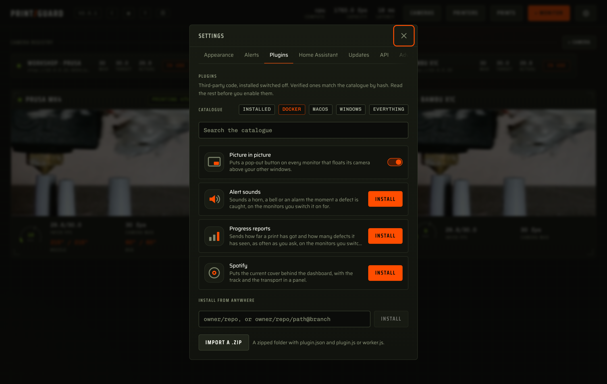
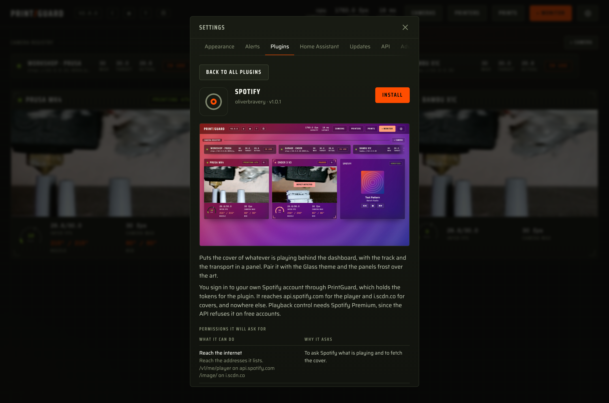
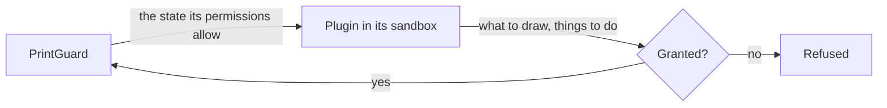

# Plugins

[Docs](README.md) · [Printers](printers.md) · [Cameras](cameras.md) · [Monitoring](monitoring.md) · [Notifications](notifications.md) · [Training frames](feedback.md) · [Hardware](hardware.md) · [Deployment](deployment.md) · [API & MCP](api.md) · **Plugins** · [Writing plugins](plugin-development.md) · [Architecture](architecture.md) · [Troubleshooting](troubleshooting.md)

Plugins are written in JavaScript and run in a sandbox. This page covers installing them and
what they can reach. [Writing plugins](plugin-development.md) covers making one.

- [What plugins are](#what-plugins-are)
- [The shipped plugins](#the-shipped-plugins)
- [Installing a plugin](#installing-a-plugin)
- [Verified and third party](#verified-and-third-party)
- [Enabling a plugin](#enabling-a-plugin)
- [Updates](#updates)
- [Permissions](#permissions)
- [What a plugin can and cannot do](#what-a-plugin-can-and-cannot-do)
- [Credentials](#credentials)
- [Switching plugins off at boot](#switching-plugins-off-at-boot)
- [Writing a plugin](#writing-a-plugin)

## What plugins are

A plugin can draw a panel on your dashboard, run a job on the hub, or both. They get
fine-grained permissions to an internal API, so you can add features without waiting on a
release.

A panel joins the dashboard's layout, so it drags, pins and hides with the monitors. A plugin
can also draw on every monitor tile or add its own heading to every monitor's settings.

## The shipped plugins

Four plugins are in the catalogue, and their source is in [`plugins/`](../plugins).

| Plugin | What it does | Asks for |
|---|---|---|
| [Picture in picture](../plugins/picture-in-picture) | Puts a button on every monitor that floats its camera above your other windows | `state:read`, `camera:view` |
| [Alert sounds](../plugins/alert-sounds) | Sounds a horn, a bell or an alarm when a defect is caught, on the monitors you pick | `state:read`, `sound` |
| [Progress reports](../plugins/progress-reports) | Sends how far a print has got and how many defects it has seen, as often as you ask | `state:read`, `alert:send` |
| [Spotify](../plugins/spotify) | Puts the current cover behind the dashboard, with the track and the transport in a panel | `net`, `oauth`, `background` |

## Installing a plugin

The Plugins tab in Settings lists what you have installed and what the catalogue offers.

| From | How |
|---|---|
| The catalogue | Open a plugin's page for its screenshots, README and the permissions it will ask for, then install from there |
| A GitHub repository | Paste `owner/repo`, or `owner/repo/path@branch` for one inside a larger repo. A full `https://github.com/owner/repo` URL works too, and so does `@tag` or `@sha` in place of a branch |
| A file | Import a `.zip` of the plugin's folder |

Every installed plugin has the same page, opened from its card.

The catalogue is filtered by where your hub runs, and an install from a repository or a zip is
refused if the plugin names other platforms.

## Verified and third party

Verified means the manifest and every file hash to what the catalogue pins at a commit. These
are the ones I have reviewed. Anything else is third party, so read it first. Both run under
the same restrictions.

When you enable one, PrintGuard reads its code and shows in the same dialog where the code and
the manifest disagree.

| It says | Meaning |
|---|---|
| Asks for a permission but never uses it | The manifest is wider than the code needs |
| Uses a permission without asking. PrintGuard will refuse it | The sandbox refuses it anyway, so this is early notice |
| Uses something, so its reach cannot be read from the code | It builds a command, an address or a channel as it runs |

It says what it found, it does not pass a verdict. A plugin that builds a URL as it runs is not
a bad plugin, and the check that stops anything is the one at the sandbox edge.

## Enabling a plugin

A plugin arrives switched off. **Enable** lists what it asks for, what each permission allows
and the author's reason for it. It is all or nothing. Disabling keeps what you accepted.

The list names the addresses a network permission covers and the other plugins it calls, so
you see its whole reach before it runs.

## Updates

A repository install pins the commit it resolved to. **Update** re-resolves the branch it was
installed from, or the default branch if it had none, and re-checks the hashes.

An update that asks for more stands the plugin down until you accept the wider list. More means
a permission, an address or another plugin it calls.

| Installed over | Grants, stored data and credentials |
|---|---|
| The same repository and path | Carry across |
| Anywhere else, a zip included | Start from scratch |

## Permissions

| Permission | Lets the plugin |
|---|---|
| `state:read` | Read monitor names, scores and alerts, and camera and printer status, and hear each score, alert, warning, printer update and error as it happens |
| `camera:view` | Put a live feed in its own panel |
| `sound` | Sound a short alert through the speakers |
| `monitor:control` | Enable, disable and retune any monitor |
| `printer:control` | Pause, resume and cancel prints |
| `notify` | Raise a message in the dashboard |
| `alert:send` | Send through your own ntfy, Pushover, Telegram or Discord |
| `net` | Reach the addresses its manifest lists |
| `net:local` | Reach addresses on this machine and the network around it |
| `monitor:manage` | Add monitors and delete them |
| `camera:control` | Retune any camera's brightness, crop, rotation and frame rate |
| `camera:manage` | Register cameras and delete them, and scan for ones not yet registered |
| `camera:frames` | Take a still of any camera and read the picture itself |
| `history:read` | Read a monitor's score history and past alerts |
| `printer:manage` | Connect, edit, test and delete printers, setting their credentials, and read which integrations exist |
| `settings` | Change alert channels, theme and the rest of Settings, send a test alert, and read which notifiers exist |
| `tokens` | Mint and revoke API tokens |
| `oauth` | Sign you in to a service and use the result |
| `link:provide` | Answer other plugins on the channels it offers |
| `link:consume` | Ask the plugins and channels it names, and hear them |
| `background` | Put a picture behind the dashboard and make the panels see-through |
| `routes` | Answer requests under `/plugins/<id>/`, reading each request's headers |
| `gate` | See and refuse every other request to the hub |

Every permission a manifest asks for carries a line saying why, in the plugin author's own
words, and one without a reason will not install. That line sits beside PrintGuard's own
description of the permission when you are asked to accept it.

Storing its own data needs no permission. The store is capped at 16 KB and saved with your
PrintGuard state.

## What a plugin can and cannot do

A plugin gets the state its permissions allow and hands back what to draw and a list of things
to do. PrintGuard does them, checking each against your permissions first.

```mermaid
flowchart LR
    engine["PrintGuard"] -- "the state its permissions allow" --> plugin["Plugin in its sandbox"]
    plugin -- "what to draw, things to do" --> check{"Granted?"}
    check -- "yes" --> engine
    check -- "no" --> refused["Refused"]
```

A plugin has up to three files, and each runs in a sandbox.

| File | Runs in |
|---|---|
| `plugin.js` | A hidden iframe in the dashboard, with an opaque origin and `default-src 'none'` |
| `panel.html` | A visible iframe with the same origin rules, where its own markup, styles and scripts are allowed |
| `worker.js` | [QuickJS](https://github.com/quickjs-ng/quickjs) compiled to WebAssembly on the hub, under wasmtime |

| Attack | What stops it |
|---|---|
| Take your credentials somewhere | Neither sandbox has sockets. The browser files' policy is `connect-src 'none'`, and the hub file has no WASI network and no filesystem. The only way out is a request through PrintGuard, to addresses the plugin declared. A redirect is handed back to the plugin and never followed |
| Read your credentials at all | State is cut down to the fields a permission names. Printer configuration, notifier settings, MQTT credentials and API tokens are in no permission. The exceptions are `routes` and `gate`, which see the cookie and authorisation headers of the requests they answer |
| Read your camera frames | A camera in a plugin's panel is a placeholder PrintGuard fills with its own player, and the video never enters the sandbox. Reading the picture itself is `camera:frames`, which is its own thing to agree to, and a plugin's own pages are refused the live stream |
| Hang or exhaust the hub | The worker runs against a memory cap, a CPU budget and a 5 second limit per call. A plugin that fails is disabled and reported |
| Open the hub by breaking its own gate | A plugin holding `gate` that fails refuses every request until you enable it again, reinstall it or remove it |
| Do something it was not granted | Every command maps to a permission, checked at the sandbox edge before it goes anywhere |
| Pretend to be PrintGuard | A `plugin.js` has no styling and no markup of its own, and PrintGuard draws what it describes with its own components. A `panel.html` does draw itself, inside a panel carrying the plugin's name. A plugin's own pages are served into a sandboxed origin that is not the dashboard's |
| Change after review | The manifest and every source file are pinned by SHA-256 at a commit |

## Credentials

A plugin can set a credential and never read one back. Printer passwords, notifier keys and API
tokens go in and do not come out.

Its own credentials work the same way. A plugin that needs a key shows a field for it on its
page in the Plugins tab, once it's enabled. Paste the value there and PrintGuard holds it and fills it in as the
plugin's requests leave.

Be clear on what that buys. The value never enters the sandbox, the plugin's stored data, the
state the dashboard reads or a bug report. It does not stop a plugin you granted the network
from sending a secret to an address it declared. Those addresses are in front of you before you
enable it, the code check holds them against what it calls, and a listed plugin has been
reviewed. That is the control.

A plugin that signs you in to a service, such as Spotify, needs an app of your own with that
service. No plugin carries one, since a shared app is what providers hand out quota and terms
against.

1. Open the plugin's page and follow **Create one** to the service's developer page.
2. Register an app there, giving it the redirect URI the page shows.
3. Paste the app's client id into the page.
4. Press **Connect** and sign in.

The redirect URI is the address you opened PrintGuard at with `/oauth/callback` on the end,
written as `127.0.0.1` since providers stopped accepting `localhost`. PrintGuard runs the
sign-in with PKCE, so there is no client secret to paste. **Disconnect** forgets the sign-in
and keeps the client id.

## Switching plugins off at boot

A plugin holding **Authorise every request** can lock you out. One that fails locks everyone out,
since a hub with a broken gate refuses every request.

To start the hub with plugins off, add `PRINTGUARD_PLUGINS=off` to its environment, then remove the plugin or enable it again.

[Deployment](deployment.md#plugins) has the compose snippet and what the `routes` and `gate`
permissions mean for an exposed hub.

## Writing a plugin

A plugin is a folder with a manifest and up to three source files, with no build step.
[Writing plugins](plugin-development.md) starts from a working one and covers the API,
the limits and publishing to the catalogue.
