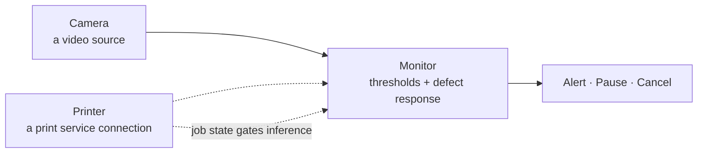
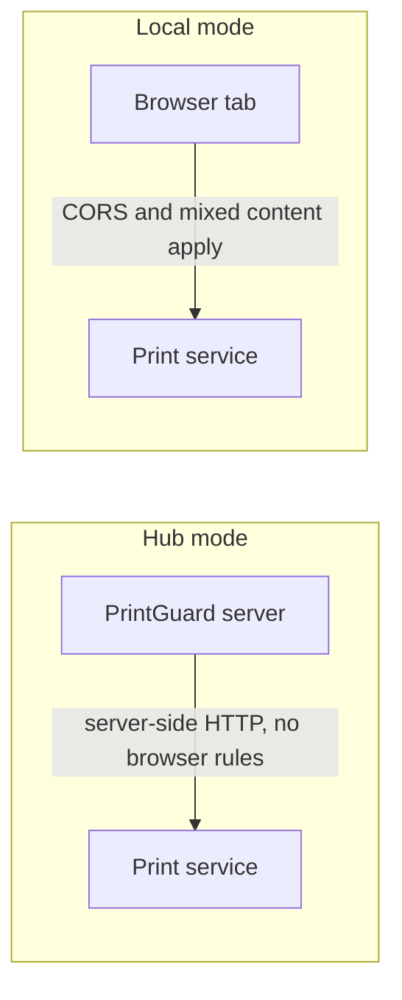

<div align="center">

# Printers, cameras and notifications

[Docs](README.md) · [Architecture](architecture.md) · **Printers & cameras** · [Hardware](hardware.md) · [Deployment](deployment.md) · [API & MCP](api.md) · [Plugins](plugins.md) · [Troubleshooting](troubleshooting.md)

</div>

Connecting print services and cameras, what PrintGuard does with a printer's webcam, and
how alerts are wired up.

- [How the pieces fit](#how-the-pieces-fit)
- [Register a printer](#register-a-printer)
- [Sending prints](#sending-prints)
- [Temperatures and preheat](#temperatures-and-preheat)
- [Supported print services](#supported-print-services)
- [Printer cameras](#printer-cameras)
- [Adding cameras yourself](#adding-cameras-yourself)
- [Notifications](#notifications)
- [Networking caveats](#networking-caveats)

## How the pieces fit

A camera and a printer are registered once each, then bound together by a monitor. One
printer connection can back several monitors, and a monitor without a printer still watches
and alerts. Each of the three carries a name you can change later, from **Edit** in the camera
or printer registry and from a monitor's settings panel.



The dotted lines are the optional parts. Bind no printer and PrintGuard still alerts you, it
just cannot stop the print.

## Register a printer

Open the printer registry, choose the service, fill in the form and **Test** it before
saving. Then bind it to a monitor and choose whether a sustained defect alerts you, pauses the
print or cancels it.

Linked printers report job name, progress, temperatures and state on every monitor that uses
them, and they gate inference. A printer that positively reports "not printing" stands its monitors down, so
an idle printer costs nothing. Losing contact with a printer never stands monitoring down, and
neither does a state the adapter cannot read, so a monitor left watching an apparently idle
printer warns and says which state it is getting. See
[failing safely](architecture.md#failing-safely).

## Sending prints

The print library holds sliced files on the hub. Open **Prints** in the header, drop files in or
browse for them, and each keeps the preview, estimated time, filament and printer model its
slicer wrote into it. Open one to orbit its toolpath in 3D, layer by layer.

Tag a file with the printers it was sliced for and it can only start on one of those. A file
with no tags can go to any printer whose service takes the format. Either way the printer has to
report idle at the moment you press **Print**, so nothing lands on top of a running job.

| Service | Takes | How it starts |
|---|---|---|
| OctoPrint | `.gcode`, `.gco`, `.g` | Uploaded to local storage, selected and printed |
| Klipper via Moonraker | `.gcode`, `.gco`, `.g` | Uploaded to the gcodes root and printed |
| Elegoo | `.gcode` | Centauri: uploaded to internal storage and started. Neptune and OrangeStorm: through Moonraker |
| Prusa via PrusaLink | `.gcode`, `.bgcode` | Put onto the USB stick, or local storage on a Raspberry Pi, and printed after upload |
| Bambu Lab | `.3mf` sliced by Bambu Studio or Orca | Uploaded to the SD card over FTPS, then the first plate is started over MQTT |

A file is sent under its library name, so rename it first if the printer's own file list
matters to you. Binary gcode has no preview or 3D view, since its toolpath is compressed.

A Bambu print uses the settings sliced into the file, with bed levelling on, flow and vibration
calibration off, and filament from the external spool or the first AMS slot. Starting a 3mf
needs Developer Mode, the same switch the MQTT connection needs. A project exported without its
gcode is refused at upload.

Files live in the data directory under `prints/`, so they survive a restart and travel with the
`/data` volume.

## Temperatures and preheat

A linked printer's nozzle and bed temperatures sit on its monitor's tile and in the monitor's
panel, where a running print also gets a progress bar and the time left. The panel takes a
target for either heater, applied on Enter, and a row of preheat presets that set both at once.
**Edit** beside them changes the presets, which every printer shares, and **Off** turns every
heater off.

| Service | Reads temperatures | Sets targets |
|---|---|---|
| OctoPrint | Yes | Yes, through its tool and bed endpoints |
| Klipper via Moonraker | Yes | Yes, with `SET_HEATER_TEMPERATURE` |
| Elegoo | Yes | Yes, on both families |
| Prusa via PrusaLink | Yes | No, PrusaLink has no endpoint for it |
| Bambu Lab | Yes | Yes, as the `M104` and `M140` lines Bambu Studio sends |

A target is capped at 350 °C for the nozzle and 150 °C for the bed, and the printer's own
firmware applies its limits on top. Temperatures refresh with the printer's state, every five
seconds.

## Supported print services

| Service | Modes | Authentication | Exposes a camera |
|---|---|---|---|
| [OctoPrint](https://octoprint.org) | Hub and local | API key | Yes, its webcam stream |
| [Klipper via Moonraker](https://moonraker.readthedocs.io) | Hub and local | Optional API key | Yes, its configured webcams |
| [Elegoo](https://github.com/ELEGOO-3D/elegoo-link) | Hub only | Access code, or Moonraker API key | Centauri chamber camera |
| [Prusa via PrusaLink](https://help.prusa3d.com/guide/wi-fi-and-prusa-connect-link-setup-core-one-mk4-s-mk3-9-mk3-5-xl-mini_413293) | Hub only | HTTP Digest, user `maker` | No local stream |
| [Bambu Lab](https://github.com/Doridian/OpenBambuAPI) | Hub only | Access code and serial | Chamber camera |

"Hub only" means a browser cannot make the connection at all, so the integration is offered
only when PrintGuard runs as a server. The reasons are per service and listed below.

<details>
<summary><b>Bambu Lab</b>: LAN Only Mode, Developer Mode, and why hub only</summary>

Bambu printers speak MQTT over TLS rather than HTTP, and a browser cannot open a raw
socket, so control is hub only.

1. On the printer, enable **LAN Only Mode**, then **Developer Mode** under
   Network in Settings. This opens the MQTT channel.
2. Note the **access code** shown there, and the **serial number** under Device in Settings.
3. Register the printer with its IP address, serial number and access code.

The chamber camera is registered automatically: RTSP on the X1 and H2 series, or the
proprietary port 6000 protocol on the A1 and P1 series. The form links Bambu's
[Enable LAN Mode](https://wiki.bambulab.com/en/knowledge-sharing/enable-lan-mode) guide.

</details>

<details>
<summary><b>Elegoo</b>: two families, Centauri and Neptune/OrangeStorm</summary>

Elegoo control is hub only. Choose the family that matches your printer:

**Centauri** covers the Centauri Carbon and Centauri Carbon 2. PrintGuard detects which
local protocol the printer speaks and registers its chamber camera automatically.

- Carbon 2: enable **LAN Only Mode** in its network settings and use the access code shown
  there.
- Original Carbon: the IP address is enough.

**Neptune/OrangeStorm** covers the Neptune 4 Pro, Plus and Max, the OrangeStorm Giga, and
any other Elegoo printer running Moonraker. PrintGuard uses the stock Moonraker service on
port `7125` and accepts an API key if you set one.

All state, camera and control traffic stays between PrintGuard and the printer on your LAN.
Elegoo's cloud is never involved.

</details>

<details>
<summary><b>Prusa</b>: PrusaLink, not PrusaConnect</summary>

Prusa printers connect over **PrusaLink**, the API that runs on the printer itself on the
MK4, MK4S, MK3.9, MK3.5, MINI, XL and CORE One, or on a Raspberry Pi attached to an MK3 or
MK2.5. It authenticates with HTTP Digest, which a browser cannot perform, so Prusa is hub
only.

1. Enable **PrusaLink** on the printer under Settings, Network, then PrusaLink.
2. Register it with its URL and the password shown there. The username is always `maker`.

PrusaConnect is not used, so no frames or job data leave hardware you own. PrusaLink's
webcam feature pushes snapshots to PrusaConnect rather than serving a local video stream, so
if the printer has a camera, add it separately as a **Stream URL**.

</details>

## Printer cameras

If a registered printer exposes a webcam, PrintGuard registers it as a camera for you, with
no stream URL to copy. The camera registry's **Printer cameras** tab lists them and a
**Refresh** button picks up a camera attached after the printer was registered.

These cameras belong to their printer, so they cannot be removed on their own and they are
dropped when the printer is.

## Adding cameras yourself

Beyond printer webcams, a hub takes cameras three ways:

| Source | What it accepts | Notes |
|---|---|---|
| **Stream URL** | RTSP, RTMP, HTTP/MJPEG or WHEP, including anything already pushed to the bundled MediaMTX | PrintGuard creates a MediaMTX pull path for it |
| **This machine** | A camera plugged into the machine PrintGuard runs on | Captured by the hub itself, so it keeps watching with every window closed |
| **This browser** | The browser's own camera | Publishes to the hub over a WebSocket and reconnects after a hub restart |

> [!IMPORTANT]
> Browsers only grant camera access on secure pages. **This browser** publishing and local
> mode both need the hub served over HTTPS or opened on `localhost`.
> [Deployment](deployment.md) covers HTTPS with Tailscale or a tunnel.

### Cameras plugged into the hub

A USB camera reaches the container only if you pass it in, and once you have, it registers
itself and appears in the camera registry. List the ones attached with `ls /dev/v4l/by-id/`,
whose names still point at the same camera after a reboot renumbers the devices, and map each
one in.

```yaml
    devices:
      - /dev/v4l/by-id/usb-046d_HD_Pro_Webcam_C920_A1B2C3-video-index0:/dev/nozzle-cam
```

A camera arrives named after itself, so rename it in the registry. There's no Remove button on
it, since the compose file is what decides it exists. Drop the `devices:` entry and restart to
remove it.

Docker can't hand a running container a camera plugged in after it started, so a new camera
means another `devices:` entry and `docker compose up -d`.

Set `PRINTGUARD_CAMERAS=off` to leave them unregistered and add them by hand from **This
machine** instead. The desktop app works that way already, since a computer's own webcam is
rarely the one you want watched.

## Notifications

Alert channels live in **Settings**. Enable a channel, fill in the form and send a test
alert. Every enabled channel receives defect snapshots and watchdog warnings for monitors
that have notifications switched on.

A monitor's **cooldown** is the quiet window after a defect alert. Watchdog warnings are
separate, so a camera or printer that keeps dropping out warns once for the whole unstable
episode, and the recovery is only announced once it has stayed healthy, so reconnections
cannot turn into a stream of notifications.

The **fault grace period**, in the Alerts tab, is how long a fault has to last before it is
pushed. Two minutes by default, and worth raising for a wireless camera that drops out and
comes straight back. It stops at fifteen minutes and cannot be turned off, since a print
nothing is watching is worth hearing about, and an outage nobody has answered is announced
again every thirty minutes. The dashboard shows every fault as it happens whatever it is set
to.

| Channel | Modes | Notes |
|---|---|---|
| [ntfy](https://ntfy.sh) | Hub and local | Self-hostable, no account needed |
| [Pushover](https://pushover.net) | Hub and local | One-off app purchase, and you create the application token. Priority covers every notice and defaults to High, which bypasses the quiet hours set on the device |
| [Discord](https://discord.com) | Hub and local | Webhook URL |
| [Telegram](https://telegram.org) | Hub only | Telegram's API sends no CORS headers |
| Desktop notification | Desktop app only | Native OS notification on the computer running the app |

## Networking caveats

Most connection problems come down to who makes the request. In hub mode the server does,
from inside the container. In local mode the browser does, under browser security rules.



### Running in Docker

The hub reaches printer services from inside the container, so
`localhost` means the container, not your host, and a URL like `http://localhost:5000`
fails with *all connection attempts failed*. Use `http://host.docker.internal:5000`. The
shipped [`docker-compose.yaml`](../docker-compose.yaml) maps that name for you. On a Linux
host the print service must also listen on `0.0.0.0` rather than loopback only.

### Local mode URLs

Give the browser a URL it can reach itself: `http://localhost:5000`
when the service runs on the same machine, otherwise the host's LAN IP. Never
`host.docker.internal`, which only resolves inside a container.

### CORS in local mode

The browser enforces CORS, so enable it in OctoPrint under
Settings, API, or add `cors_domains` to `moonraker.conf`. Without it the connection test
fails with *access control checks*.

### Mixed content

If PrintGuard itself is served over HTTPS, for example through a
Cloudflare Tunnel, the browser blocks calls to an `http://` printer. Safari reports *not
allowed to request resource* even for `http://localhost`. To control an HTTP printer from
an HTTPS deployment, use hub mode, where the server makes the request, or serve the printer
over HTTPS.

[Troubleshooting](troubleshooting.md) has more symptoms and fixes.
