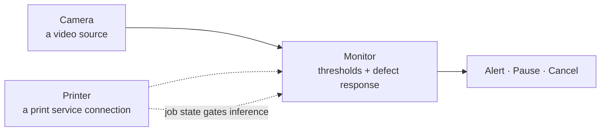

# Printers

[Docs](README.md) · **Printers** · [Cameras](cameras.md) · [Monitoring](monitoring.md) · [Notifications](notifications.md) · [Training frames](feedback.md) · [Hardware](hardware.md) · [Deployment](deployment.md) · [API & MCP](api.md) · [Plugins](plugins.md) · [Writing plugins](plugin-development.md) · [Architecture](architecture.md) · [Troubleshooting](troubleshooting.md)

Connecting a print service, sending it files and setting its temperatures.

- [How the pieces fit](#how-the-pieces-fit)
- [Register a printer](#register-a-printer)
- [Supported print services](#supported-print-services)
- [Sending prints](#sending-prints)
- [Temperatures and preheat](#temperatures-and-preheat)
- [Networking caveats](#networking-caveats)

## How the pieces fit

A camera and a printer are registered once each, then bound together by a monitor. One
printer connection can back several monitors, and a monitor without a printer still watches
and alerts. Each of the three carries a name you can change later, from **Edit** in the camera
or printer registry and from a monitor's settings panel.

```mermaid
flowchart LR
    cam["Camera<br/>a video source"] --> mon
    prn["Printer<br/>a print service connection"] -.-> mon
    mon["Monitor<br/>thresholds + defect response"] --> act["Alert · Pause · Cancel"]
    prn -. "job state gates inference" .-> mon
```

The dotted lines are the optional parts. Bind no printer and PrintGuard still alerts you, it
just cannot stop the print. [Cameras](cameras.md) covers the video side,
[monitoring](monitoring.md) the thresholds and [notifications](notifications.md) the alert
channels.

## Register a printer

Open the printer registry, choose the service, fill in the form and press **Test connection**
before saving. A printer with a starred field left blank is not saved, and the error names the
field. Then bind it to a monitor and choose whether a sustained defect alerts you, pauses the
print or cancels it.

Linked printers report job name, progress, temperatures and state on every monitor that uses
them, and they gate inference. Monitoring runs while a printer reports it is printing and stands
down when it reports idle, paused or an error, so an idle printer costs nothing. Losing contact
or a state the adapter cannot read keeps whatever the printer last reported, meaning a printer
switched off after a print stays in standby while one that drops off mid-print keeps being
watched and warns you. See [failing safely](architecture.md#failing-safely).

## Supported print services

| Service | Authentication | [Exposes a camera](cameras.md#printer-cameras) |
|---|---|---|
| [OctoPrint](https://octoprint.org) | API key | Yes, its webcam stream |
| [Klipper via Moonraker](https://moonraker.readthedocs.io) | Optional API key | Yes, its configured webcams |
| [Elegoo](https://github.com/ELEGOO-3D/elegoo-link) | Access code, or Moonraker API key | Centauri chamber camera, or Moonraker's configured webcams |
| [Prusa via PrusaLink](https://help.prusa3d.com/guide/wi-fi-and-prusa-connect-link-setup-core-one-mk4-s-mk3-9-mk3-5-xl-mini_413293) | HTTP Digest, user `maker` | No local stream |
| [Bambu Lab](https://github.com/Doridian/OpenBambuAPI) | Access code and serial | Chamber camera |

<b>Bambu Lab</b>: LAN Only Mode and Developer Mode

Bambu printers speak MQTT over TLS rather than HTTP.

1. On the printer, enable **LAN Only Mode**, then **Developer Mode** under
   Network in Settings. This opens the MQTT channel.
2. Note the access code shown there, and the serial number under Device in Settings.
3. Register the printer with its IP address, serial number and access code.

The chamber camera is registered automatically: RTSP on the X1 and H2 series, or the
proprietary port 6000 protocol on the A1 and P1 series. The form links Bambu's
[Enable LAN Mode](https://wiki.bambulab.com/en/knowledge-sharing/enable-lan-mode) guide.

PrintGuard holds one connection to the printer and reads the reports it pushes. A printer that
pushes nothing for a minute is reconnected and shown offline until it reports again. With
Developer Mode off the printer still reports its state but rejects a pause, cancel, heater
target or print start, and PrintGuard reports that command as failed.

<b>Elegoo</b>: two families, Centauri and Neptune/OrangeStorm

Choose the family that matches your printer:

**Centauri** covers the Centauri Carbon and Centauri Carbon 2. PrintGuard detects which
local protocol the printer speaks and registers its chamber camera automatically.

- Carbon 2: enable **LAN Only Mode** in its network settings and use the access code shown
  there.
- Original Carbon: the IP address is enough.

While a Carbon 2 starts up, loads or unloads filament, levels or calibrates outside a print,
PrintGuard shows its state as unknown and a monitor stays as it was.

**Neptune/OrangeStorm** covers the Neptune 4 Pro, Plus and Max, the OrangeStorm Giga, and
any other Elegoo printer running Moonraker. PrintGuard uses the stock Moonraker service on
port `7125`, accepts an API key if you set one and registers the webcams Moonraker lists.

All state, camera and control traffic stays between PrintGuard and the printer on your LAN.
Elegoo's cloud is never involved.

<b>Prusa</b>: PrusaLink, not PrusaConnect

Prusa printers connect over **PrusaLink**, the API that runs on the printer itself on the
MK4, MK4S, MK3.9, MK3.5, MINI, XL and CORE One, or on a Raspberry Pi attached to an MK3 or
MK2.5. It authenticates with HTTP Digest.

1. Enable **PrusaLink** on the printer under Settings, Network, then PrusaLink.
2. Register it with its URL and the password shown there. The username is always `maker`.

PrusaConnect is not used, so no frames or job data leave hardware you own. PrusaLink's
webcam feature pushes snapshots to PrusaConnect rather than serving a local video stream, so
if the printer has a camera, add it separately as a [stream URL](cameras.md#stream-urls).

## Sending prints

The print library holds sliced files on the hub. Open **Prints** in the header and drop files in
or browse for them.

Each one opens in a panel that draws its toolpath on your device before
the file is uploaded, where you can name it, tag it and correct its first layer nozzle and bed
temperatures. The panel sends the start and end of the file to the hub to read its print time,
filament and temperatures. Every other print temperature the slicer set moves by the same amount, while the
temperatures a start gcode probes or wipes at stay put. A file sliced with several filaments shows
the one its first layer prints with and moves only that filament's temperatures, and nothing moves
past 350°C on the nozzle or 150°C on the bed. A file whose slicer lists no print
temperatures has every one of its set-points moved. Binary gcode keeps the temperatures it
was sliced with.

Each file keeps the preview, estimated time, filament and printer model its slicer wrote into it.
Cura and a few others write no preview, so your browser draws one and adds it to the gcode as
it's uploaded. A file uploaded through the REST API without a preview shows its format
instead. Open a file to orbit its toolpath in 3D, layer by layer.

Tag a file with the printers it was sliced for and it can only start on one of those. A tag is
only offered for a printer whose service takes the format. A file
with no tags can go to any printer whose service takes the format. Remove a printer and the files
tagged only for it stay tagged, so they start nowhere until you tag them for another. Either way the printer has to
report idle at the moment you press **Print**, so nothing lands on top of a running job.

| Service | Takes | How it starts |
|---|---|---|
| OctoPrint | `.gcode`, `.gco`, `.g` | Uploaded to local storage, selected and printed |
| Klipper via Moonraker | `.gcode`, `.gco`, `.g` | Uploaded to the gcodes root and printed |
| Elegoo | `.gcode` | Centauri: uploaded to internal storage and started. Neptune and OrangeStorm: through Moonraker |
| Prusa via PrusaLink | `.gcode`, `.bgcode` | Put onto the first writable storage, the USB stick or local storage on a Raspberry Pi, and printed after upload |
| Bambu Lab | `.3mf` sliced by Bambu Studio or Orca | Uploaded to the printer's storage over FTPS, then the first plate is started over MQTT |

A file the service stores but doesn't start, or a start the printer refuses, is reported as a
failed print.

A file is sent under its library name, cut to 60 characters with anything outside plain letters,
digits, dots and dashes turned into `_`. Rename it first if the printer's own file list matters
to you. PrusaLink replaces a file of the same name already on the printer. A file can be up to
512 MB. A file whose gcode is over 32 MB isn't drawn in the browser, since parsing it takes
about nine times its size in memory, so it has no 3D view and no drawn preview. It uploads and
prints as usual, and the hub still reads its print time, filament and temperatures. A smaller
file the browser can't draw, such as on a device with no WebGL, uploads without a drawn preview
too. Binary gcode has no 3D view and no drawn preview, since its toolpath is
compressed, so it shows the preview PrusaSlicer embedded and nothing else. Its print time and filament can
be blank too, where PrusaSlicer compressed them.

A Bambu print uses the settings sliced into the file, with bed levelling on, flow and vibration
calibration off, and filament from the external spool, not an AMS. Starting a 3mf
needs Developer Mode, the same switch the MQTT connection needs. A project exported without its
gcode is refused at upload. A Bambu printer keeps reporting a cancelled or failed job as failed until
the next one starts, which PrintGuard shows as idle, so clear the bed before you press **Print**.

Files live in the data directory under `prints/`, so they survive a restart and travel with the
`/data` volume.

## Temperatures and preheat

A linked printer's nozzle and bed temperatures sit on its monitor's tile and in the monitor's
panel, where a running print also gets a progress bar and the time left. The panel takes a
target for either heater, applied on Enter or when you leave the field, and a row of preheat presets that set both at once.
**Edit** beside them changes the presets, which every printer shares, and **Off** turns every
heater off.

| Service | Reads temperatures | Sets targets |
|---|---|---|
| OctoPrint | Yes | Yes, through its tool and bed endpoints, for the first nozzle |
| Klipper via Moonraker | Yes | Yes, with `SET_HEATER_TEMPERATURE` |
| Elegoo | Yes | Yes, on both families |
| Prusa via PrusaLink | Yes | No, PrusaLink has no endpoint for it |
| Bambu Lab | Yes | Yes, as the `M104` and `M140` lines Bambu Studio sends |

A target is capped at 350 °C for the nozzle and 150 °C for the bed, and the printer's own
firmware applies its limits on top. Temperatures refresh with the printer's state, about every
five seconds. Printers are read together, so the gap grows to about fifteen seconds while one of
them isn't answering.

## Networking caveats

The hub makes every request to a print service itself, so the address you register has to be
one the hub can reach, not one your browser can. The browser never calls the printer, so an
`http://` printer works from a hub you open over HTTPS.

Register the address the service answers on, not one that redirects to it. A proxy that answers
`http://` with a 301 or 302 to `https://` turns a pause into a read, so PrintGuard reports the
command as failed and names the address to use. A 307 or 308 keeps the command and is followed.

### Where a printer's webcam is read from

OctoPrint and Moonraker usually report their webcam as a path such as `/webcam/?action=stream`,
which their own web interface resolves against the address it's served on. PrintGuard does the
same from the address you registered:

| Registered address | Webcam is read from |
|---|---|
| Moonraker's own port, `7125` to `7199`, such as `http://pi.lan:7126` for a second instance | The same host on the default port, `http://pi.lan/webcam2/?action=stream` |
| OctoPrint's own port, `http://octopi.local:5000` | The same host on the default port, `http://octopi.local/webcam/?action=stream` |
| Any other port, such as a reverse proxy on `http://nas.lan:8080` | That port, `http://nas.lan:8080/webcam/?action=stream` |
| No port | The same address |

An OctoPrint container published as `5000:80` can't be told apart from OctoPrint's own port, so
its webcam is looked for on port 80. Publish it on another port, or set an absolute stream URL
in OctoPrint's webcam settings, which is used as it is.

A Moonraker webcam set to the MediaMTX or go2rtc WebRTC service is pulled from that server's
WHEP endpoint. One set to camera-streamer is read from its MJPEG stream, since camera-streamer
has no WHEP endpoint.

### Running in Docker

The hub reaches printer services from inside the container, so
`localhost` means the container, not your host, and a URL like `http://localhost:5000`
fails with *all connection attempts failed*. Use `http://host.docker.internal:5000`. The
shipped [`docker-compose.yaml`](../docker-compose.yaml) maps that name for you. On a Linux
host the print service must also listen on `0.0.0.0` rather than loopback only.

### The desktop app

The app runs on your computer rather than in a container, so `http://localhost:5000` reaches
a print service on the same machine, and anything else is its LAN address.

[Troubleshooting](troubleshooting.md) has more symptoms and fixes.
