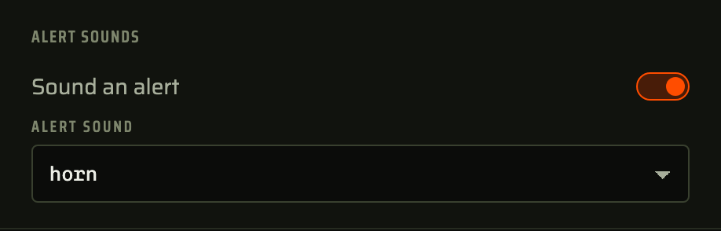

# Alert sounds

Sounds a horn, a bell or an alarm the moment a defect is caught, so a print failing in the next room is heard rather than noticed later. Each monitor picks its own sound in its settings, or none.

The sounds ship with the plugin and play in the browser tab, so there is nothing to configure and no account. It only reads the dashboard state to know when an alert fires.
