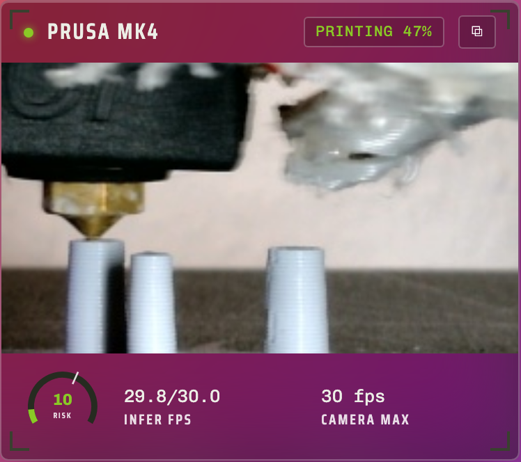

# Picture in picture

Puts a pop-out button on every monitor that floats its camera above your other windows, using the browser's own picture in picture. The feed keeps playing while you work in another app, and closing the floating window puts it back on the dashboard.

It reads the dashboard to know which cameras exist and views their streams, and nothing else. Works wherever the browser offers picture in picture, so Firefox on Android sits this one out.
