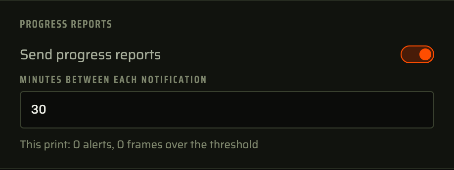

# Progress reports

Sends a tally of a print through your alert channels as often as you ask: how far it has got, how long it has been going and how many defects have been seen. Useful for long prints you want to glance at from your phone without opening the dashboard.

Reports go through the same ntfy, Pushover, Telegram or Discord channels your defect alerts use. Each monitor turns reports on in its settings and picks how often they come.
