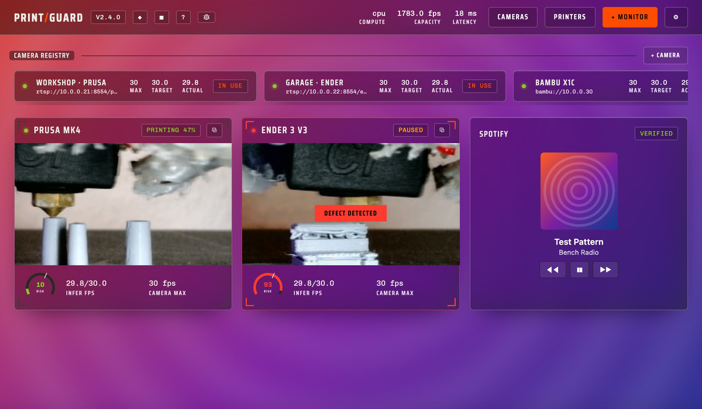

# Spotify

Puts the cover of whatever is playing behind the dashboard, with the track and the transport in a panel. Pair it with the Glass theme and the panels frost over the art.

You sign in to your own Spotify account through PrintGuard, which holds the tokens for the plugin. It reaches api.spotify.com for the player and i.scdn.co for covers, and nowhere else. Playback control needs Spotify Premium, since the API refuses it on free accounts.
